# Lively  
**Producto: AgeCare**  
# UNIVERSIDAD PERUANA DE CIENCIAS APLICADAS

<p align="center">
  
</p>

### Carrera: Ingeniería de Software  
### Ciclo: 5° ciclo  
### Curso: Desarrollo de Aplicaciones Open Source  
### Sección: 1ASI0729  
### Profesor: Juan Antonio Flores Moroco 

## Informe de Trabajo Final  
**"Lively"**  
**Producto: "AgeCare"**

### Integrantes:
- Ramiro Alexander Guzmán Chávez – U202217062  
- Fátima Andrea Asmad Padilla – U20221B490  
- Jeremy Alexander Quijada Magro – U202219657  
- Gabriel Huang Liu Franco – U202310345  
- Mauricio Rigoberto Muñoz Vilcapoma – U202217212  

**Abril, 2025**  
**URL del proyecto:** [https://github.com/MauricioMVilcapoma/OpenSource-4328](https://github.com/MauricioMVilcapoma/OpenSource-4328)

---

## Registro de Versiones del Informe

| Versión | Fecha       | Autor | Descripción |
|---------|-------------|-------|-------------|
| TB1     | 15/04/2025  | Ramiro Alexander Guzman Chavez   | Desarrollé la carátula del repositorio, el diagrama de clases, el diagrama de la base de datos y el class dictionary. |
| TB1     | 17/04/2025  | Ramiro Alexander Guzman Chavez   | Añadí mi registro de entrevistas realizadas por segmento objetivo. |
| TB1     | 18/04/2025  | Franco Gabriel Huang Liu         | Realicé los wireframes, wireflows y la sección de Lean UX. |
| TB1     | 23/04/2025  | Franco Gabriel Huang Liu         | Se terminó el mockup y el userflow. |
| TB1     | 23/04/2025  | Ramiro Alexander Guzman Chavez   | Agregué el Software Configuration Management. |
| TB1     | 15/04/2025  | Mauricio Rigoberto Muñoz Vilcapoma | Realicé el user task matrix y persona. |
| TB1     | 16/04/2025  | Mauricio Rigoberto Muñoz Vilcapoma | Realicé el journey mapping y emphaty mapping. |
| TB1     | 24/04/2025  | Mauricio Rigoberto Muñoz Vilcapoma | Realicé Project Report Collaboration Insights. |
| TB1     | 17/04/2025  | Quijada Magro Jeremy Alexander    | Realicé Análisis Competitivo y Estrategia ante competidores. |
| TB1     | 20/04/2025  | Quijada Magro Jeremy Alexander    | Realicé Style GuideLines and Information Architecture. |
| TB1     | 22/04/2025  | Quijada Magro Jeremy Alexander    | Realicé Domain-Design Software Architecture. |
| TB1     | 23/04/2025  | Quijada Magro Jeremy Alexander    | Realicé Landing Page UI Design. |
| TP1     | 10/05/2025  | Ramiro Alexander Guzmán Chávez        | Realizó mejoras con respecto a la TB1 y creó y desplegó su frontend al igual que su jsonserver y colaboró en el sprint 2. |
| TP1     | 10/05/2025  | Fátima Andrea Asmad Padilla           | Realizó mejoras con respecto a la TB1 y creó y desplegó su frontend al igual que su jsonserver y colaboró en el sprint 2. |
| TP1     | 10/05/2025  | Jeremy Alexander Quijada Magro        | Realizó mejoras con respecto a la TB1 y creó y desplegó su frontend al igual que su jsonserver y colaboró en el sprint 2. |
| TP1     | 10/05/2025  | Franco Gabriel Huang Liu               | Realizó mejoras con respecto a la TB1 y creó y desplegó su frontend al igual que su jsonserver y colaboró en el sprint 2. |
| TP1     | 10/05/2025  | Mauricio Rigoberto Muñoz Vilcapoma   | Realizó mejoras con respecto a la TB1 y creó y desplegó su frontend al igual que su jsonserver y colaboró en el sprint 2. |
| TB2     | 22/06/2025  | Franco Gabriel Huang Liu               | Realizó las entrevistas de validación y las validaciónes según heurísticas |
| TB2     | 23/06/2025  | Franco Gabriel Huang Liu               | Realizó Services Documentation y Team Collaboration Insights during sprint |
| TB2     | 10/06/2025  | Ramiro Alexander Guzmán Chávez        | Realizó mejoras con respecto a la TB2 y creó y colaboró en el sprint 3. |
| TB2     | 20/06/2025  | Fátima Andrea Asmad Padilla           | Realizó mejoras con respecto a la TB2 y creó  y colaboró en el sprint 3. |
| TB2     | 20/06/2025  | Jeremy Alexander Quijada Magro        | Realizó mejoras con respecto a la TB2 y creó  y colaboró en el sprint 3. |
| TB2     | 20/06/2025  | Franco Gabriel Huang Liu               | Realizó mejoras con respecto a la TB2 y creó  y colaboró en el sprint 3. |
| TB2     | 20/06/2025  | Mauricio Rigoberto Muñoz Vilcapoma   | Realizó mejoras con respecto a la TB2 y creó y colaboró en el sprint 3. |


---

## Project Report Collaboration Insights

- **URL de la organización del proyecto:**  
  [https://github.com/upc-pre-202510-1asi0729-4328-Lively](https://github.com/upc-pre-202510-1asi0729-4328-Lively)
- **URL del repositorio del informe:**  
    [https://github.com/upc-pre-202510-1asi0729-4328-Lively/OpenSource-4328](https://github.com/upc-pre-202510-1asi0729-4328-Lively/OpenSource-4328)

Todas las tareas correspondientes a la entrega de la TB1 han sido completadas y están documentadas en el repositorio de GitHub de la organización del equipo. Para la elaboración del informe, cada integrante del equipo se encargó de redactar y generar gráficos en formato Markdown, según los puntos que le fueron asignados, realizando commits para dejar constancia del progreso en el repositorio.

Aquí se pueden visualizar todos los commits realizados para la TB1, lo cual evidencia el trabajo colaborativo del equipo.

<p align="center">
  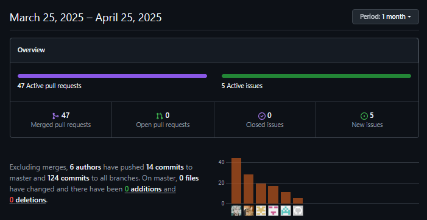
  
Para facilitar el desarrollo del trabajo, optamos por seguir el flujo de trabajo Gitflow. En este esquema, cada subtítulo del informe fue tratado como una feature. Un miembro del equipo creaba una rama específica para ese subtítulo y trabajaba en ella, mientras que otros miembros podían colaborar directamente o supervisar su progreso. Una vez finalizada la feature, todo el equipo revisaba el contenido y, tras obtener el consenso, se realizaba el merge hacia la rama develop. Además, organizamos las tareas considerando su nivel de dificultad, asegurando así una distribución equitativa del trabajo entre todos los integrantes.

A lo largo del desarrollo de la TB1, generamos varias ramas distintas que fueron integradas a la rama develop. Cada una representaba una sección específica del proyecto. Este enfoque nos permitió trabajar de manera ordenada y colaborativa, asegurando que cada parte del informe fuera desarrollada y revisada de forma independiente antes de su integración final.

<p align="center">
  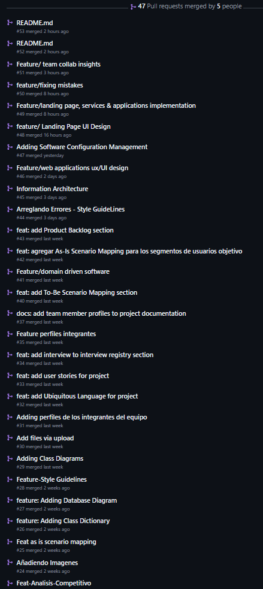

## TP:

A lo largo del desarrollo del TP, generamos varias ramas distintas que fueron integradas a la rama develop. Cada una representaba una sección específica del proyecto. Este enfoque nos permitió trabajar de manera ordenada y colaborativa, asegurando que cada parte del informe fuera desarrollada y revisada de forma independiente antes de su integración final.
Aquí se pueden visualizar todos los commits realizados para la TP1, lo cual evidencia el trabajo colaborativo del equipo.
<p align="center">
  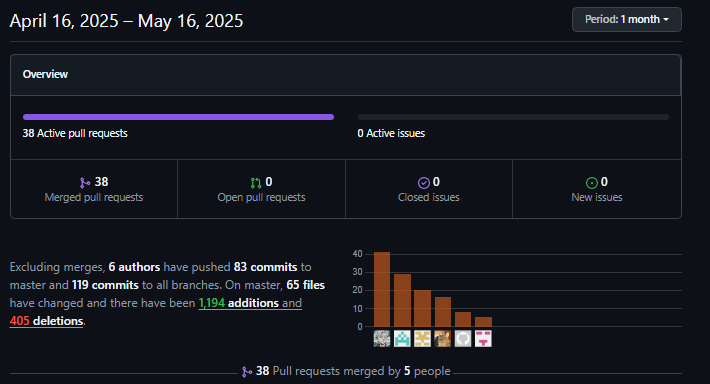

<p align="center">
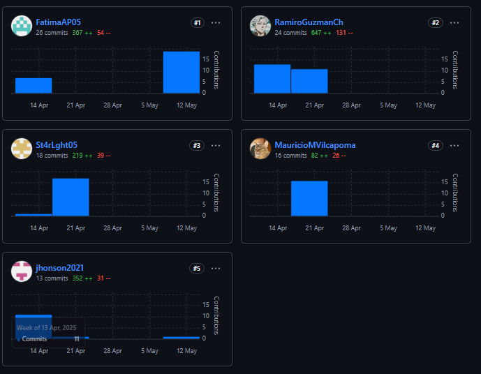


## 📌 **PARA LA TB2**

# 🚀 **Landing Page**
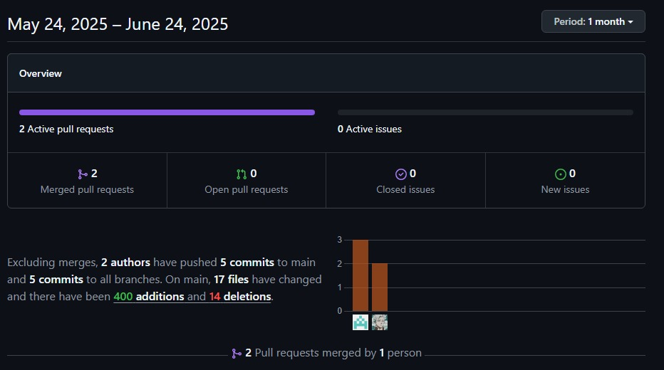

**Actividad registrada:**
- **Ramiro Guzman:** 2 commits  
- **Fatima Asmad:** 3 commits  

---

# 💻 **Frontend**
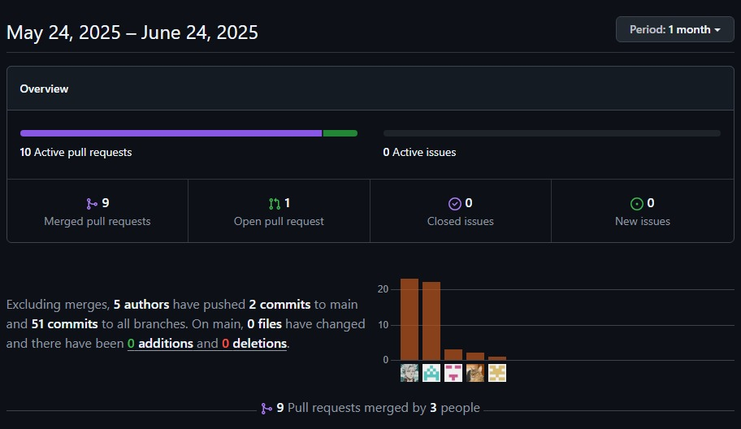

**Actividad registrada:**
- **Ramiro Guzman:** 23 commits  
- **Mauricio Muñoz:** 2 commits  
- **Fatima Asmad:** 22 commits  
- **Franco Huang:** 1 commit  
- **Jeremy Quijada:** 3 commits  

---

# 🛠️ **Backend**
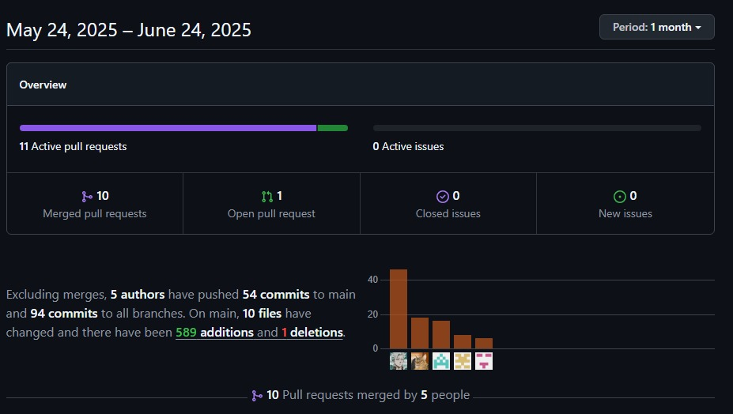

**Actividad registrada:**
- **Ramiro Guzman:** 46 commits  
- **Mauricio Muñoz:** 18 commits  
- **Fatima Asmad:** 16 commits  
- **Franco Huang:** 8 commits  
- **Jeremy Quijada:** 6 commits  


REPORTE


  
---
## Contenido
#### Tabla de contenidos

- [Student Outcome](#student-outcome)
- [Capítulo I: Introducción](#capítulo-i-introducción)
  - [1.1. Startup Profile](#11-startup-profile)
    - [1.1.1. Descripción de la startup](#111-descripción-de-la-startup)
    - [1.1.2. Perfiles de los integrantes del equipo](#112-perfiles-de-los-integrantes-del-equipo)
  - [1.2. Solution Profile](#12-solution-profile)
    - [1.2.1. Antecedentes y problemática](#121-antecedentes-y-problemática)
    - [1.2.2. Lean UX Process](#122-lean-ux-process)
      - [1.2.2.1. Lean UX Problem Statements](#1221-lean-ux-problem-statements)
      - [1.2.2.2. Lean UX Assumptions](#1222-lean-ux-assumptions)
      - [1.2.2.3. Lean UX Hypothesis Statements](#1223-lean-ux-hypothesis-statements)
      - [1.2.2.4. Lean UX Canvas](#1224-lean-ux-canvas)
  - [1.3. Segmentos objetivo](#13-segmentos-objetivo)
- [Capítulo II: Requirements Elicitation & Analysis](#capítulo-ii-requirements-elicitation--analysis)
  - [2.1. Competidores](#21-competidores)
    - [2.1.1. Análisis competitivo](#211-análisis-competitivo)
    - [2.1.2. Estrategias y tácticas frente a competidores](#212-estrategias-y-tácticas-frente-a-competidores)
  - [2.2. Entrevistas](#22-entrevistas)
    - [2.2.1. Diseño de entrevistas](#221-diseño-de-entrevistas)
    - [2.2.2. Registro de entrevistas](#222-registro-de-entrevistas)
    - [2.2.3. Análisis de entrevistas](#223-análisis-de-entrevistas)
  - [2.3. Needfinding](#23-needfinding)
    - [2.3.1. User Personas](#231-user-personas)
    - [2.3.2. User Task Matrix](#232-user-task-matrix)
    - [2.3.3. User Journey Mapping](#233-user-journey-mapping)
    - [2.3.4. Empathy Mapping](#234-empathy-mapping)
    - [2.3.5. As-is Scenario Mapping](#235-as-is-scenario-mapping)
  - [2.4. Ubiquitous Language](#24-ubiquitous-language)
- [Capítulo III: Requirements Specification](#capítulo-iii-requirements-specification)
  - [3.1. To-Be Scenario Mapping](#31-to-be-scenario-mapping)
  - [3.2. User Stories](#32-user-stories)
  - [3.3. Impact Mapping](#33-impact-mapping)
  - [3.4. Product Backlog](#34-product-backlog)
- [Capítulo IV: Product Design](#capítulo-iv-product-design)
  - [4.1. Style Guidelines](#41-style-guidelines)
    - [4.1.1. General Style Guidelines](#411-general-style-guidelines)
    - [4.1.2. Web Style Guidelines](#412-web-style-guidelines)
  - [4.2. Information Architecture](#42-information-architecture)
    - [4.2.1. Organization Systems](#421-organization-systems)
    - [4.2.2. Labeling Systems](#422-labeling-systems)
    - [4.2.3. SEO Tags and Meta Tags](#423-seo-tags-and-meta-tags)
    - [4.2.4. Searching Systems](#424-searching-systems)
    - [4.2.5. Navigation Systems](#425-navigation-systems)
  - [4.3. Landing Page UI Design](#43-landing-page-ui-design)
    - [4.3.1. Landing Page Wireframe](#431-landing-page-wireframe)
    - [4.3.2. Landing Page Mock-up](#432-landing-page-mock-up)
  - [4.4. Web Applications UX/UI Design](#44-web-applications-uxui-design)
    - [4.4.1. Web Applications Wireframes](#441-web-applications-wireframes)
    - [4.4.2. Web Applications Wireflow Diagrams](#442-web-applications-wireflow-diagrams)
    - [4.4.3. Web Applications Mock-ups](#443-web-applications-mock-ups)
    - [4.4.4. Web Applications User Flow Diagrams](#444-web-applications-user-flow-diagrams)
  - [4.5. Web Applications Prototyping](#45-web-applications-prototyping)
  - [4.6. Domain-Driven Software Architecture](#46-domain-driven-software-architecture)
    - [4.6.1. Software Architecture Context Diagram](#461-software-architecture-context-diagram)
    - [4.6.2. Software Architecture Container Diagrams](#462-software-architecture-container-diagrams)
    - [4.6.3. Software Architecture Components Diagrams](#463-software-architecture-components-diagrams)
  - [4.7. Software Object-Oriented Design](#47-software-object-oriented-design)
    - [4.7.1. Class Diagrams](#471-class-diagrams)
  - [4.7.2. Class Dictionary](#472-class-dictionary)
  - [4.8. Database Design](#48-database-design)
    - [4.8.1. Database Diagram](#481-database-diagram)
- [Capítulo V: Product Implementation, Validation & Deployment](#capítulo-v-product-implementation-validation--deployment)
  - [5.1. Software Configuration Management](#51-software-configuration-management)
    - [5.1.1. Software Development Environment Configuration](#511-software-development-environment-configuration)
    - [5.1.2. Source Code Management](#512-source-code-management)
    - [5.1.3. Source Code Style Guide & Conventions](#513-source-code-style-guide--conventions)
    - [5.1.4. Software Deployment Configuration](#514-software-deployment-configuration)
  - [5.2. Landing Page, Services & Applications Implementation](#52-landing-page-services--applications-implementation)
    - [5.2.1. Sprint 1](#521-sprint-1)
      - [5.2.1.1. Sprint Planning 1](#5211-sprint-planning-1)
      - [5.2.1.2. Aspect Leaders and Collaborators](#5212-aspect-leaders-and-collaborators)
      - [5.2.1.3. Sprint Backlog 1](#5213-sprint-backlog-1)
      - [5.2.1.4. Development Evidence for Sprint Review](#5214-development-evidence-for-sprint-review)
      - [5.2.1.5. Execution Evidence for Sprint Review](#5215-execution-evidence-for-sprint-review)
      - [5.2.1.6. Services Documentation Evidence for Sprint Review](#5216-services-documentation-evidence-for-sprint-review)
      - [5.2.1.7. Software Deployment Evidence for Sprint Review](#5217-software-deployment-evidence-for-sprint-review)
      - [5.2.1.8. Team Collaboration Insights during Sprint](#5218-team-collaboration-insights-during-sprint)
    - [5.2.2. Sprint 2](#522-sprint-2)
      - [5.2.2.1. Sprint Planning 2](#5221-sprint-planning-2)
      - [5.2.2.2. Aspect Leaders and Collaborators](#5222-aspect-leaders-and-collaborators)
      - [5.2.2.3. Sprint Backlog 2](#5223-sprint-backlog-2)
      - [5.2.2.4. Development Evidence for Sprint Review](#5224-development-evidence-for-sprint-review)
      - [5.2.2.5. Execution Evidence for Sprint Review](#5225-execution-evidence-for-sprint-review)
      - [5.2.2.6. Services Documentation Evidence for Sprint Review](#5226-services-documentation-evidence-for-sprint-review)
      - [5.2.2.7. Software Deployment Evidence for Sprint Review](#5227-software-deployment-evidence-for-sprint-review)
      - [5.2.2.8. Team Collaboration Insights during Sprint](#5228-team-collaboration-insights-during-sprint)
     - [5.2.3. Sprint 3](#523-Sprint-3)Add commentMore actions
      - [5.2.3.1. Sprint Planning 3](#5231-Sprint-Planning-3)
      - [5.2.3.2. Aspect Leaders and Collaborators](#5232-Aspect-Leaders-and-Collaborators)
      - [5.2.3.3. Sprint Backlog 3](5233-Sprint-Backlog-3)
      - [5.2.3.4. Development Evidence for Sprint Review](5234-Development-Evidence-for-Sprint-Review)
      - [5.2.3.5. Execution Evidence for Sprint Review](5235-Executio-Evidence-for-Sprint-Review)
      - [5.2.3.6. Services Documentation Evidence for Sprint Review](5236-Services-Documentation-Evidence-for-Sprint-Review)
      - [5.2.3.7. Software Deployment Evidence for Sprint Review](5237-Software-Deployment-Evidence-for-Sprint-Review)
      - [5.2.3.8. Team Collaboration Insights during Sprint](5238-Team-Collaboration-Insights-during-Sprint)
      - [5.3. Validation Interviews](53-Validation-Interviews)
      - [5.3.1. Diseño de Entrevistas](531-Diseño-de-Entrevistas)
      - [5.3.2. Registro de Entrevistas](532-Registro-de-Entrevistas)
      - [5.3.3. Evaluaciones según heurísticas](533-Evaluaciones-según-heurísticas.)
      - [5.4. Video About-the-Product](54-Video-About-the-Product)
- [Conclusiones](#conclusiones)
  - [Conclusiones y recomendaciones](#conclusiones-y-recomendaciones)
- [Bibliografía](#bibliografía)
- [Anexos](#anexos)

## Student Outcome

---

**ABET – EAC - Student Outcome 3**  
**Criterio:** Capacidad de comunicarse efectivamente con un rango de audiencias.  

En el siguiente cuadro se describen las acciones realizadas y conclusiones del equipo que sustentan el logro del ABET - EAC - Student Outcome 3:

| Criterio específico | Acciones realizadas | Conclusiones |
|---------------------|---------------------|--------------|
| **1. Comunica oralmente con efectividad a diferentes rangos de audiencia** | **TB1:** <br> **Ramiro Alexander Guzmán Chávez**: Coordinó reuniones del equipo, guiando las discusiones y aclarando dudas para mantener el enfoque.<br>**Fatima Andrea Asmad Padilla**: Participó activamente en las reuniones grupales, compartiendo ideas y sugerencias de mejora.<br>**Jeremy Alexander Quijada Magro**: Explicó avances del equipo en reuniones de coordinación con otros grupos.<br>**Gabriel Huang Liu Franco**: Comunicó hallazgos técnicos durante las sesiones internas, facilitando la comprensión entre miembros no técnicos.<br>**Mauricio Rigoberto Muñoz Vilcapoma**: Brindó aportes claros y organizados durante las reuniones internas, ayudando a tomar decisiones en grupo. <br> **TP:** <br> **Ramiro Alexander Guzmán Chávez**: Lideró reuniones técnicas para revisar y corregir observaciones de la TB1, explicando claramente los ajustes requeridos y coordinando la integración de los componentes del frontend. <br> **Fatima Andrea Asmad Padilla**: Comunicó de forma clara las mejoras implementadas en su parte del frontend, respondiendo preguntas del equipo y proponiendo soluciones a detalles visuales y de usabilidad. <br> **Jeremy Alexander Quijada Magro**: Presentó los cambios aplicados a la documentación del trabajo previo y explicó su funcionalidad del frontend, adecuando su comunicación al nivel técnico de sus compañeros. <br> **Gabriel Huang Liu Franco**: Describió los procesos técnicos implicados en su sección del frontend, adaptando su lenguaje para asegurar que todos los miembros comprendieran el flujo de datos y estructura del código. <br> **Mauricio Rigoberto Muñoz Vilcapoma**: Explicó con claridad la lógica detrás de los componentes que desarrolló, resolviendo dudas del grupo y proponiendo ajustes durante el despliegue conjunto. | **TB1**: <br> En esta etapa de desarrollo, el equipo ha demostrado habilidades de comunicación oral efectivas para la coordinación interna y el trabajo colaborativo. Han logrado mantener una comunicación fluida, lo cual ha sido clave para la organización y avance del proyecto.<br>  **TP**:  <br> El equipo continuó demostrando una comunicación oral efectiva, ahora con un enfoque más técnico y orientado a la solución de problemas. La capacidad para explicar sus contribuciones individuales en el desarrollo del frontend, así como la colaboración para corregir observaciones de la TB1, evidenció una mejora en la articulación de ideas hacia distintos niveles de audiencia, consolidando el trabajo en equipo y el avance del proyecto.<br> **TB2**:<br> El equipo reforzó la claridad y efectividad de su comunicación oral, evidenciando mayor dominio técnico y capacidad de síntesis al presentar avances. Se observó un lenguaje más preciso y enfocado en los objetivos del proyecto, lo que facilitó la toma de decisiones y la integración de componentes desarrollados. |
| **2. Comunica por escrito con efectividad a diferentes rangos de audiencia** | **TB1:** <br> **Ramiro Alexander Guzmán Chávez**: Redactó partes del documento principal del proyecto, incluyendo la definición del problema.<br>**Fátima Andrea Asmad Padilla**: Encargada de la sección de requerimientos y criterios de aceptación.<br>**Jeremy Alexander Quijada Magro**: Redactó documentos de planificación como cronogramas y tareas.<br>**Gabriel Huang Liu Franco**: Documentó aspectos técnicos del desarrollo para ser comprendidos por todo el equipo.<br>**Mauricio Rigoberto Muñoz Vilcapoma**: Contribuyó con la redacción de objetivos y marco teórico del proyecto. <br> **TP:** <br> **Ramiro Alexander Guzmán Chávez**:  Revisó y mejoró la redacción de la introducción y justificación del proyecto, asegurando claridad y coherencia en la presentación de los ajustes realizados en la TP. <br>**Fátima Andrea Asmad Padilla**: Actualizó los requerimientos funcionales y no funcionales, redactando criterios de aceptación más precisos para reflejar los avances implementados en el frontend.<br> **Jeremy Alexander Quijada Magro**: Elaboró un nuevo cronograma ajustado al trabajo realizado en la TP y detalló las tareas corregidas y completadas, utilizando un lenguaje claro y accesible. <br>**Gabriel Huang Liu Franco**: Redactó la documentación técnica relacionada al despliegue del frontend, enfocándose en que fuera comprensible tanto para perfiles técnicos como no técnicos del equipo. <br>**Mauricio Rigoberto Muñoz Vilcapoma**: Revisó y fortaleció la redacción del marco teórico y los objetivos específicos, incorporando mejoras sugeridas en la retroalimentación de la TB1. | **TB1:** <br> A través de documentos técnicos, organizativos y explicativos, el equipo ha mostrado capacidad de comunicación escrita clara y estructurada. La redacción ha permitido que todos los miembros comprendan sus responsabilidades y que el avance del proyecto esté bien documentado. <br> **TP**: <br> El equipo reforzó sus habilidades de comunicación escrita al actualizar y mejorar las secciones del documento original, incorporando correcciones y nuevos avances. La capacidad para expresar de forma clara y estructurada los aspectos técnicos, organizativos y conceptuales del proyecto permitió una mejor comprensión interna del trabajo realizado, así como una presentación más profesional y efectiva ante diferentes audiencias.<br> **TB2**:<br> El equipo demostró consistencia en la comunicación escrita, elaborando documentación técnica y organizativa que reflejó adecuadamente los avances del proyecto. La redacción fue precisa, facilitando la revisión, comprensión y seguimiento de las tareas tanto por el equipo como por evaluadores externos. |


---


## Capítulo I: Introducción

### 1.1. Startup Profile

### 1.1.1. Descripción de la Startup

Somos **Lively**, una *startup* fundada por estudiantes comprometidos con el bienestar social, enfocada en transformar la experiencia de vida en los asilos de ancianos mediante soluciones tecnológicas innovadoras.

Hemos desarrollado **AgeCare**, una plataforma digital que permite monitorear en tiempo real el estado físico, emocional y mental de los adultos mayores residentes en centros geriátricos. AgeCare ofrece reportes detallados, alertas personalizadas y herramientas de comunicación que facilitan la conexión entre los cuidadores, el personal médico y los familiares.

Nuestra solución no solo mejora la calidad del cuidado, sino que también brinda tranquilidad y confianza a las familias, sabiendo que sus seres queridos están bien atendidos y acompañados.

**Misión**: Nuestra misión es empoderar a los adultos mayores y sus familias mediante herramientas digitales avanzadas que mejoren la comunicación, el monitoreo de la salud y la calidad de vida.

**Visión**: En Lively aspiramos a ser la plataforma líder en el cuidado de adultos mayores, fomentando conexiones más profundas y brindando soluciones innovadoras para su bienestar integral.

#### 1.1.2. Perfiles de los integrantes del equipo

---

#### **Muñoz Vilcapoma Mauricio – Ingeniería de Software – U202217212**  


Soy Muñoz Vilcapoma Mauricio, estudiante de Ingeniería de Software. Deseo desempeñar un papel fundamental en el mundo de la tecnología, creando soluciones innovadoras y avanzadas como desarrollador de Software. Estoy comprometido con mi desarrollo profesional y con hacer una diferencia en el campo de la ingeniería de software.

---

#### **Ramiro Alexander Guzman Chavez – Ingeniería de Software – U202217062**  


Mi perfil se basa en ser una persona responsable, disciplinada en todo aspecto y comprometida con las actividades que me puedan tocar.
Considero que tengo una experiencia altamente capacitada para este tipo de tareas. Suelo desarrollarme de manera positiva en los trabajos grupales y tengo conocimientos en bases de datos, lo cual puede aportar de manera importante al equipo.
Además, cuento con conocimientos en lenguajes de programación como Java y JavaScript, lo que me permite desarrollar soluciones tanto del lado del backend como del frontend, contribuyendo a proyectos de desarrollo de software de manera integral.

---

#### **Franco Gabrel Huang Liu – Ingeniería de Software – U202301345**  


Soy estudiante de Ingeniería de Software con un fuerte interés en el desarrollo de productos digitales y la tecnología. En mi tiempo libre, me gusta jugar videojuegos, escuchar y tocar musica, jugar basquet.Cuento con habilidades en gestión de bases de datos y tengo experiencia en análisis de datos, lo que me ayuda a tomar decisiones informadas y crear soluciones efectivas. Me gusta trabajar en equipo y tratar de ayudar en la medida de lo posible.

---

#### **Quijada Magro Jeremy Alexander – Ingeniería de Software - U202219657**


Soy estudiante de Ingeniería de Software con habilidades en programación, especialmente en el manejo de bases de datos. Me destaco en el trabajo en equipo gracias a mi capacidad de cooperación y comunicación efectiva. Me apasiona desarrollar soluciones eficientes y aportar al crecimiento de los proyectos en los que participo.

---

#### **Fatima Andrea Asmad Padilla – Ingeniería de Software – U20221B490**  


Mi perfil se caracteriza por la responsabilidad, disciplina y compromiso en cada tarea que realizo, buscando siempre dar lo mejor de mí en cualquier proyecto o actividad asignada. Actualmente curso el sexto ciclo de la carrera de Ingeniería de Software, lo cual me ha permitido adquirir una base sólida en distintas áreas del desarrollo tecnológico.


---

### 1.2. Solution Profile


#### 1.2.1. Antecedentes y problemática

**WHAT**
Existe una falta de transparencia y comunicación efectiva entre los asilos de ancianos y los familiares sobre el bienestar y estado de salud de los residentes.

**WHY**
Esta falta de información genera preocupación, desconfianza y dificultades para que los familiares puedan monitorear y asegurar el adecuado cuidado de sus seres queridos.

**WHERE**
El problema ocurre en asilos de ancianos en Lima, Perú, donde la comunicación tradicional es limitada y no se dispone de medios accesibles para los familiares, especialmente si viven lejos.

**WHO**
Los afectados son los residentes de los asilos (adultos mayores), sus familiares que no pueden acceder fácilmente a información sobre ellos, y el personal de cuidado que enfrenta dificultades para comunicar el estado real y actualizado.

**WHEN**
La falta de información actualizada ocurre constantemente, generando incertidumbre durante las visitas o llamadas ocasionales, y especialmente en momentos críticos de salud.

**HOW**
Actualmente, la información sobre el bienestar y estado de salud se registra manualmente, en formatos físicos o sistemas poco integrados, dificultando el acceso inmediato y el seguimiento en tiempo real.

**HOW MUCH**
Este problema afecta a cientos de adultos mayores en asilos en Lima y a sus familias, dentro de un contexto nacional donde 3.9 millones de adultos mayores están en situación de vulnerabilidad, aumentando el riesgo de desatención y aislamiento.

#### 1.2.2. Lean UX Process
##### 1.2.2.1. Lean UX Problem Statements

**Problem Statment 1:**
Usuarios: Familiares de adultos mayores que residen en asilos.
Necesidad: Necesitan mantenerse informados sobre el estado de salud y bienestar de sus seres queridos, pero actualmente no tienen acceso a información en tiempo real ni canales efectivos de comunicación.

**Problem Statment 2:**
Usuarios: Personal de cuidado en asilos de ancianos.
Necesidad: Necesitan una forma más eficiente de registrar, organizar y compartir información sobre la salud y el estado emocional de los residentes, sin interrumpir sus labores cotidianas.

**Problem Statment 3:**
Usuarios: Directores o administradores de asilos.
Necesidad: Buscan garantizar una atención de calidad y mantener la confianza de las familias, pero carecen de herramientas que respalden decisiones basadas en datos y evidencias.

##### 1.2.2.2. Lean UX Assumptions
**¿Quiénes son nuestros usuarios?**
**R:** Familiares de adultos mayores que viven en asilos, personal de cuidado (enfermeros, cuidadores) y administradores de centros geriátricos. También incluye a profesionales de la salud interesados en mejorar la atención de los residentes a través del uso de tecnología.

**¿Dónde encaja muestro producto en su trabajo o vida?**

**R:** AgeCareDB facilita el seguimiento del bienestar físico y emocional de los adultos mayores en asilos. Para los familiares, representa una fuente confiable de información y tranquilidad. Para el personal, mejora el registro y análisis de datos de salud. Y para los administradores, permite una supervisión más clara del servicio brindado y una mejor comunicación con los familiares.

**¿Qué problema podría afrontar nuestro producto y cómo podemos resolverlo?**

**Problema:** Los familiares suelen sentirse desconectados o preocupados por la falta de información sobre el estado de salud de sus seres queridos en los asilos. Al mismo tiempo, el personal se ve sobrecargado con registros manuales y comunicación informal.
**Solución:** AgeCareDB centraliza la información clínica y emocional de los residentes, proporciona actualizaciones en tiempo real a los familiares y optimiza el trabajo del personal con herramientas intuitivas de registro, alertas inteligentes y comunicación directa.

**¿Cuándo y cómo se utiliza?**

**R:** AgeCareDB puede utilizarse en cualquier momento desde un dispositivo móvil o computadora. El personal del asilo lo emplea durante las rutinas de cuidado para registrar observaciones; los familiares acceden para revisar el estado de sus seres queridos y comunicarse con el equipo de atención; los administradores lo usan para generar reportes y evaluar la calidad del servicio.

**¿Qué características son importantes?**

- Registro fácil y rápido del estado físico y emocional de los residentes.
- Actualizaciones en tiempo real accesibles para los familiares.
- Alertas inteligentes ante signos de riesgo o cambios importantes.
- Panel de control para los administradores con reportes visuales.
- Canal de comunicación directa entre familia y personal del asilo.

**¿Cómo debe verse nuestro producto y cómo comportarse?**

**R:** La plataforma debe tener un diseño cálido, humano y profesional, con una interfaz clara y amigable tanto para personal médico como para familiares no técnicos. Debe transmitir confianza, ser accesible y mostrar los datos de manera visual y comprensible. Su comportamiento debe ser fluido, confiable y siempre centrado en facilitar el bienestar del residente y la conexión emocional entre familias y cuidadores.

##### 1.2.2.3. Lean UX Hypothesis Statements

**Creemos que** al facilitar el acceso rápido a información confiable sobre el estado de salud de los residentes, los familiares reducirán su ansiedad y mejorarán su percepción sobre el cuidado recibido.
**Sabremos que** hemos tenido éxito cuando más del 70% de los familiares reporten sentirse mejor informados y confiados en encuestas periódicas.
**Sabremos que** esto es verdad porque aumentará la frecuencia y duración de las consultas de familiares en la plataforma.

**Creemos que** al mejorar la eficiencia en el registro y organización de datos por parte del personal de cuidado, se reducirá su carga administrativa y aumentará el tiempo dedicado a la atención directa.
**Sabremos que** hemos tenido éxito cuando el personal reporte una reducción significativa en el tiempo dedicado a tareas administrativas y un aumento en la satisfacción laboral.
**Sabremos que** esto es verdad porque se registrará un mayor número de observaciones clínicas completas y oportunas.

**Creemos que** al proveer a los administradores con información clara y datos confiables sobre el estado general de los residentes, se fortalecerá la toma de decisiones para mejorar la calidad del servicio.
**Sabremos que** hemos tenido éxito cuando los administradores usen los datos para implementar mejoras y reporten mayor confianza en sus decisiones.
**Sabremos que** esto es verdad porque se observará un aumento en la adopción de políticas basadas en datos y mayor satisfacción de las familias.

**Creemos que** al reducir la dependencia de comunicaciones informales y dispersas, se disminuirán los errores y malentendidos sobre el cuidado de los residentes.
**Sabremos que** hemos tenido éxito cuando se reduzcan los incidentes relacionados con falta de información o errores de comunicación.
**Sabremos que** esto es verdad porque habrá menos quejas formales y reclamaciones por parte de familiares y personal.

**Creemos que** al facilitar la visualización de tendencias y cambios en el bienestar emocional y físico de los residentes, el personal podrá anticipar problemas y mejorar el seguimiento individual.
**Sabremos que** hemos tenido éxito cuando el personal reporte un uso constante de estas visualizaciones y mayor efectividad en intervenciones preventivas.
**Sabremos que** esto es verdad porque disminuirán las complicaciones derivadas de deterioros no detectados oportunamente.

**Creemos que** al brindar a los familiares acceso remoto y en cualquier momento, mejorará su sensación de acompañamiento y participación en el cuidado de sus seres queridos.
**Sabremos que** hemos tenido éxito cuando aumente la frecuencia de accesos y consultas fuera del horario de visitas.
**Sabremos que** esto es verdad porque los familiares manifestarán una mayor conexión emocional y compromiso con el cuidado.

##### 1.2.2.4. Lean UX Canvas

### 1.3. Segmentos objetivo
**Segmentos Objetivos de AgeCare**

**a) Familiares mayores de 18 años preocupados por el bienestar de sus seres queridos**

**Descripción del segmento:**  
Este grupo incluye a hijos, nietos u otros parientes adultos que tienen familiares mayores residiendo en asilos de ancianos. Están motivados por el deseo de asegurar una buena calidad de vida y atención para sus seres queridos, especialmente en contextos donde no pueden estar presentes físicamente.


**Características demográficas:**
- Edad: Mayores de 18 años.
- Ubicación: Principalmente en Lima Metropolitana, pero también en otras regiones del Perú e incluso en el extranjero.
- Nivel educativo: Mayormente con educación secundaria completa o superior.
- Uso de tecnología: Usuarios activos de smartphones y redes sociales; familiarizados con herramientas digitales.

**Información estadística de sustento:**
- Según el INEI (2022), el 69.7% de los hogares en Lima tienen acceso a Internet, lo que facilita el uso de plataformas como AgeCareDB para el monitoreo remoto.
- En Perú, se estima que por cada adulto mayor hay al menos dos familiares directos responsables o interesados en su cuidado (fuente: MIMP).

---

**b) Profesionales de la salud y cuidadores en asilos de ancianos**

**Descripción del segmento:**  
Incluye a enfermeras, técnicos en enfermería, médicos geriatras, y cuidadores formales que trabajan directamente en el cuidado diario de adultos mayores en instituciones geriátricas. Son los principales encargados de registrar la información en la plataforma.

**Características demográficas:**
- Edad: Entre 25 y 60 años.
- Nivel educativo: Formación técnica o universitaria en salud.
- Ubicación: Laboran en asilos de Lima, tanto públicos como privados.
- Uso de tecnología: Experiencia previa con sistemas electrónicos de registro o dispositivos móviles en el entorno laboral.

**Información estadística de sustento:**
- Según el Minsa, existen más de 1,300 instituciones de cuidado de adultos mayores en Lima.
- El 81% del personal de salud en instituciones geriátricas reporta necesidad de herramientas digitales para mejorar la atención (fuente: Observatorio de Salud Pública del Perú).

## Capítulo II: Requirements Elicitation & Analysis

### 2.1. Competidores
**CarePredict**


Es una startup estadounidense que ha desarrollado un sistema de monitoreo basado en inteligencia artificial para el seguimiento del comportamiento y salud de adultos mayores. Su producto estrella, **Tempo**, es un wearable que detecta cambios en patrones de actividad que pueden indicar problemas de salud o bienestar.

**Birdie**


Empresa británica que ofrece una plataforma digital para el cuidado domiciliario de adultos mayores. Su software permite a cuidadores realizar seguimientos, reportar visitas, documentar medicación y generar reportes en tiempo real para familiares y proveedores de salud.

**GrandPad**


Es una compañía que ofrece tablets simplificadas y diseñadas especialmente para adultos mayores. Incluyen videollamadas, acceso fácil a fotos, música y correo electrónico, con una interfaz muy accesible. Están enfocadas en combatir la soledad y promover la conexión social.
#### 2.1.1. Análisis competitivo
### **¿Por qué llevar a cabo este análisis?**

Llevar a cabo este análisis permite identificar y comparar las fortalezas, debilidades y propuestas de valor de los principales competidores, con el fin de mejorar la estrategia de **AgeCare**, detectar oportunidades en el mercado y definir una ventaja competitiva clara y sostenible.

---

### Perfil 
| Perfil       | AgeCare                                                                 | CarePredict                                                                 | Birdie                                                                              | GrandPad                                                                 |
|--------------|-------------------------------------------------------------------------|------------------------------------------------------------------------------|-------------------------------------------------------------------------------------|---------------------------------------------------------------------------|
| Overview     | Plataforma digital para el monitoreo físico, emocional y social en geriátricos. | Sistema de monitoreo inteligente para la salud de adultos mayores basado en wearables y IA. | Plataforma digital para la gestión de cuidado domiciliario, enfocada en agencias y cuidadores. | Tablets simplificadas diseñadas para adultos mayores, centradas en la conexión social. |
| Ventaja Competitiva      | Mejora del bienestar integral y prevención temprana en centros geriátricos. | Predicción temprana de problemas de salud, previniendo emergencias y optimizando la atención médica. | Mejora en la calidad del cuidado y comunicación en tiempo real entre cuidadores, pacientes y familiares. | Conexión social accesible y uso intuitivo para adultos mayores.        |


### Perfil de Marketing
| Perfil de Markteing     | AgeCare                                                     | CarePredict                                                 | Birdie                                                                 | GrandPad                                                   |
|----------------------|-------------------------------------------------------------|-------------------------------------------------------------|------------------------------------------------------------------------|-------------------------------------------------------------|
| Mercado Objetivo | Geriátricos e instituciones de cuidado de largo plazo.      | Centros geriátricos y residencias para adultos mayores.     | Centros de salud y hogares para adultos mayores que buscan monitoreo. | Agencias de cuidado a domicilio, familias y cuidadores.     |
| Estrategias de Marketing    | Alianzas estratégicas, demostraciones de valor, participación en eventos del sector salud. | Participación en eventos de salud, conferencias geriátricas, marketing digital a instituciones. | Publicidad en publicaciones médicas, eventos de salud y asociaciones de cuidado.        | Estrategias en redes sociales, marketing de contenido y participación en ferias de salud.   |

### Perfil de Producto 
| Perfil de Producto | AgeCare                                                                 | CarePredict                                                            | Birdie                                                                 | GrandPad                                           |
|-----------------------|-------------------------------------------------------------------------|------------------------------------------------------------------------|------------------------------------------------------------------------|---------------------------------------------------|
| Productos & Servicios                | Plataforma web con dashboards, alertas, historial de bienestar, módulo social. | Wearable con sensores, app móvil, reportes automáticos.                | Software en la nube, app para cuidadores, alertas familiares.         | Tablet con apps preinstaladas, soporte técnico 24/7. |
| Precios & Costos           | SaaS por suscripción mensual, escalable según número de residentes.         | Suscripción mensual (wearables incluidos), con costos iniciales altos. | Suscripción por cuidador o paquete según agencia, precio medio-alto. | Compra única del dispositivo + suscripción mensual (desde $49/mes).     |
| Canales de Distribucion      | Web, móvil (Android/iOS) para profesionales de salud. | Web y App móvil, integración con sistemas médicos. | Web, App móvil para cuidadores y familiares.            | Venta directa en web, retail tech y asociaciones de retiro. |


### Análisis SWTO 
| Analisis SWTO | AgeCare                            | CarePredict                              | Birdie                                      | GrandPad                                             |
|------------|------------------------------------|-------------------------------------------|---------------------------------------------|------------------------------------------------------|
|        Fortalezas    | Plataforma integral (social, emocional, física).Interfaz amigable. Orientación al bienestar. | Tecnología avanzada de IA. Wearables precisos. Detección temprana de emergencias. | Fuerte automatización de procesos. Buen diseño UX. Escalabilidad para agencias. | Hardware diseñado específicamente para mayores. Alta adopción entre usuarios no tecnológicos. |
|    Debilidades         | Requiere colaboración del personal geriátrico. Aún en etapa de crecimiento. | Costo elevado de implementación. Dependencia del wearable. | Limitado a cuidado domiciliario. Poca personalización emocional. | Menor foco en salud o bienestar físico. Limitada interoperabilidad. |
|     Oportunidades          | Expansión a seguros y servicios médicos. Integración con dispositivos IoT. | Asociaciones con hospitales y aseguradoras. Expansión global. | Ingreso a nuevos mercados latinos o asiáticos. Servicios premium. | Aumento de la población mayor digital. Integración con salud pública. |
|    Amenazas      | Competencia con grandes empresas tech. Lenta adopción institucional. | Rápida evolución tecnológica. Problemas de privacidad de datos. | Nuevas plataformas gratuitas o de bajo costo. Regulación cambiante. | Reemplazo por dispositivos móviles más versátiles. Competencia en hardware. |AgeCare**, detectar oportunidades en el mercado y definir una ventaja competitiva clara y sostenible.
#### 2.1.2. Estrategias y tácticas frente a competidores
**Diferenciación por enfoque institucional**

- **Estrategia:** Enfocar AgeCare exclusivamente en instituciones geriátricas (asilos, residencias y centros de cuidado prolongado), en lugar de domicilios individuales.
- **Táctica:** Desarrollar funcionalidades específicas como control de turnos, historial por residente, alertas múltiples y reportes agregados para administradores y personal de salud.

> Esta estrategia **responde a las fortalezas** de Birdie y GrandPad en el cuidado domiciliario, pero se **especializa en un segmento institucional poco cubierto**, aprovechando su limitada personalización para contextos geriátricos.

**Modelo SaaS accesible y escalable**

- **Estrategia:** Ofrecer un modelo de suscripción mensual sin necesidad de inversión en hardware.
- **Táctica:** Diseñar planes escalables según el número de residentes, con opciones básicas y premium.

> Esta estrategia **aprovecha las debilidades** de CarePredict y GrandPad, cuyos modelos requieren hardware propietario y altos costos iniciales. También **mitiga amenazas económicas**, facilitando la adopción en mercados emergentes.


**Valor diferencial: bienestar emocional y social**

- **Estrategia:** Incorporar el monitoreo emocional y social como parte central de la plataforma.
- **Táctica:** Ofrecer un módulo de actividades, interacción familiar, retroalimentación emocional y seguimiento de participación.

> Esta propuesta **capitaliza las debilidades** de la competencia, que se enfocan mayormente en el aspecto físico, y **aprovecha la oportunidad** de una población mayor más conectada emocional y digitalmente.

**Interoperabilidad como ventaja competitiva**

- **Estrategia:** Diseñar AgeCare como un sistema abierto y adaptable a otros entornos digitales.
- **Táctica:** Desarrollar una API que permita integrar la plataforma con historiales médicos, CRMs institucionales, herramientas de comunicación o dispositivos IoT.

> Esta táctica **responde a la amenaza** de la rápida evolución tecnológica y **aprovecha la debilidad** de plataformas cerradas como Birdie y GrandPad que presentan baja interoperabilidad.


**Enfoque en privacidad y cumplimiento normativo**

- **Estrategia:** Incorporar políticas de privacidad desde el diseño (privacy by design).
- **Táctica:** Alinear la plataforma con normativas internacionales como GDPR y HIPAA, y destacarlo como valor agregado para instituciones preocupadas por la seguridad de los datos.

> Esta medida **mitiga amenazas legales y regulatorias**, fortaleciendo la confianza institucional y brindando un diferenciador competitivo en entornos altamente regulados.

### 2.2. Entrevistas

#### 2.2.1. Diseño de entrevistas
**Preguntas Generales**

1. ¿Cuál es su nombre completo?  
2. ¿Cuántos años tienes?  
3. ¿Cuál es su situación actual? ¿Trabaja, estudia o ambos?  
4. ¿En qué ciudad resides?  


**Preguntas sobre Personalidad**

5. ¿Te consideras una persona extrovertida o introvertida? ¿Por qué?  
6. ¿Eres una persona que toma decisiones racionales o emocionales? ¿Por qué?  


**Segmento: Familiares mayores de 18 años preocupados por el bienestar de sus seres queridos**

1. ¿Con qué frecuencia visitas o te comunicas con tu familiar en el asilo?  
2. ¿Qué aspectos del cuidado de tu familiar en el asilo te generan mayor preocupación?  
3. ¿Cómo te gustaría estar informado sobre el estado y la atención que recibe tu familiar en el asilo?  
4. ¿Qué tipo de información consideras más relevante para tomar decisiones informadas sobre el cuidado de tu familiar?  
5. ¿Qué importancia le das a la comunicación con el personal del asilo sobre el estado de tu familiar?  
6. ¿Cómo crees que una plataforma digital como AgeCareDB podría mejorar tu experiencia y tranquilidad en relación con el cuidado de tu familiar en el asilo?  
7. ¿Qué actividades o servicios adicionales te gustaría que se ofrecieran en el asilo para mejorar la calidad de vida de tu familiar?  
8. ¿Qué tan importante es para ti participar activamente en decisiones relacionadas con el cuidado de tu familiar en el asilo?  
9. ¿Cómo percibes la atención emocional y afectiva que recibe tu familiar por parte del personal del asilo?  
10. ¿Qué medidas consideras necesarias para garantizar la privacidad y seguridad de la información proporcionada a través de AgeCareDB sobre tu familiar en el asilo?  
11. ¿Qué beneficios crees que obtendrías de una plataforma como AgeCareDB que te permita estar informado sobre la salud física y mental de tu familiar en tiempo real?  
12. ¿Qué sugerencias tendrías para mejorar la comunicación y la participación de los familiares en el cuidado de los residentes en el asilo?  


**Segmento: Profesionales de la salud y cuidadores en asilos de ancianos**

1. ¿Cuáles consideras que son los mayores desafíos en la atención y cuidado de los adultos mayores en el asilo?  
2. ¿Cómo utilizas actualmente la tecnología en tu trabajo diario y qué mejoras crees que podrían implementarse?  
3. ¿Qué estrategias utilizas para mantener una comunicación efectiva con los familiares de los residentes?  
4. ¿Qué cambios o mejoras sugieres para optimizar la gestión de datos y la prestación de atención en el asilo?  
5. ¿Cómo crees que la tecnología podría ayudarte a mejorar la calidad de vida de los residentes y tu eficiencia en el trabajo?  
6. ¿Qué formación o capacitación adicional consideras necesaria para mejorar la atención y cuidado de los residentes?  
7. ¿Cómo evalúas la satisfacción de los familiares con respecto al cuidado y atención que reciben sus seres queridos?  
8. ¿Qué medidas tomas para promover un ambiente seguro y acogedor para los residentes?  
9. ¿Cómo abordarías los desafíos de la salud mental en los residentes y qué recursos utilizas para brindar apoyo?  
10. ¿Cómo gestionas la distribución de tareas y la coordinación del personal para garantizar una atención de calidad?  
11. ¿Qué medidas implementarías para garantizar la privacidad y dignidad de los residentes en el asilo?  
12. ¿Qué importancia le das a la actualización y seguimiento de las políticas y normativas en el cuidado de los adultos mayores en el asilo?

### 2.2.2. Registro de entrevistas

En esta sección se documenta la recolección de información a través de entrevistas realizadas a representantes de los segmentos objetivo. Para esta investigación, se consideraron dos grupos clave: adultos jóvenes ocupados (25 - 50 años) y jóvenes universitarios saludables en formación (18 - 24 años). El propósito es comprender sus necesidades, desafíos y expectativas para el desarrollo de la aplicación VibeFit, enfocada en promover un estilo de vida saludable y activo.

&nbsp;

| **Entrevista 1** |
|------------------|
| <strong>Nombre:</strong> Carlos Angulo Solis |
| <strong>Edad:</strong> 27 |
| <strong>Procedencia:</strong> Lima |
| <strong>Segmento:</strong> Adultos Jóvenes Ocupados (25 - 50 años) |
| <strong>Resumen:</strong> Carlos expresa que su mayor inquietud es la falta de información constante o detallada sobre temas de salud y bienestar, especialmente en relación con sus seres queridos. Le interesa una herramienta que le permita estar informado en tiempo real sobre aspectos físicos y emocionales, idealmente con alertas, reportes periódicos y un historial accesible. También destaca la importancia de la participación activa en decisiones relacionadas al cuidado. Aunque no es usuario regular de apps de salud, señala que le atraería una plataforma que combine bienestar emocional, recomendaciones personalizadas y privacidad de datos. |
| <strong>Enlace de video:</strong> [https://drive.google.com/file/d/1XyHZqSwgCH1QAF2ZZtt9kltcLSW96G-W/view?usp=sharing](https://drive.google.com/file/d/1XyHZqSwgCH1QAF2ZZtt9kltcLSW96G-W/view?usp=sharing) |
| <strong>Foto del entrevistado:</strong><br> |

&nbsp;

| **Entrevista 2** |
|------------------|
| <strong>Nombre:</strong> Christopher Adrián Carlos Urcia Tardío |
| <strong>Edad:</strong> 25 |
| <strong>Procedencia:</strong> Lima |
| <strong>Segmento:</strong> Profesionales de la salud y cuidadores en asilos de ancianos |
| <strong>Resumen:</strong> Christopher señala que uno de los mayores desafíos en el cuidado de adultos mayores es atender sus necesidades individuales, especialmente cuando hay poco personal disponible. Actualmente utilizan computadoras para registrar medicamentos y controles, pero considera que sistemas más ágiles mejorarían la eficiencia y la conexión entre el equipo. Para comunicarse con las familias, recurren a llamadas, mensajes y videollamadas, priorizando la amabilidad y la claridad. Sugiere que un sistema centralizado de datos facilitaría el trabajo y reduciría errores. También cree que la tecnología puede mejorar la calidad de vida de los residentes y su propio desempeño, al reducir el papeleo y ofrecer herramientas para terapias o ejercicios. Destaca la necesidad de más capacitación, especialmente en enfermedades como el Alzheimer y en el uso de tecnología. Evalúan la satisfacción familiar mediante reuniones y encuestas, y toman medidas para mantener un entorno seguro, limpio y acogedor. Además, promueven actividades recreativas para el bienestar mental de los residentes y aseguran la privacidad y el respeto de sus decisiones. Finalmente, remarca la importancia de mantenerse actualizados en normativas y políticas para brindar un servicio de calidad. |
| <strong>Enlace de video:</strong> [https://drive.google.com/file/d/1O6PdCJe6cACyJwkq85c6r39Jqrymv76-/view?usp=sharing](https://drive.google.com/file/d/1O6PdCJe6cACyJwkq85c6r39Jqrymv76-/view?usp=sharing) |
| <strong>Foto del entrevistado:</strong><br> |

&nbsp;

| **Entrevista 3** |
|------------------|
| <strong>Nombre:</strong> Lopez Huaman Edwin |
| <strong>Edad:</strong> 21 |
| <strong>Procedencia:</strong> Lima |
| <strong>Segmento:</strong> Familiares mayores de 18 años preocupados por el bienestar de sus seres queridos |
| <strong>Resumen:</strong> Edwin, cuidador en un asilo, destaca la importancia de monitorear constantemente el estado físico y emocional de los residentes. Señala que la comunicación con los familiares a veces es limitada por falta de tiempo o herramientas adecuadas. Considera que una plataforma como AgeCareDB ayudaría a organizar mejor la información, facilitar el seguimiento de la salud de los adultos mayores y mejorar la coordinación con las familias. También valora que la plataforma sea fácil de usar, segura y que no interfiera con sus tareas diarias. |
| <strong>Enlace de video:</strong> [https://upcedupe-my.sharepoint.com/:v:/g/personal/u202217212_upc_edu_pe/EWBTtL_BCX1Is_Xjaw67usoButr6xQBKEu2QrJrGc7a42Q?e=RYQj3D](https://upcedupe-my.sharepoint.com/:v:/g/personal/u202217212_upc_edu_pe/EWBTtL_BCX1Is_Xjaw67usoButr6xQBKEu2QrJrGc7a42Q?e=RYQj3D)|
| <strong>Foto del entrevistado:</strong><br> |

&nbsp;

| **Entrevista 4** |
|------------------|
| <strong>Nombre:</strong> Robert Joaquín Reyna Bohorquez |
| <strong>Edad:</strong> 21 |
| <strong>Procedencia:</strong> Lima |
| <strong>Segmento:</strong> Familiares mayores de 18 años preocupados por el bienestar de sus seres queridos |
| <strong>Resumen:</strong> Robert es estudiante universitario y trabaja medio tiempo para cubrir sus gastos. Se considera una persona más introvertida y trata de tomar decisiones racionales, aunque reconoce que en situaciones emocionales puede dejarse llevar por sus sentimientos. Visita a su familiar en el asilo una vez por semana o, en su defecto, se comunica por llamada. Sus principales preocupaciones giran en torno al trato que recibe su familiar, su salud física y emocional, y que no se sienta solo. Le gustaría recibir información clara y constante a través de una aplicación, con notificaciones sobre su estado general, medicamentos, comportamiento y bienestar emocional. Valora mucho la comunicación con el personal del asilo y desea estar involucrado en las decisiones sobre su cuidado. Sugiere que una plataforma como Lively podría brindarle tranquilidad, permitiéndole sentirse presente incluso a la distancia. También propone actividades recreativas, música y terapias para mejorar la calidad de vida de los residentes. Considera crucial la privacidad de los datos, recomendando el uso de contraseñas, accesos restringidos y transparencia en el manejo de información. Finalmente, sugiere mejoras en la comunicación entre familiares y personal, como reuniones virtuales, reportes semanales y una sección en la app para mensajes o participación en decisiones importantes. |
| <strong>Enlace de video:</strong> [https://drive.google.com/file/d/1-SF7lOPblklXH5iPaLcWS9xHElqvmHlu/view?usp=sharing](https://drive.google.com/file/d/1-SF7lOPblklXH5iPaLcWS9xHElqvmHlu/view?usp=sharing) |
| <strong>Foto del entrevistado:</strong><br> |

&nbsp;

| **Entrevista 5** |
|------------------|
| <strong>Nombre:</strong> Mario Stephano Alessandro Barrientos Seminario |
| <strong>Edad:</strong> 19 |
| <strong>Procedencia:</strong> Lima |
| <strong>Segmento:</strong> Profesionales de la salud y cuidadores en asilos de ancianos |
| <strong>Resumen:</strong> Mario Stefano Alesandro Barriento Seminario, de 19 años, trabaja y estudia en Lima. Durante la entrevista, destacó que el principal desafío en el cuidado de adultos mayores en asilos es brindar atención personalizada debido a las distintas necesidades médicas y emocionales de cada residente. Actualmente utiliza la tecnología para llevar registros y controlar la medicación, pero considera que sería ideal contar con un sistema más práctico e integrado para facilitar la comunicación con familiares y el acceso a historiales médicos. Resalta la importancia de la comunicación clara y empática con las familias y sugiere que la implementación de tecnologías como recordatorios, actividades interactivas y monitoreo de salud podría mejorar tanto la calidad de vida de los residentes como la eficiencia del personal. También menciona que capacitaciones en demencia, cuidados paliativos y manejo emocional son fundamentales para optimizar la atención. Para promover un ambiente seguro y acogedor, se enfoca en la prevención de riesgos físicos y el apoyo emocional, respetando siempre la privacidad y dignidad de los residentes. Finalmente, subraya la importancia de mantenerse actualizado en políticas y normativas para garantizar una atención ética, segura y profesional. |
| <strong>Enlace de video:</strong> https://youtu.be/mWJkpLYoQKI |
| <strong>Foto del entrevistado:</strong><br> |

| **Entrevista 6** |
|------------------|
| <strong>Nombre:</strong> Joaquin Pedraza Zapata |
| <strong>Edad:</strong> 20 |
| <strong>Procedencia:</strong> Lima |
| <strong>Segmento:</strong> Familiares mayores de 18 años preocupados por el bienestar de sus seres queridos |
| <strong>Resumen:</strong> Joaquín se comunica frecuentemente con su familiar en el asilo y le preocupa especialmente la calidad del cuidado y la atención emocional que recibe. Desea estar informado en tiempo real sobre la salud y bienestar de su ser querido, y valora una comunicación fluida con el personal del asilo. Cree que una plataforma como AgeCareDB podría brindarle mayor tranquilidad, siempre que garantice la seguridad de la información. También sugiere incluir más actividades y fomentar la participación activa de los familiares en las decisiones de cuidado. |
| <strong>Enlace de video:</strong>[https://upcedupe-my.sharepoint.com/:v:/g/personal/u202217212_upc_edu_pe/EUGZuPolmyRGqec8TzCULK0BLqUcqWhXFALdSBQhXCAXRA?e=i2OZXS&nav=eyJyZWZlcnJhbEluZm8iOnsicmVmZXJyYWxBcHAiOiJTdHJlYW1XZWJBcHAiLCJyZWZlcnJhbFZpZXciOiJTaGFyZURpYWxvZy1MaW5rIiwicmVmZXJyYWxBcHBQbGF0Zm9ybSI6IldlYiIsInJlZmVycmFsTW9kZSI6InZpZXcifX0%3D](https://upcedupe-my.sharepoint.com/:v:/g/personal/u202217212_upc_edu_pe/EUGZuPolmyRGqec8TzCULK0BLqUcqWhXFALdSBQhXCAXRA?e=i2OZXS&nav=eyJyZWZlcnJhbEluZm8iOnsicmVmZXJyYWxBcHAiOiJTdHJlYW1XZWJBcHAiLCJyZWZlcnJhbFZpZXciOiJTaGFyZURpYWxvZy1MaW5rIiwicmVmZXJyYWxBcHBQbGF0Zm9ybSI6IldlYiIsInJlZmVycmFsTW9kZSI6InZpZXcifX0%3D) |
| <strong>Foto del entrevistado:</strong><br> |

#### 2.2.3. Análisis de entrevistas

**Entrevista 1:**

El análisis de la entrevista con Carlos Angulo Solis revela una necesidad latente de soluciones tecnológicas que no solo informen, sino que también empoderen a los usuarios en el cuidado de su salud y la de sus seres queridos. Aunque Carlos no es un usuario habitual de aplicaciones de salud, muestra un interés genuino por herramientas que ofrezcan información clara, en tiempo real y con valor práctico para la toma de decisiones. Este perfil evidencia una oportunidad para atraer a personas que, si bien no están inmersas en el ecosistema digital de bienestar, podrían comprometerse activamente si la solución propuesta responde a sus necesidades de forma intuitiva y útil.

Carlos busca una plataforma que le proporcione reportes periódicos, alertas, y un historial accesible de salud física y emocional, lo que indica la importancia de la trazabilidad y la personalización de datos. También destaca el valor de la participación activa en los cuidados, dejando claro que no basta con observar: se quiere involucrar. Este tipo de usuario espera un sistema que equilibre la tecnología con la sensibilidad humana, sin descuidar aspectos fundamentales como la privacidad de los datos.

En ese sentido, su testimonio sugiere que VibeFit podría posicionarse no solo como una app de monitoreo, sino como una aliada para la gestión proactiva del bienestar familiar, integrando funcionalidades de seguimiento, comunicación con profesionales y espacios para la toma de decisiones compartidas. Su caso refuerza la idea de que una plataforma efectiva debe ser comprensible, empática y flexible, capaz de adaptarse a distintos niveles de experiencia tecnológica y emocional.

**Entrevista 2:**

La entrevista con Christopher Adrián Carlos Urcia Tardío pone en evidencia las limitaciones actuales del sistema de atención en asilos, especialmente frente a la escasez de personal y la necesidad de atender múltiples requerimientos individuales. Su testimonio resalta cómo los procesos administrativos, aunque necesarios, consumen tiempo valioso que podría destinarse al cuidado directo de los residentes. Por ello, Christopher sugiere que la implementación de un sistema digital ágil y centralizado permitiría reducir errores, mejorar la eficiencia del equipo y, sobre todo, facilitar la conexión entre el personal y las familias.

Además, subraya la importancia de la comunicación empática y constante, así como el valor que una plataforma tecnológica podría tener para facilitar terapias, monitoreo y actividades recreativas. Reconoce que, si bien se utilizan herramientas como llamadas y mensajes, una solución más estructurada permitiría optimizar la información compartida con los familiares. También hace énfasis en la necesidad de formación continua, tanto en tecnología como en enfermedades neurodegenerativas, lo cual habla de su compromiso con una atención integral y de calidad. Finalmente, sugiere que el respeto a la privacidad, la actualización en normativas y la creación de un ambiente seguro y digno son pilares fundamentales del servicio que brindan, elementos que una app como VibeFit podría reforzar significativamente.

**Entrevista 3:**

La entrevista con Edwin Lopez Huamán revela la visión de un cuidador joven que conoce de cerca las limitaciones operativas dentro de un asilo, especialmente en lo relacionado con la organización de la información y la comunicación con los familiares. Si bien su rol se centra en la atención directa a los adultos mayores, Edwin identifica la falta de herramientas adecuadas para un seguimiento ágil del estado físico y emocional de los residentes, lo cual puede afectar tanto la calidad del servicio como la confianza de las familias.

Su testimonio destaca la importancia de que la tecnología no sea un obstáculo, sino un aliado funcional en sus tareas diarias. Por ello, considera clave que la interfaz de una solución como VibeFit sea simple, rápida de usar y no represente una carga adicional. Además, enfatiza el valor de contar con un sistema que registre y actualice de forma centralizada la información relevante del residente, lo que permitiría generar reportes y alertas que sirvan tanto para la toma de decisiones internas como para mantener informados a los familiares.

Edwin también señala que una mejor coordinación entre el personal y los familiares, mediada por una plataforma digital segura, podría mejorar el ambiente emocional tanto del residente como del equipo de trabajo. Su testimonio refuerza la necesidad de que VibeFit no solo sea una app de monitoreo, sino también una herramienta de organización, transparencia y conexión, que permita un flujo de comunicación constante sin interferir en las tareas esenciales del cuidado diario.

**Entrevista 4:**

El testimonio de Robert Joaquín Reyna Bohorquez permite comprender la perspectiva de un familiar joven y preocupado por el bienestar de su ser querido en un asilo. Su experiencia refleja un vínculo emocional fuerte que se ve limitado por la distancia y la falta de información constante, lo que genera ansiedad e incertidumbre. Joaquín valora profundamente la comunicación clara con el personal y desea sentirse parte activa en la toma de decisiones relacionadas al cuidado de su familiar, lo que sugiere una necesidad clara de herramientas que permitan esta participación remota de forma práctica y segura.

Plantea que una aplicación como VibeFit debería incluir notificaciones sobre el estado general, tratamiento, emociones y comportamiento del residente, lo que permitiría una conexión más directa y permanente. También menciona ideas innovadoras como incluir música, terapias y actividades recreativas que contribuyan al bienestar emocional de los residentes, reafirmando la importancia de un enfoque integral del cuidado. Finalmente, subraya la importancia de proteger la privacidad mediante contraseñas, accesos diferenciados y transparencia en el manejo de datos, lo cual refleja una creciente preocupación por la ciberseguridad y la ética en el uso de tecnologías sensibles. Este análisis muestra que los familiares jóvenes no solo desean estar informados, sino también formar parte activa del proceso de cuidado, un aspecto que debe ser considerado en el diseño de la aplicación.

**Entrevista 5:**

La entrevista a Mario Stefano Alesandro Barriento Seminario revela importantes necesidades y oportunidades de mejora en el ámbito del cuidado de adultos mayores. Su experiencia demuestra que la atención personalizada es un desafío constante, especialmente por las múltiples condiciones médicas y emocionales que presentan los residentes. Este enfoque individualizado requiere una gestión organizada y sensible, donde el tiempo y los recursos del personal son factores clave. En ese sentido, Mario señala que la tecnología actualmente tiene un rol limitado, siendo utilizada principalmente para el control de medicación y registros, pero manifiesta la necesidad de sistemas integrados y accesibles que permitan una mejor coordinación entre personal, pacientes y familiares.

Asimismo, enfatiza la importancia de la comunicación empática y continua con los familiares, lo cual no solo mejora la satisfacción, sino que también fortalece la confianza en el equipo de trabajo. Además, reconoce que herramientas tecnológicas sencillas, como recordatorios o actividades digitales, pueden aumentar tanto la calidad de vida de los residentes como la eficiencia del personal, especialmente en tareas repetitivas.

En cuanto al recurso humano, Mario destaca la urgencia de capacitaciones específicas en demencia, cuidados paliativos y manejo emocional, elementos clave para un abordaje profesional y humano. También demuestra conciencia sobre el valor de respetar la intimidad y dignidad de los residentes, proponiendo medidas prácticas para garantizarla. Por último, remarca la necesidad de estar actualizados en las normativas del sector, entendiendo que esto no solo asegura una mejor atención, sino que también protege legalmente al personal y otorga credibilidad a la institución.

Este análisis evidencia una fuerte alineación entre las necesidades reales del personal de salud y las oportunidades que puede ofrecer un sistema tecnológico bien diseñado. La implementación de soluciones digitales enfocadas en gestión, comunicación y personalización del cuidado no solo es deseable, sino necesaria.

**Entrevista 6:**

El relato de Joaquín Pedraza Zapata aporta una perspectiva emocional y comprometida desde el rol de familiar. Su preocupación principal es la calidad de la atención emocional que recibe su ser querido, lo cual va más allá de los indicadores médicos. Joaquín anhela una presencia más activa a pesar de la distancia física, y considera que una herramienta tecnológica puede cumplir un rol fundamental para mantener ese vínculo emocional y brindar tranquilidad.

La importancia de la comunicación fluida con el personal del asilo es un punto clave en su discurso. Joaquín valora la posibilidad de estar al tanto del estado general de su familiar en tiempo real, y plantea la necesidad de que una aplicación como VibeFit incorpore mecanismos de comunicación efectivos, actualizaciones automatizadas y reportes personalizados. Esta necesidad sugiere que el desarrollo de la app debe contemplar no solo funcionalidades de monitoreo, sino también espacios para la interacción humana y la toma compartida de decisiones.

Además, Joaquín propone la inclusión de actividades que favorezcan el bienestar emocional del residente, así como espacios dentro de la app para la participación activa de los familiares en decisiones relevantes. Su enfoque en la seguridad de los datos y la privacidad demuestra una conciencia digital avanzada, por lo que considera que cualquier solución tecnológica debe ofrecer garantías claras y visibles de protección. Su experiencia subraya el potencial de VibeFit para convertirse en un puente confiable entre los asilos y las familias, permitiendo una experiencia de cuidado más cercana, personalizada y emocionalmente significativa.


### 2.3. Needfinding

#### 2.3.1. User Personas
**Profesionales de la salud y cuidadores en asilos**
<p align="center">
  
  
**Familiares preocupados por sus seres queridos**
<p align="center">
  
  
#### 2.3.2. User Task Matrix
En este cuadro, se presentan las tareas realizadas por los dos **User Personas**:  
1. **Laura Martínez** (Profesional de la salud y cuidadora en un asilo de ancianos).  
2. **Lucy Anderson** (Familiar preocupado por el bienestar de su ser querido en un asilo).

Cada fila muestra una tarea clave y su frecuencia e importancia para cada persona.

| **Tareas**                                                                                  | **Laura Martínez (Profesional de salud)** |           | **Lucy Anderson (Familiar)**          |           |
|---------------------------------------------------------------------------------------------|-------------------|------------|-------------------|------------|
|                                                                                             | **Frecuencia**    | **Importancia** | **Frecuencia**    | **Importancia** |
| Registrar información médica de los residentes                                              | Alta              | Alta       | Baja              | Baja       |
| Comunicar el estado físico y emocional de los residentes a los familiares                   | Media             | Alta       | Alta              | Alta       |
| Actualizar el plan de cuidado individual de los residentes                                  | Alta              | Alta       | Baja              | Baja       |
| Responder preguntas o inquietudes de los familiares                                          | Alta              | Alta       | Alta              | Alta       |
| Acceder a historiales médicos de los residentes                                              | Alta              | Alta       | Baja              | Baja       |
| Participar en la toma de decisiones médicas                                                  | Alta              | Alta       | Baja              | Baja       |
| Gestionar la comunicación diaria entre el personal de salud                                 | Alta              | Alta       | Baja              | Baja       |
| Verificar el cumplimiento de la medicación de los residentes                                | Alta              | Alta       | Baja              | Baja       |
| Solicitar informes sobre el estado de los residentes                                        | Baja              | Alta       | Alta              | Alta       |
| Revisar las alertas de salud (por ejemplo, caídas, cambios en la salud)                     | Alta              | Alta       | Baja              | Baja       |
| Establecer contacto con el personal para coordinar visitas o cuidados adicionales           | Baja              | Media      | Alta              | Alta       |
| Monitorear el bienestar emocional de los residentes                                          | Media             | Alta       | Baja              | Baja       |
| Tomar decisiones sobre el cambio de residencia o cuidados adicionales                       | Baja              | Media      | Alta              | Alta       |
| Tener acceso a información sobre actividades recreativas y sociales de los residentes       | Baja              | Baja       | Alta              | Alta       |
| Obtener feedback o recomendaciones del personal del asilo sobre el bienestar de su ser querido | Baja              | Alta       | Alta              | Alta       |


 **Explicación de las Tareas con Mayor Frecuencia e Importancia**

 **Laura Martínez (Profesional de la salud y cuidador):**
- **Registrar información médica de los residentes:** Alta frecuencia e importancia. Como enfermera jefe, Laura debe asegurarse de que todos los datos médicos estén correctamente documentados para brindar un cuidado adecuado.
- **Actualizar el plan de cuidado individual de los residentes:** Laura es responsable de adaptar los cuidados a las necesidades de cada residente, lo que debe ser una tarea constante.
- **Responder preguntas o inquietudes de los familiares:** Alta frecuencia e importancia, ya que los familiares de los residentes suelen tener preguntas sobre el bienestar de sus seres queridos.

 **Lucy Anderson (Familiar):**
- **Comunicar el estado físico y emocional de los residentes a los familiares:** Lucy tiene una alta prioridad en recibir esta información de manera constante y en tiempo real para mantener su tranquilidad.
- **Solicitar informes sobre el estado de los residentes:** Lucy busca información objetiva y detallada que le permita estar al tanto de la situación de su madre, por lo que esta tarea es muy importante.
- **Establecer contacto con el personal para coordinar visitas o cuidados adicionales:** Lucy tiene una alta frecuencia en esta tarea, ya que, al ser hija de la residente, desea involucrarse en la toma de decisiones y asegurarse de que el cuidado sea el adecuado.


 **Principales Diferencias**

- **Enfoque de la tarea:** Laura está más enfocada en las actividades operativas, como el registro de información médica y la gestión interna del cuidado. En contraste, Lucy se enfoca en obtener información sobre el bienestar de su madre y mantener una comunicación constante con el personal del asilo.
- **Importancia de la toma de decisiones:** Para Laura, las decisiones médicas y operativas son fundamentales, mientras que para Lucy, la toma de decisiones se refiere principalmente a asegurar que su madre esté bien cuidada y que su comunicación con el personal sea efectiva.

 **Coincidencias**

- Ambas comparten la tarea de **comunicar el estado de los residentes**. Aunque Laura es quien tiene la responsabilidad directa de gestionar la atención, Lucy necesita esta información para asegurarse de que su madre esté siendo bien cuidada.
- La **respuesta a preguntas o inquietudes** es una tarea común en ambos casos, aunque la frecuencia e importancia varían según el rol.


#### 2.3.3. User Journey Mapping

En esta sección se describe el recorrido completo de los usuarios clave en la solución AgeCareDB, desde el primer contacto con la plataforma hasta el logro de sus objetivos principales. Se detallan las fases del viaje, emociones, pensamientos y acciones, con el fin de identificar oportunidades de mejora en la experiencia. Los mapas están segmentados por tipo de usuario: profesionales de la salud y cuidadores en asilos, así como familiares preocupados por sus seres queridos.

**Profesionales de la salud y cuidadores en asilos**
<p align="center">
  
  
**Familiares preocupados por sus seres queridos**
<p align="center">
  
  
#### 2.3.4. Empathy Mapping 
**Profesionales de la salud y cuidadores en asilos**
<p align="center">
  
  
**Familiares preocupados por sus seres queridos**
<p align="center">
  
  
### 2.3.5. As-is Scenario Mapping. 

En esta sección se presenta un análisis detallado de la situación actual (AS-IS) para los diferentes usuarios involucrados en el cuidado de los residentes en asilos de ancianos. A través de este mapeo, identificamos los procesos, las interacciones y las emociones clave de los familiares, el personal del asilo y los administradores, proporcionando una visión clara de los puntos críticos y áreas de oportunidad en la gestión de la atención. 

Este análisis ha sido realizado y visualizado mediante la herramienta Lucidchart. Se puede acceder al diagrama completo en el siguiente [enlace](https://lucid.app/lucidspark/6a41f4d0-d91e-468b-b59d-43df6f388e11/edit?viewport_loc=3256%2C-2135%2C5072%2C2879%2C0_0&invitationId=inv_8453e7bd-4629-41c1-bcbe-ab31de734325)<br> 

Figura 1 :<br>
AS - IS de User Persona 1: Familiares de los residentes <br>

<br>
Nota: Este mapeo describe las experiencias actuales de los familiares de los residentes en asilos de ancianos.<br>


Figura 2 :<br>
AS - IS de User Persona 2: Personal del asilo (enfermeras y cuidadores)<br>

<br>
Nota: Este mapeo describe las experiencias actuales del personal del asilo de ancianos.<br>

## 2.4. Ubiquitous Language 

El Lenguaje Ubicuo de Tempo establece un vocabulario común entre desarrolladores, profesionales de la salud y usuarios, asegurando una comunicación clara y coherente durante todo el desarrollo del sistema. Este glosario define los términos clave del dominio y se utiliza de forma consistente en la plataforma, documentación e interacción con los stakeholders.

<table>
  <tr>
    <td>Term</td>
    <td >Definition</td>
  </tr>
  <tr>
    <td >Resident (Residente)</td>
    <td >Persona adulta mayor que vive en un asilo y es usuaria directa del sistema de atención.</td> 
  </tr>
  <tr>
    <td >Family Member(Familiar)</td>
    <td >Pariente o tutor legal del residente que tiene acceso a la información sobre su bienestar a través de la plataforma.</td>
    <tr>
      <td >Caregiver(Cuidador)</td>
      <td >Personal del asilo encargado del cuidado directo del residente, incluyendo tareas físicas, emocionales y sociales.</td>
    </tr>
    <tr>>
    <td >Nurse (Enfermera)</td>
    <td >Profesional de salud que realiza evaluaciones médicas y seguimiento clínico del residente.</td>
    </tr>
   <tr>
     <td >Asylum (Asilo)</td>
     <td >Institución donde residen y reciben atención adultos mayores; cliente directo de AgeCareDB.</td>
   </tr>    
    <tr>
      <td >Medical Report (Informe Médico)</td>
      <td >Documento digital generado por el personal de salud con el historial clínico y reportes actuales del residente.</td>
    </tr>
    <tr>
      <td >Daily Activity Log (Registro de Actividades Diarias)</td>
      <td >Bitácora de las actividades físicas, sociales y recreativas en las que participa un residente cada día.</td>
    </tr>
</table>


## Capítulo III: Requirements Specification

### 3.1. To-Be Scenario Mapping

El TO BE Scenario Mapping describe cómo será la experiencia futura y mejorada de los usuarios tras la implementación de Tempo, centrándose en cuatro dimensiones clave: phases, doing, thinking y feeling. Este análisis ayuda a visualizar el impacto real de la solución tecnológica en el día a día de los involucrados.

Este análisis ha sido realizado y visualizado mediante la herramienta Lucidchart. Se puede acceder al diagrama completo en el siguiente enlace [https://lucid.app/lucidspark/dd6ea347-da29-4d45-a908-654729460131/edit?invitationId=inv_9aa0e46f-82f1-41da-9915-dad775d1b045](https://lucid.app/lucidspark/dd6ea347-da29-4d45-a908-654729460131/edit?invitationId=inv_9aa0e46f-82f1-41da-9915-dad775d1b045)

Figura :

User Persona 1: Familiares de los residentes


Nota: Este mapeo describe las experiencias futuras de los familiares de los residentes en asilos de ancianos. 

Figura :

User Persona 2: Personal del asilo (enfermeras y cuidadores)


Nota: Este mapeo describe las experiencias actuales del personal del asilo de ancianos. 

### 3.2. User Stories

Las siguientes historias de usuario han sido organizadas por Epics, los cuales agrupan funcionalidades clave del sistema AgeCareDB, orientado a la gestión del bienestar de adultos mayores en una institución geriátrica. Cada historia sigue el formato rol – necesidad – propósito y se complementa con criterios de aceptación en estilo Gherkin, facilitando su validación en un entorno ágil.

El enfoque principal está en dos segmentos de usuarios: cuidadores, responsables del monitoreo y atención diaria, y familiares de residentes, interesados en el seguimiento del estado de salud y bienestar. Asimismo, se consideran actores secundarios como desarrolladores (para el consumo técnico del sistema vía API) y visitantes del sitio web, que acceden a contenido informativo.

Las historias se estructuran en los siguientes Epics:

Epic: Gestión del Bienestar del Residente

Epic ID: E001

Epic que agrupa funcionalidades sobre salud, actividades y bienestar emocional del residente.

| Epic/Story ID | Título | Descripción | 	Criterios de Aceptación | Relacionado con (Epic ID) |
|---------------|---------|-------------|--------------------------|---------------------------|
| US-01 | Ver estado de salud del residente | Como familiar, quiero ver el estado de salud actualizado del residente para estar informado. | "Given el familiar ha iniciado sesión. When accede al perfil del residente. Then puede ver sus signos vitales y registros recientes." | EP-001 |
| US-02 | Registrar signos vitales | Como cuidador, quiero registrar los signos vitales del residente para llevar un control de su salud. | "Given el cuidador está autenticado. When ingresa los datos del residente. Then el sistema guarda los signos vitales correctamente." | EP-001 |
| US-03 | Recibir alertas críticas | Como familiar, quiero recibir una alerta cuando la salud del residente esté en riesgo. | "Given el sistema detecta un valor crítico. When el familiar tiene las notificaciones activadas. Then se envía una alerta inmediata." | EP-001 |
| US-11 | Ver actividades diarias | Como familiar, quiero ver las actividades realizadas por mi ser querido para saber si participa y está activo. | "Given el familiar está autenticado. When accede al perfil del residente. Then visualiza un resumen de las actividades registradas por el personal." | EP-001 |
| US-12 | Registrar actividad del residente | Como cuidador, quiero registrar las actividades del residente para tener un seguimiento de su rutina diaria. | "Given el cuidador está autenticado. When completa el formulario de actividad. Then se guarda la información y se vincula al residente correspondiente." | EP-001 |
| US-13 | Evaluar estado emocional del residente | Como cuidador, quiero registrar una evaluación emocional diaria para dar seguimiento a su bienestar psicológico. | "Given el cuidador está autenticado. When ingresa a la sección emocional del residente. Then puede registrar el estado anímico observado y comentarios." | EP-001 |
| US-14 | Recibir notificaciones de cambios | Como familiar, quiero recibir notificaciones cuando hay cambios importantes en el estado de mi familiar. | "Given hay un cambio relevante (crítico o anormal). When se registra el evento. Then el sistema genera una alerta que llega al familiar por el canal configurado." | EP-001 |
| US-15 | Filtrar residentes por estado de salud | Como cuidador, quiero filtrar a los residentes según su estado de salud para priorizar la atención. | "Given el cuidador accede a la lista. When usa los filtros. Then el sistema muestra solo residentes con el estado seleccionado (crítico, estable, etc.)." | EP-001 |
| US-28 | Ver lista de residentes asignados | Como cuidador, quiero ver solo a los residentes que tengo asignados para optimizar mi trabajo. | "Given el cuidador está autenticado. When entra al módulo de residentes. Then el sistema filtra solo los que están bajo su responsabilidad." | EP-001 |
| US-37 | Consultar historial de paciente | Como médico, quiero consultar el historial clínico del residente para revisar diagnósticos y tratamientos previos. | "Given el médico ha iniciado sesión. When accede al perfil del residente. Then visualiza un historial ordenado con diagnósticos, tratamientos y fechas." | EP-001 |

Epic: Interacción Familiar

Epic ID: E002

Epic que incluye funciones que permiten a los familiares interactuar, recibir actualizaciones y dar feedback.

| Epic/Story ID | Título | Descripción	 | Criterios de Aceptación | Relacionado con (Epic ID) |
|---------------|---------|-------------|--------------------------|---------------------------|
| US-04 | Enviar mensajes al personal | Como familiar, quiero enviar mensajes al personal para consultar sobre el residente. | "Given el familiar ha iniciado sesión. When redacta y envía un mensaje. Then el mensaje se entrega al personal correspondiente." | EP-002 |
| US-05 | Ver respuestas del personal | Como familiar, quiero leer las respuestas a mis consultas para mantenerme informado. | "Given el personal responde un mensaje. When el familiar accede a su bandeja. Then puede leer las respuestas asociadas." | EP-002 |
| US-29 | Evaluar la calidad del servicio | Como familiar, quiero dejar una evaluación de la atención brindada para contribuir con la mejora del servicio. | "Given el familiar accede a la sección de feedback. When responde la encuesta. Then el sistema registra sus respuestas de forma anónima y confidencial." | EP-002 |

Epic: Landing Page / Sitio Informativo

Epic ID: E003

Epic sobre contenido y funcionalidades del sitio web informativo orientado a visitantes.

| Epic/Story ID | Título | Descripción	 | Criterios de Aceptación | Relacionado con (Epic ID) |
|---------------|---------|-------------|--------------------------|---------------------------|
| US-06 | Conocer los servicios del asilo | Como visitante, quiero conocer los servicios que ofrece el asilo para evaluar si es adecuado. | "Given el visitante accede a la landing. When navega por la sección de servicios. Then visualiza una descripción detallada de cada servicio." | EP-003 |
| US-07 | Leer la misión y visión del proyecto | Como visitante, quiero saber la misión y visión del proyecto para entender su propósito. | "Given el visitante accede a la sección institucional. When explora la página. Then ve la misión, visión y objetivos claros del servicio." | EP-003 |
| US-08 | Visualizar preguntas frecuentes | Como visitante, quiero leer preguntas frecuentes para resolver dudas básicas. | "Given el visitante accede a la sección FAQ. When selecciona una pregunta. Then se despliega la respuesta correspondiente." | EP-003 |
| US-16 | Ver equipo profesional del asilo | Como visitante, quiero conocer el equipo profesional del asilo para confiar en su experiencia y formación. | "Given el visitante accede al sitio. When entra a la sección “Nuestro equipo”. Then visualiza perfiles con formación, especialidades y funciones." | EP-003 |
| US-17 | Solicitar información desde la web | Como visitante, quiero llenar un formulario de contacto para recibir más información personalizada sobre los servicios. | "Given el visitante completa el formulario. When envía los datos. Then el sistema envía un correo al área correspondiente y muestra confirmación." | EP-003 |
| US-18 | Ver testimonios y casos de éxito | Como visitante, quiero leer experiencias reales para sentir confianza en el servicio. | "Given el visitante está en la sección de testimonios. When explora las historias. Then puede ver comentarios y casos de familiares satisfechos." | EP-003 |
| US-19 | Descargar folleto informativo | Como visitante, quiero descargar un folleto para compartir la información del servicio con otros miembros de mi familia. | "Given el visitante está en la landing. When hace clic en “Descargar folleto”. Then el sistema genera un PDF con resumen de AgeCareDB." | EP-003 |

Epic: RESTful API

Epic ID: E004

Epic que agrupa requerimientos técnicos y endpoints de acceso y gestión de datos para desarrolladores.

| Epic/Story ID | Título | Descripción | Criterios de Aceptación | Relacionado con (Epic ID) |
|---------------|---------|-------------|--------------------------|---------------------------|
| US-09 | Consultar API de residentes (GET) | Como developer, quiero consultar el listado de residentes mediante la API para integrarlo al frontend. | "Given se realiza un GET a `/api/residentes` . When la autenticación es válida. Then se devuelve un JSON con los residentes registrados" | EP-004 |
| US-10 | Validar credenciales del API | Como developer, quiero autenticarme con token para acceder a los servicios protegidos del API. | "Given se envía un token válido en la cabecera. When accede a una ruta protegida. Then el sistema verifica la autenticación y autoriza o deniega el acceso." | EP-004 |
| US-20 | Registrar un nuevo residente (API) | Como developer, quiero registrar un nuevo residente en la base de datos a través del API. | "Given se realiza un POST a `/api/residentes` con información válida. When la petición es aceptada. Then se guarda el nuevo residente y se devuelve su ID con código 201." | EP-004 |
| US-21 | Actualizar datos del residente (API) | Como developer, quiero actualizar los datos personales o médicos de un residente vía API. | "Given se realiza un PUT a `/api/residentes/{id}` con información válida. When se valida la existencia del residente. Then se actualizan los datos y retorna un código 200." | EP-004 |
| US-22 | Obtener historial de actividades (API) | Como developer, quiero obtener el historial de actividades de un residente para mostrarlo en su perfil. | "Given se realiza un GET a `/api/actividades/{residenteId}`. When el residente tiene registros. Then se devuelve un array con las actividades en formato JSON." | EP-004 |
| US-23 | Eliminar registro médico (API) | Como developer, quiero eliminar un registro médico incorrecto desde el API. | "Given se realiza un DELETE a `/api/registros/{id}`. When el registro existe. Then se elimina de la base de datos y retorna código 204." | EP-004 |
US-24 | Consultar métricas de salud (API) | Como developer, quiero obtener métricas resumidas del estado de un residente para visualizaciones en el dashboard. | "Given se hace un GET a `/api/metricas/{residenteId}`. When los datos existen. Then el sistema responde con promedio, tendencias y alertas clave. And el código de respuesta es 200."" | EP-004 |

Epic: Reportes y Analítica

Epic ID: E005

Epic que agrupa funcionalidades para la visualización de tendencias y generación de reportes.

| Epic/Story ID | Título | Descripción | 	Criterios de Aceptación | Relacionado con (Epic ID) |
|---------------|---------|-------------|--------------------------|---------------------------|
| US-25 | Ver reporte semanal de estado del residente | 	Como familiar, quiero ver un reporte semanal de salud para entender la evolución general. | "Given el familiar está autenticado. When accede a “Reportes”. Then visualiza gráficos y resúmenes del estado físico y emocional en la semana." | EP-005 |
| US-26 | Descargar reporte en PDF | Como familiar, quiero descargar el reporte semanal en formato PDF para archivarlo o compartirlo. | "Given hay un reporte disponible. When hace clic en “Descargar PDF”. Then el sistema genera el archivo y permite su descarga inmediata." | EP-005 |
| US-27 | Ver tendencias de salud por categoría | Como cuidador, quiero ver tendencias por categorías (nutrición, movilidad, ánimo) para ajustar planes de cuidado. | "Given el cuidador accede a la vista de métricas. When selecciona una categoría. Then el sistema muestra la evolución gráfica correspondiente." | EP-005 |
| US-30 | Recibir recordatorios para revisar informes | Como familiar, quiero recibir recordatorios semanales para revisar los reportes y estar al tanto del estado del residente. | "Given es fin de semana. When el sistema detecta que hay un nuevo reporte. Then se envía un recordatorio vía correo o notificación push configurada." | EP-005 |
| US-38 | Generar reporte clínico por paciente	Como médico, quiero generar un reporte clínico por paciente para registrar diagnósticos, tratamientos y observaciones médicas. | "Given el médico accede al perfil del residente. When completa el formulario de reporte clínico. Then el sistema guarda y vincula el reporte con fecha y autor." | EP-005 |
| US-39 | Gestionar reporte clínico del residente | Como médico, quiero poder crear, editar o eliminar un reporte clínico desde la interfaz para mantener la información médica actualizada. | "Given el médico está autenticado. When accede a un reporte clínico. Then puede editar su contenido o eliminarlo si es necesario." | EP-005 |

Epic: Gestión de Personal Médico

Epic ID: E006

Epic que agrupa funciones como registrar, editar o eliminar perfiles de doctores y enfermeros.

| Epic/Story ID | Título | Descripción | 	Criterios de Aceptación | Relacionado con (Epic ID) |
|---------------|---------|-------------|--------------------------|---------------------------|
| US-31	| Registrar doctor | Como administrador, quiero registrar un nuevo doctor para asignarlo a los residentes y que pueda hacer seguimiento médico. | "Given el administrador accede al sistema. When completa el formulario de registro del doctor. Then el sistema guarda sus datos y lo asocia al equipo médico." | EP-006 | 
| US-32 | Editar doctor existente | Como administrador, quiero editar la información de un doctor ya registrado para mantener sus datos actualizados. | "Given el administrador está autenticado. When accede al perfil del doctor. Then puede modificar campos como especialidad, correo o teléfono y guardar los cambios." | EP-006 |
| US-33 | Registrar enfermero | Como administrador, quiero registrar un nuevo enfermero para gestionar sus funciones dentro del sistema. | "Given el administrador accede al sistema. When completa los datos del enfermero. Then el sistema guarda la información y lo agrega al personal activo." | EP-006 |
| US-34 | Registrar nuevo paciente (interfaz) | Como encargado, quiero registrar un nuevo paciente desde la interfaz para que quede almacenado en el sistema y se le pueda hacer seguimiento. | "Given el encargado está autenticado. When llena el formulario con los datos del paciente. Then el sistema valida y guarda los datos correctamente." | EP-006 |

Epic: Gestión de Medicamentos

Epic ID: E007

Epic que agrupa funcionalidades relacionadas con registro, seguimiento y control de medicamentos.

| Epic/Story ID | Título | Descripción | 	Criterios de Aceptación | Relacionado con (Epic ID) |
|---------------|---------|-------------|--------------------------|---------------------------|
| US-35 | Registrar medicina | Como encargado, quiero registrar una nueva medicina para llevar control del tratamiento de los residentes. | "Given el encargado está autenticado. When llena el formulario de medicina. Then el sistema guarda el nombre, dosis, fecha de vencimiento y observaciones." | EP-007 | 
| US-36 | Eliminar medicina caducada | Como encargado, quiero eliminar medicinas vencidas del sistema para mantener el stock actualizado y evitar errores de medicación. | "Given hay medicinas caducadas. When el encargado selecciona una y hace clic en eliminar. Then el sistema la retira del listado y muestra confirmación." | EP-007 | 


### 3.3. Impact Mapping

<p align="center">
  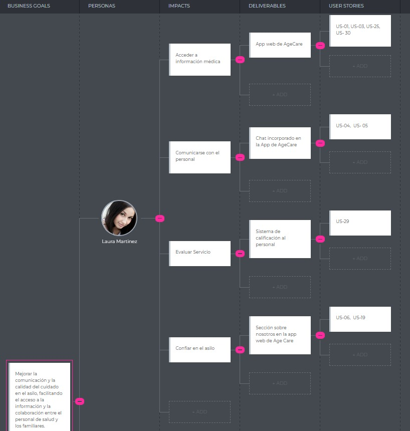
</p>
<p align="center">
  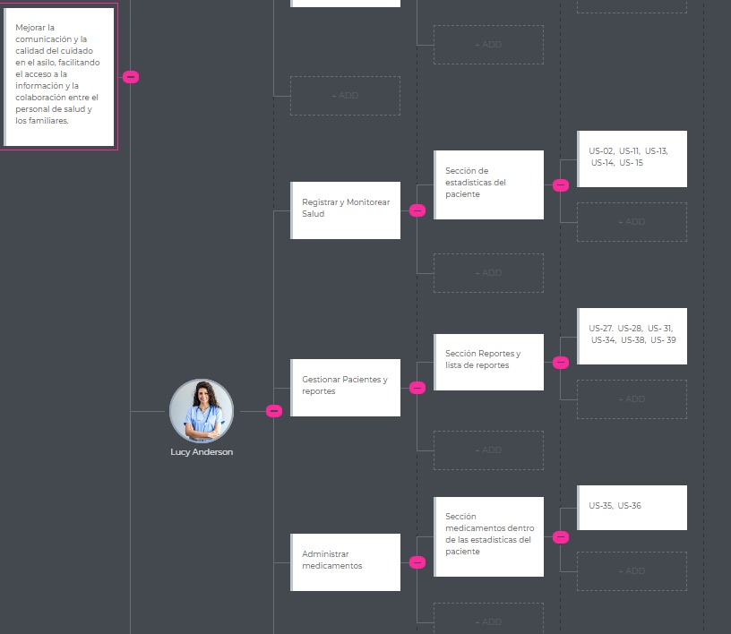
</p>

### 3.4. Product Backlog

El Product Backlog representa la lista priorizada de funcionalidades, mejoras y requerimientos técnicos que forman parte del alcance del sistema AgeCareDB. Cada ítem del backlog responde a una necesidad identificada en los segmentos de usuarios principales (cuidadores y familiares), así como en actores secundarios relevantes (desarrolladores y visitantes).

Este backlog ha sido construido a partir de las historias de usuario previamente definidas, y está organizado de forma que permita una gestión iterativa e incremental del desarrollo del sistema, conforme a los principios de metodologías ágiles.  
**El orden de las historias está determinado por el valor que aportan al negocio**, comenzando con la página pública (Landing Page), seguida de funcionalidades CRUD, el núcleo del sistema, historias técnicas (API), y finalmente funcionalidades complementarias.

> **Enlace al Product Backlog público:**  
> [https://trello.com/invite/b/68267bff8d17b7cdedc81fc0/ATTI9b222886c42338db28af15f683f5af1554589F3D/si729-20251-4328-grupo-1](https://trello.com/invite/b/68267bff8d17b7cdedc81fc0/ATTI9b222886c42338db28af15f683f5af1554589F3D/si729-20251-4328-grupo-1)

| #Orden | User Story Id | Título | Descripción | Story Points |
|--------|----------------|--------|-------------|--------------|
| 1 | US-06 | Conocer los servicios del asilo | Como visitante, quiero conocer los servicios que ofrece el asilo para evaluar si es adecuado. | 3 |
| 2 | US-07 | Leer la misión y visión del proyecto | Como visitante, quiero saber la misión y visión del proyecto para entender su propósito. | 2 |
| 3 | US-08 | Visualizar preguntas frecuentes | Como visitante, quiero leer preguntas frecuentes para resolver dudas básicas. | 2 |
| 4 | US-31 | Registrar doctor | Como administrador, quiero registrar la información de un doctor para mantener actualizada la base de datos médica del asilo. | 3 |
| 5 | US-32 | Editar doctor existente | Como administrador, quiero poder actualizar los datos de un doctor para corregir información o reflejar cambios en el personal. | 2 |
| 6 | US-33 | Crear perfil de enfermero | Como administrador, quiero registrar el perfil de un enfermero para tener un control del personal asistencial disponible. | 3 |
| 7 | US-34 | Registrar medicina | Como personal médico, quiero registrar nuevas medicinas en el sistema para controlar su uso en el tratamiento de los residentes. | 3 |
| 8 | US-35 | Eliminar medicina caducada | Como personal médico, quiero eliminar medicinas caducadas del sistema para evitar su uso por error. | 2 |
| 9 | US-38 | Registrar residente desde el frontend | Como cuidador o administrador, quiero registrar un nuevo residente desde una interfaz visual para facilitar su ingreso al sistema. | 3 |
| 10 | US-01 | Ver estado de salud del residente | Como familiar, quiero ver el estado de salud actualizado del residente para estar informado. | 5 |
| 11 | US-03 | Recibir alertas críticas | Como familiar, quiero recibir una alerta cuando la salud del residente esté en riesgo. | 5 |
| 12 | US-11 | Ver actividades diarias | Como familiar, quiero ver las actividades realizadas por mi ser querido para saber si participa y está activo. | 3 |
| 13 | US-12 | Registrar actividad del residente | Como cuidador, quiero registrar las actividades del residente para tener un seguimiento de su rutina diaria. | 3 |
| 14 | US-13 | Evaluar estado emocional del residente | Como cuidador, quiero registrar una evaluación emocional diaria para dar seguimiento a su bienestar psicológico. | 3 |
| 15 | US-14 | Consultar historial emocional del residente | Como familiar, quiero consultar el historial emocional del residente para comprender mejor su estado mental a lo largo del tiempo. | 3 |
| 16 | US-25 | Ver reporte semanal de estado del residente | Como familiar, quiero ver un reporte semanal de salud para entender la evolución general. | 5 |
| 17 | US-30 | Recibir recordatorios para revisar informes | Como familiar, quiero recibir recordatorios semanales para revisar los reportes y estar al tanto del estado del residente. | 2 |
| 18 | US-26 | Descargar reporte en PDF | Como familiar, quiero descargar el reporte semanal en formato PDF para archivarlo o compartirlo. | 2 |
| 19 | US-15 | Filtrar residentes por estado de salud | Como cuidador, quiero filtrar a los residentes según su estado de salud para priorizar la atención. | 3 |
| 20 | US-27 | Ver tendencias de salud por categoría | Como cuidador, quiero ver tendencias por categorías (nutrición, movilidad, ánimo) para ajustar planes de cuidado. | 5 |
| 21 | US-28 | Ver lista de residentes asignados | Como cuidador, quiero ver solo a los residentes que tengo asignados para optimizar mi trabajo. | 2 |
| 22 | US-36 | Generar reporte clínico por paciente | Como cuidador o médico, quiero registrar reportes clínicos por paciente para documentar diagnósticos y tratamientos aplicados. | 3 |
| 23 | US-37 | Consultar historial clínico del paciente | Como personal autorizado, quiero consultar el historial clínico de un paciente para entender su evolución médica. | 3 |
| 24 | US-39 | Gestionar reportes clínicos | Como doctor o encargado, quiero registrar, editar y eliminar reportes clínicos desde un formulario, para mantener actualizada la información médica del paciente. | 5 |
| 25 | US-09 | Consultar API de residentes (GET) | Como developer, quiero consultar el listado de residentes mediante la API para integrarlo al frontend. | 2 |
| 26 | US-10 | Validar credenciales del API | Como developer, quiero autenticarme con token para acceder a los servicios protegidos del API. | 1 |
| 27 | US-20 | Registrar un nuevo residente (API) | Como developer, quiero registrar un nuevo residente en la base de datos a través del API. | 2 |
| 28 | US-21 | Actualizar datos del residente (API) | Como developer, quiero actualizar los datos personales o médicos de un residente vía API. | 2 |
| 29 | US-22 | Obtener historial de actividades (API) | Como developer, quiero obtener el historial de actividades de un residente para mostrarlo en su perfil. | 3 |
| 30 | US-23 | Eliminar registro médico (API) | Como developer, quiero eliminar un registro médico incorrecto desde el API. | 2 |
| 31 | US-24 | Consultar métricas de salud (API) | Como developer, quiero obtener métricas resumidas del estado de un residente para visualizaciones en el dashboard. | 3 |
| 32 | US-04 | Enviar mensajes al personal | Como familiar, quiero enviar mensajes al personal para consultar sobre el residente. | 3 |
| 33 | US-05 | Ver respuestas del personal | Como familiar, quiero leer las respuestas a mis consultas para mantenerme informado. | 3 |
| 34 | US-29 | Evaluar la calidad del servicio | Como familiar, quiero dejar una evaluación de la atención brindada para contribuir con la mejora del servicio. | 2 |
| 35 | US-16 | Ver equipo profesional del asilo | Como visitante, quiero conocer el equipo profesional del asilo para confiar en su experiencia y formación. | 2 |
| 36 | US-17 | Solicitar información desde la web | Como visitante, quiero llenar un formulario de contacto para recibir más información personalizada sobre los servicios. | 3 |
| 37 | US-18 | Ver testimonios y casos de éxito | Como visitante, quiero leer experiencias reales para sentir confianza en el servicio. | 2 |
| 38 | US-19 | Descargar folleto informativo | Como visitante, quiero descargar un folleto para compartir la información del servicio con otros miembros de mi familia. | 3 |


## Capítulo IV: Product Design

### 4.1. Style Guidelines

En esta sección, sentamos las bases para contar con un repositorio central y organizado de uso común para todo el equipo, que incluye assets, fonts, etc. Esto con el fin de mantener una presentación consistente y enfocada.

#### 4.1.1. General Style Guidelines

#### Branding

Buscamos reflejar confianza, cuidado y tecnología humana. Asi que para brindar protección, salud y conexión familiar, debemos integrar íconos sutiles como corazones, hogares o siluetas de adultos mayores con una tipografía clara y moderna. El branding se construye sobre la base de:

- **Misión:** Proporcionar soluciones tecnológicas que prioricen el bienestar.  
- **Visión:** Crear entornos dignos y seguros para adultos mayores usando tecnología.

#### Logo

Queremos transmitir una imagen contemporánea a través de este diseño, utilizando un logotipo minimalista en tonos azules para reforzar este concepto.


#### Typography

La tipografía debe transmitir claridad, calidez y profesionalismo. Por esa razón decidimos usar **Open Sans**, ya que tiene un diseño limpio y sencillo, lo que facilita la lectura en pantallas.

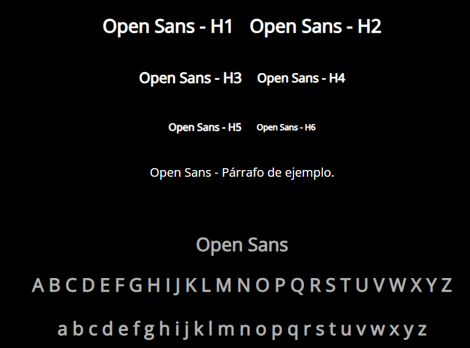

#### Colors

Elegimos los siguientes colores buscando plasmar una paleta relajante y profesional:


#### Spacing

Para nuestro proyecto, el espaciado es crucial para garantizar la legibilidad y accesibilidad, así que por eso tomamos estas decisiones:

- **Espaciado entre párrafos:** Dejar un espacio adicional entre párrafos, equivalente a al menos el tamaño de una línea completa. Esto ayuda a separar visualmente las ideas.  
- **Espaciado entre elementos interactivos:** 8-12 píxeles de espacio entre botones, enlaces o cualquier elemento clicable. Esto evitará errores al tocar en pantallas táctiles.  
- **Márgenes y padding:** Usar márgenes generosos de 16-24 píxeles alrededor del contenido para evitar que se sienta abarrotado.

#### Tono de Comunicación

| Dimensión              | Nivel Adoptado    |
|------------------------|-------------------|
| Divertido/Serio        | Medio-Serio       |
| Formal/Casual          | Semi-Formal       |
| Respetuoso/Irreverente | Muy Respetuoso    |
| Entusiasta/Sereno      | Sereno y Empático |

Decidimos mantener una comunicación clara, cálida y profesional, porque este enfoque nos permite conectar de manera efectiva con el público, especialmente en un contexto tan sensible como el cuidado de personas mayores. 

#### 4.1.2. Web Style Guidelines

#### **Diseño Responsive**

Para asegurar que la página se ajuste correctamente a distintos tamaños de pantalla y que el contenido siga siendo comprensible y visualmente atractivo, se empleará CSS junto con media queries. Estas herramientas permitirán definir estilos específicos según la resolución del dispositivo. Elementos fundamentales, como la barra de navegación y el pie de página, se adaptarán automáticamente para garantizar una experiencia óptima en diversos dispositivos. Siguiendo los siguientes breakpoints:

| Dispositivo     | Ancho mínimo | Ejemplo de uso            |
|-----------------|--------------|----------------------------|
| Mobile          | ≥ 320px      | Teléfonos                  |
| Tablet          | ≥ 768px      | iPad / tablets genéricas   |
| Laptop  | ≥ 1024px     | Monitores y laptops        |
| Wide Screen     | ≥ 1440px     | Pantallas grandes o TV     |

#### **Navegación**

Usaremos un menú de hamburguesa en dispositivos móviles para optimizar el espacio disponible, mientras que el menú horizontal nos permitirá acceder de manera inmediata a las opciones principales, mejorando la navegación y la experiencia del usuario.

#### **Imágenes**

Emplearemos los formatos de imagen JPEG y PNG para garantizar una calidad visual óptima. Asimismo, se definirán tamaños específicos y se aplicarán técnicas de compresión para optimizar el rendimiento del sitio web sin afectar la nitidez de las imágenes.

#### **Interacción del Usuario**

Se implementarán animaciones sutiles para mostrar imágenes y textos informativos sobre el servicio. En computadoras portátiles y PCs, será suficiente desplazarse por la página para visualizar todo el contenido y disfrutar de estas interacciones dinámicas

### 4.2. Information Architecture

#### 4.2.1. Organization Systems

Nuestro objetivo es ofrecer una experiencia de usuario fluida y consistente, tanto en nuestra página web como en nuestra aplicación móvil. A continuación, presentamos la estructura visual, diseñada estratégicamente para ajustarse a las necesidades de nuestros dos segmentos objetivos.

Ambos segmentos tienen acceso a las mismas secciones, pero la diferencia principal está en los permisos. Mientras que los médicos pueden gestionar y generar reportes médicos o programar citas, los familiares solo tienen acceso a la visualización de reportes y estadísticas, pudiendo comunicarse con los médicos únicamente en casos de emergencia o dudas específicas.

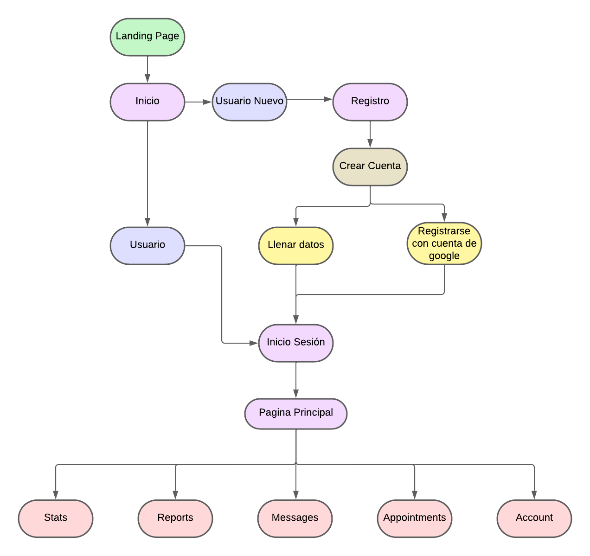

Como se ve en el diagrama, se sigue un proceso estructurado para facilitar la gestión de la salud de los pacientes, permitiendo la interacción entre médicos y familiares. Aquí explicamos cada etapa del proceso y las funciones disponibles:

1. **Landing Page**: Es la página de inicio donde los usuarios pueden explorar la aplicación y conocer sus beneficios.

2. **Inicio**: Los usuarios pueden iniciar sesión si ya tienen una cuenta o registrarse como nuevos usuarios.

3. **Registro**:
   - **Crear Cuenta**: Los nuevos usuarios ingresan sus datos manualmente.
   - **Registrarse con Google**: Opción para facilitar el acceso mediante una cuenta de Google.
   - **Llenar Datos**: Se completa un formulario con información personal.

4. **Inicio de Sesión**: Los usuarios existentes ingresan sus credenciales para acceder a la plataforma.

5. **Página Principal**: Una vez dentro, los usuarios pueden acceder a diversas funcionalidades.

6. **Stats**: Los médicos y familiares pueden visualizar estadísticas sobre la salud del paciente.

7. **Reports**: Se generan reportes detallados sobre el estado y evolución del paciente.

8. **Messages**: Comunicación directa entre médicos y familiares para compartir información relevante.

9. **Appointments**: Gestión de citas médicas, permitiendo la programación y seguimiento de consultas.

10. **Account**: Configuración de la cuenta, donde los usuarios pueden actualizar su información personal.

Este flujo de trabajo permite que los médicos tomen decisiones informadas sobre la salud del paciente y que los familiares estén al tanto de su evolución.

#### 4.2.2. Labeling Systems

Los sistemas de etiquetado seguirán la misma estructura presentada en Organization Systems. El usuario podrá seleccionar el encabezado de su interés y, al hacer clic, será dirigido automáticamente a la sección correspondiente dentro de la plataforma.

##### Secciones y contenido de la Landing Page

| **Sección**  | **Contenido** |
|-------------|--------------|
| **Página Principal** | Es el primer punto de contacto con AgeCare. Aquí se introduce la aplicación, explicando su propósito, misión y visión, además de resaltar sus beneficios para la gestión de la salud de los pacientes. |
| **About** | Proporciona una descripción detallada de las herramientas y funcionalidades que ofrece AgeCare. Se explican los módulos principales, cómo interactúan los médicos y familiares, y los beneficios del uso de la aplicación. |
| **Premium** | Sección dedicada a mostrar las ventajas de la versión premium. Se destacan características adicionales como reportes avanzados, integración con otros sistemas de salud y opciones de personalización que no están disponibles en la versión gratuita. |
| **Contacto** | Espacio donde los usuarios pueden encontrar los canales de comunicación con el equipo de soporte. Se incluyen redes sociales, un correo de asistencia técnica y un correo para consultas de negocios o colaboraciones. |
| **Log In** | Sección que permite a los usuarios acceder a su cuenta de AgeCare. En caso de no tener una, se ofrece la opción de registrarse y completar su perfil para aprovechar todas las funcionalidades. |


##### Secciones y contenido de AgeCare

| **Sección**  | **Contenido** |
|-------------|--------------|
| **Home** | En la página principal, los usuarios pueden acceder rápidamente a las funciones clave de la plataforma. |
| **Stats** | Sección donde los médicos y familiares pueden visualizar datos estadísticos sobre la salud del paciente, incluyendo evolución de signos vitales y patrones de comportamiento. |
| **Reports** | Espacio dedicado a la generación de informes detallados sobre el estado del paciente, facilitando el seguimiento médico con gráficos y registros históricos. |
| **Messages** | Permite la comunicación directa entre médicos y familiares, asegurando que todos estén informados sobre tratamientos, evolución y cuidados especiales. |
| **Appointments** | Módulo para la gestión de citas médicas, donde se pueden programar, modificar y recibir recordatorios sobre consultas y seguimientos. |
| **Account** | Sección para la administración del perfil del usuario, permitiendo la actualización de datos personales, preferencias y configuración de accesibilidad. |

#### 4.2.3. SEO Tags and Meta Tags

La **Landing Page** está diseñada para atraer nuevos usuarios, informar sobre la propuesta de valor y generar confianza en la marca.  Las etiquetas meta se centran en captar tráfico orgánico de personas interesadas en tecnología para el cuidado de adultos mayores.


**Título de la página (Title)**

El título resume de forma directa el propósito del sitio, incluyendo las palabras clave **"tecnología"**, **"bienestar"** y **"adultos mayores"**, que son términos con alta relevancia SEO para nuestro público objetivo.

```html
<title>RedVital – Tecnología para el bienestar de los adultos mayores</title>
```

**Meta descripción (Meta Description)**

La meta descripción ofrece una vista clara del valor que ofrece la plataforma, motivando al clic desde los resultados de búsqueda.

```html
<meta name="description" content="AgeCare es una plataforma digital que mejora la calidad de vida de los residentes en asilos, conectando a sus familias con información en tiempo real.">
```

**Palabras clave (Meta Keywords)**

Los términos elegidos cubren conceptos clave relacionados con el contexto de uso de AgeCareDB, permitiendo un mayor alcance en búsquedas asociadas.

```html
<meta name="keywords" content="asilos, adultos mayores, salud emocional, bienestar, plataforma digital, monitoreo, cuidados geriátricos, comunicación familiar">
```


**Autor del sitio (Meta Author)**

La etiqueta autor identifica al equipo creador, útil para fines de propiedad y referencia en motores de búsqueda.

```html
<meta name="author" content="Equipo AgeCare">
```

#### 4.2.4. Searching Systems

Para facilitar que los usuarios (familiares, medicos) naveguen entre grandes volúmenes de información, evitando que se sientan perdidos y garantizando una experiencia ágil y eficiente, se tomaron las siguientes decisiones para el sistema de búsqueda:

#### **Búsqueda Global**  

La búsqueda global permite a los usuarios introducir palabras clave y recibir resultados de diferentes módulos de la aplicación. Esto garantiza que cualquier tipo de información pueda localizarse de forma inmediata. 

#### **Filtrado de Información**  

- **Búsqueda en Reportes:** El módulo de reportes incluirá una función de búsqueda que permitirá localizar registros médicos específicos. Los usuarios podrán aplicar filtros por historial clínico, fecha y paciente, asegurando un acceso rápido a la información crítica sin necesidad de recorrer manualmente grandes volúmenes de datos.  

- **Búsqueda en Mensajes:**  El apartado de mensajería contará con un sistema de búsqueda que facilitará la recuperación de conversaciones clave entre médicos y familiares. Esta funcionalidad será útil para revisar indicaciones médicas, aclaraciones sobre tratamientos y otras comunicaciones relevantes dentro de la plataforma.  

- **Búsqueda de Citas Médicas:**  El sistema de búsqueda también permitirá encontrar citas médicas mediante criterios como fecha, tipo de consulta y médico asignado. Esto ayudará a los usuarios a acceder a detalles importantes sobre futuras consultas.  

Mediante estos sistemas, se busca eficiencia y la accesibilidad dentro de la aplicación, reduciendo tiempos de búsqueda y facilitando la comunicación entre médicos y familiares. Gracias a una estructura intuitiva, los usuarios podrán encontrar la información que necesitan de manera rápida y sin esfuerzo.

#### 4.2.5. Navigation Systems

Organizamos las secciones, permitiendo a los usuarios desplazarse sin dificultad entre distintas funcionalidades. La navegación está basada en una barra de menú principal, accesos rápidos y una estructura jerárquica clara que guía al usuario en su recorrido.

#### **Estructura de Navegación en la Landing Page**
 La landing page consta de las siguientes secciones principales:

| **Sección**  | **Descripción** |
|-------------|--------------|
| **Página Principal** | Introduce AgeCare, su propósito, misión y visión. Desde aquí, los usuarios pueden acceder rápidamente a las funciones clave. |
| **About** | Explica las herramientas principales de AgeCare, cómo funcionan y cómo ayudan a médicos y familiares. |
| **Premium** | Presenta las ventajas de la versión premium, con características adicionales para un mejor monitoreo de la salud del paciente. |
| **Contacto** | Incluye enlaces a redes sociales, un correo de asistencia técnica y otro para consultas de negocio. |
| **Log In** | Permite a los usuarios acceder a su cuenta o registrarse en la plataforma. |

#### **Estructura de Navegación en AgeCare**
 La aplicación consta de las siguientes secciones principales:

| **Sección**  | **Descripción** |
|-------------|--------------|
| **Home** | Muestra un resumen de AgeCare y acceso rápido a las principales funciones. |
| **Stats** | Proporciona gráficos y datos sobre la evolución de la salud del paciente, permitiendo un seguimiento detallado. |
| **Reports** | Ofrece la generación y visualización de informes médicos organizados por fecha y categoría. |
| **Messages** | Facilita la comunicación entre médicos y familiares, asegurando un intercambio efectivo de información. |
| **Appointments** | Permite la gestión de citas médicas, con opciones para programar y recibir notificaciones de próximas consultas. |
| **Account** | Sección dedicada a la administración del perfil del usuario, permitiendo la actualización de datos y configuración personalizada. |

#### Accesibilidad y navegación predictiva
AgeCare incorpora accesos rápidos para funciones esenciales, facilitando la interacción con la plataforma. Además, utiliza navegación predictiva, sugiriendo secciones según el comportamiento del usuario y sus necesidades frecuentes, lo que mejora la eficiencia del sistema. Este sistema de navegación garantiza una experiencia intuitiva dentro de AgeCare, facilitando el acceso a la información.

### 4.3. Landing Page UI Design

#### 4.3.1. Landing Page Wireframe
Los siguientes wireframes representan una visión más cercana al diseño final de la landing page. A través de estas wireframes, se podrá explorar cómo se organiza la página, qué funcionalidades estarán disponibles y cómo los usuarios interactuarán con ella.


#### 4.3.2. Landing Page Mock-up
Los siguientes mockups representan una visión más cercana a la landing Page de AgeCare:

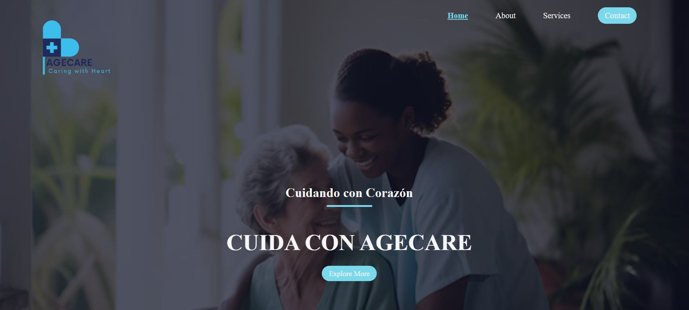

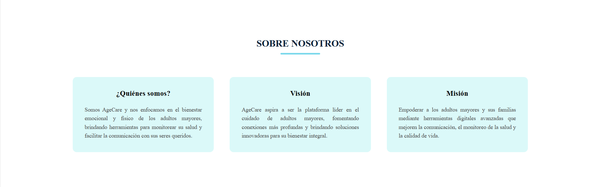

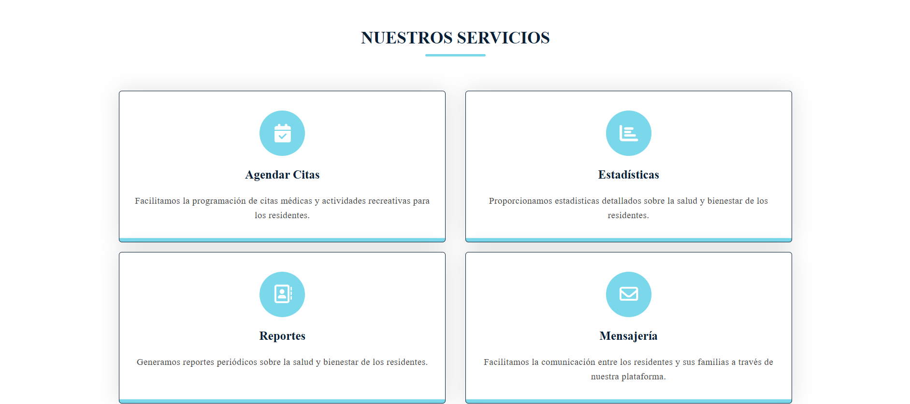

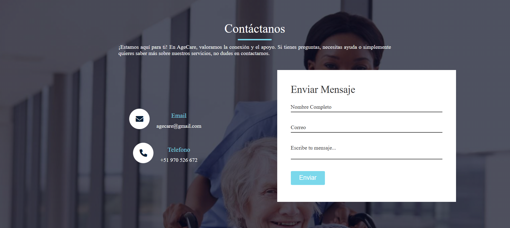

### 4.4. Web Applications UX/UI Design

#### 4.4.1. Web Applications Wireframes

Las siguientes wireframes representan la estructura inicial y funcionalidad clave de AgeCare, nuestra plataforma digital diseñada para mejorar la calidad de vida de los adultos mayores en asilos y fortalecer la conexión con sus familiares.
Estas pantallas buscan reflejar una interfaz intuitiva. Cada componente ha sido pensado para facilitar la visualización del estado de salud físico y emocional de los residentes, optimizar los procesos internos del asilo y promover una comunicación fluida entre todos los involucrados.

A través de estas wireframes, se podrá explorar cómo se organiza la información, qué funcionalidades estarán disponibles en cada módulo, y cómo los usuarios interactuarán con la plataforma para cumplir con nuestra misión: priorizar el bienestar de los residentes y brindar tranquilidad a sus familias mediante soluciones tecnológicas innovadoras.

<p align="center">
  
</p>

<p align="center">
  
</p>

<p align="center">
   
</p>

<p align="center">
  
</p>

<p align="center">
  
</p>

<p align="center">
  
</p>

<p align="center">
  
</p>

<p align="center">
  
</p>

<p align="center">
  
</p>

<p align="center">
  
</p>

<p align="center">
  
</p>

#### 4.4.2. Web Applications Wireflow Diagrams

<p align="center">
  
</p>

<p align="center">
  
</p>

#### 4.4.3. Web Applications Mock-ups

Los siguientes mockups representan una visión más cercana al diseño final de AgeCare, nuestra solución tecnológica enfocada en mejorar la experiencia dentro de los asilos de ancianos.
Cada pantalla ha sido cuidadosamente diseñada para reflejar una interfaz moderna, amigable e intuitiva, pensada para usuarios con distintos niveles de experiencia digital: desde familiares que buscan información clara y rápida, hasta personal de salud que necesita registrar datos de forma eficiente.

<p align="center">
  
</p>

<p align="center">
  
</p>

<p align="center">
   
</p>

<p align="center">
  
</p>

<p align="center">
  
</p>

<p align="center">
  
</p>

<p align="center">
  
</p>

<p align="center">
  
</p>

<p align="center">
  
</p>

<p align="center">
  
</p>

<p align="center">
  
</p>

#### 4.4.4. Web Applications User Flow Diagrams

<p align="center">
  
</p>

### 4.5. Web Applications Prototyping

<p align="center">
  
</p>

Link: https://www.figma.com/proto/amrMbK6r2R7ws36HjXJSwK/Mockup?node-id=2-3632&t=o24brncKf6wW1q6w-1

### 4.6. Domain-Driven Software Architecture

#### 4.6.1. Software Architecture Context Diagram

<p align="center">
  
</p>

#### 4.6.2. Software Architecture Container Diagrams

<p align="center">
  
</p>

#### 4.6.3. Software Architecture Components Diagrams

<p align="center">
  
</p>

### 4.7. Software Object-Oriented Design

#### 4.7.1. Class Diagrams

<p align="center">
  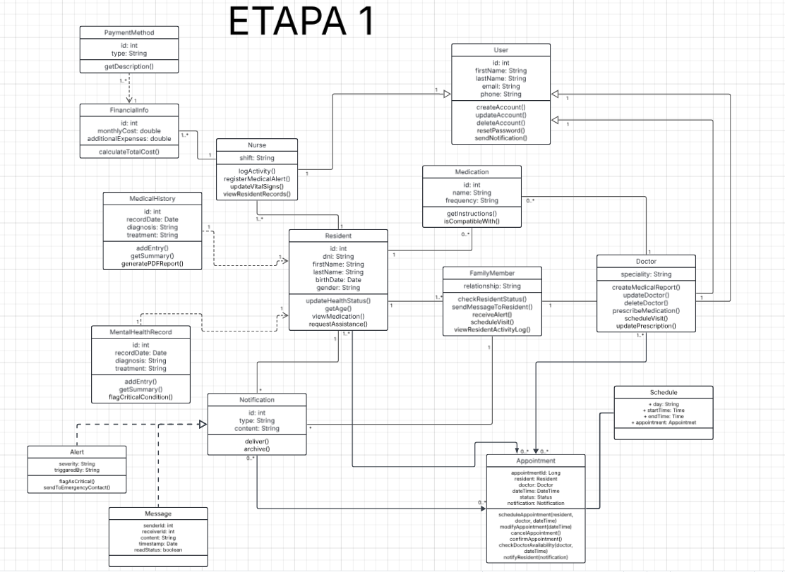
</p>

#### Se muestra la etapa 2 distribuida en Bounded Context

<p align="center">
  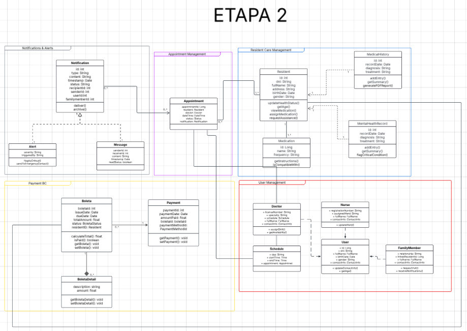
</p>

#### Se visualiza la etapa 3 en la que cada Bounded Context ha sido distribuido en aggregates, entities y value objects

<p align="center">
  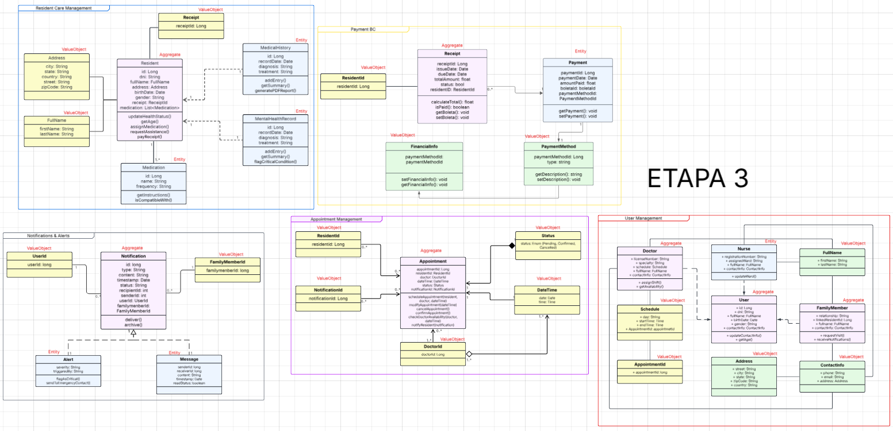
</p>


Link del diagrama de clases para una mejor visualización: https://lucid.app/lucidchart/be00e574-bbb5-48db-97c0-8dcd6397d7b3/edit?viewport_loc=-3376%2C-5634%2C5057%2C2480%2C0_0&invitationId=inv_472a9f56-96c6-42fd-a8c0-67a7ea895576

### 4.7.2 Class Dictionary

---

### PaymentMethod  
**Descripción**: Métodos de pago disponibles en el sistema.

Campo         | Tipo       | Descripción
--------------|------------|-------------------------------------------------
id            | int        | Identificador del método de pago  
type          | String     | Tipo de método de pago (ej. tarjeta, efectivo)

**Métodos**:
- getDescription(): String

---

### FinancialInfo  
**Descripción**: Información financiera del residente.

Campo              | Tipo       | Descripción
-------------------|------------|---------------------------------------------
id                 | int        | Identificador financiero  
monthlyCost        | double     | Costo mensual del servicio  
additionalExpenses | double     | Gastos adicionales

**Métodos**:
- calculateTotalCost(): double

---

### User  
**Descripción**: Usuario general del sistema.

Campo     | Tipo   | Descripción
----------|--------|--------------------------------------
id        | int    | Identificador único  
firstName | String | Nombres del usuario  
lastName  | String | Apellidos del usuario  
email     | String | Correo electrónico  
phone     | String | Número telefónico  

**Métodos**:
- createAccount(): void  
- updateAccount(): void  
- deleteAccount(): void  
- resetPassword(): void  
- sendNotification(): void

---

### Nurse  
**Descripción**: Enfermera encargada de cuidados clínicos.

Campo | Tipo   | Descripción
------|--------|-------------------------------
shift | String | Turno asignado a la enfermera

**Métodos**:
- logActivity(): void  
- registerMedicalAlert(): void  
- updateVitalSigns(): void  
- viewResidentRecords(): void

---

### MedicalHistory  
**Descripción**: Historial médico de un residente.

Campo       | Tipo   | Descripción
------------|--------|-----------------------------------
id          | int    | ID del historial  
recordDate  | Date   | Fecha del registro  
diagnosis   | String | Diagnóstico médico  
treatment   | String | Tratamiento aplicado  

**Métodos**:
- addEntry(): void  
- getSummary(): String  
- generatePDFReport(): void

---

### MentalHealthRecord  
**Descripción**: Registro del estado de salud mental del residente.

Campo       | Tipo   | Descripción
------------|--------|-------------------------------
id          | int    | Identificador del registro  
recordDate  | Date   | Fecha del diagnóstico  
diagnosis   | String | Diagnóstico  
treatment   | String | Tratamiento aplicado  

**Métodos**:
- addEntry(): void  
- getSummary(): String  
- flagCriticalCondition(): void

---

### Resident  
**Descripción**: Adulto mayor residente del hogar.

Campo      | Tipo   | Descripción
-----------|--------|-----------------------------
id         | int    | Identificador  
dni        | String | DNI  
firstName  | String | Nombres  
lastName   | String | Apellidos  
birthDate  | Date   | Fecha de nacimiento  
gender     | String | Género  

**Métodos**:
- updateHealthStatus(): void  
- getAge(): int  
- viewMedication(): void  
- requestAssistance(): void

---

### Medication  
**Descripción**: Medicamento registrado para un residente.

Campo      | Tipo   | Descripción
-----------|--------|----------------------------
id         | int    | Identificador  
name       | String | Nombre del medicamento  
frequency  | String | Frecuencia de administración  

**Métodos**:
- getInstructions(): String  
- isCompatibleWith(): boolean

---

### FamilyMember  
**Descripción**: Familiar de un residente.

Campo        | Tipo   | Descripción
-------------|--------|---------------------------------------
relationship | String | Relación con el residente  

**Métodos**:
- checkResidentStatus(): void  
- sendMessageToResident(): void  
- receiveAlert(): void  
- scheduleVisit(): void  
- viewResidentActivityLog(): void

---

### Doctor  
**Descripción**: Médico que atiende a los residentes.

Campo      | Tipo   | Descripción
-----------|--------|-----------------------------------
speciality | String | Especialidad del médico  

**Métodos**:
- createMedicalReport(): void  
- updateDoctor(): void  
- deleteDoctor(): void  
- prescribeMedication(): void  
- scheduleVisit(): void  
- updatePrescription(): void

---

### Notification  
**Descripción**: Notificaciones enviadas por el sistema.

Campo   | Tipo   | Descripción
--------|--------|--------------------------
id      | int    | Identificador  
type    | String | Tipo de notificación  
content | String | Contenido del mensaje  

**Métodos**:
- deliver(): void  
- archive(): void

---

### Alert  
**Descripción**: Alertas médicas automáticas o manuales.

Campo          | Tipo   | Descripción
---------------|--------|-------------------------------
severity       | String | Nivel de severidad de la alerta  
triggerTime    | String | Hora del disparo de la alerta  
flaggedStatus  | String | Estado marcado  

**Métodos**:
- sendToEmergencyContact(): void

---

### Message  
**Descripción**: Mensajes entre usuarios o del sistema.

Campo     | Tipo   | Descripción
----------|--------|----------------------------
id        | int    | Identificador del mensaje  
sender    | String | Emisor del mensaje  
receiver  | String | Receptor del mensaje  
content   | String | Contenido del mensaje  
timestamp | String | Fecha y hora del envío  

**Métodos**:
- send(): void  
- delete(): void  
- archive(): void

---

### Appointment  
**Descripción**: Citas programadas para residentes.

Campo        | Tipo    | Descripción
-------------|---------|----------------------------
id           | int     | Identificador de la cita  
date         | Date    | Fecha de la cita  
time         | Time    | Hora de la cita  
location     | String  | Lugar de la cita  
doctorName   | String  | Nombre del doctor  
residentName | String  | Nombre del residente  

**Métodos**:
- createAppointment(): void  
- rescheduleAppointment(): void  
- cancelAppointment(): void  
- updateAppointmentDetails(): void  
- notifyParticipants(): void

---

### Schedule  
**Descripción**: Representa la programación de citas o eventos.

Campo        | Tipo     | Descripción
-------------|----------|-------------------------------
day          | String   | Día programado  
time         | Time     | Hora programada  
appointment  | Appointment | Cita asignada

---


#### 4.8 Database Design

#### 4.8.1. Database Diagram
Para la elección de cómo relacionar las entidades, primero nos basamos en buscar tablas principales. Por ejemplo, en el sistema de gestión de proyectos, las entidades principales incluyen Resident, NursingHome, Doctor, Nurse, ResidentMedication y MedicalHistory. Basándonos en ellas como punto de partida es que se nos hizo más sencillo y lógico la relación con las otras entidades. Esto nos ayudó a modelar eficazmente los datos y asegurar la coherencia de la información en nuestra aplicación.

<p align="center">
  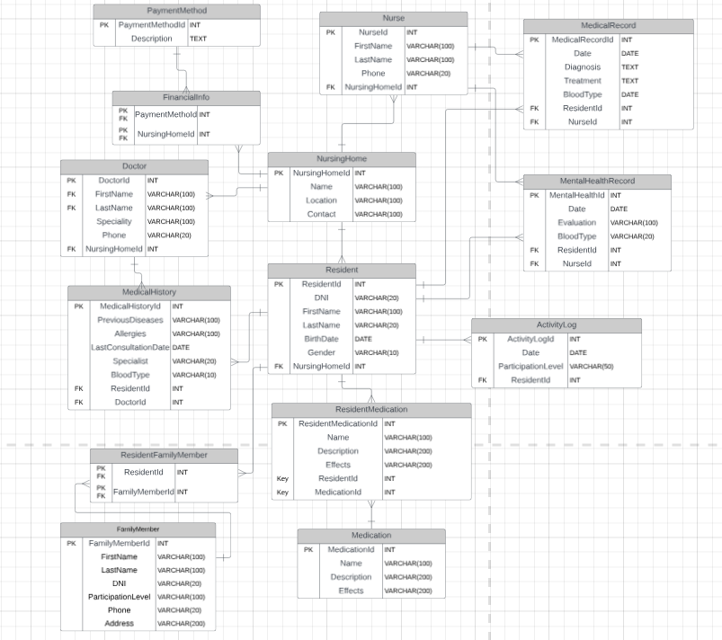
</p>

## Capítulo V: Product Implementation, Validation & Deployment

### 5.1. Software Configuration Management

En este apartado se establecen los lineamientos y procedimientos adoptados durante el desarrollo y publicación del sitio web de AgeCare, con el propósito de asegurar la coherencia y estabilidad del software desde sus primeras etapas hasta su implementación y posterior mantenimiento.

### 5.1.1. Software Development Environment Configuration

#### Project Management

Para una gestión eficiente del proyecto, se hizo necesaria la implementación de un conjunto de herramientas destinadas a la asignación de tareas, la facilitación de reuniones y la colaboración entre los integrantes. Asimismo, se empleó un repositorio centralizado para consolidar los avances de manera coordinada. A continuación, se presentan las plataformas seleccionadas junto con su respectivo propósito dentro del marco del proyecto.
- **Centro de organización de trabajo:** Github  
- **Planificación de tareas:** Trello  
- **Reuniones de equipo:** Google Meet  
- **Coordinación grupal:** WhatsApp  

#### Requirement Management

Durante el desarrollo del proyecto se recurrió a diversas herramientas que facilitaron la definición, análisis y representación visual de los requerimientos técnicos y funcionales. Estas plataformas promovieron una planificación estructurada y una mayor claridad en el diseño conceptual del sistema:

| Herramienta   | Descripción                                                                                                     | Enlace                                      |
|---------------|-----------------------------------------------------------------------------------------------------------------|---------------------------------------------|
| **Trello**        | Herramienta de organización de proyectos basada en tableros y tarjetas, empleada para distribuir tareas entre los miembros del equipo y hacer seguimiento al progreso de cada fase del desarrollo. | [trello.com](https://trello.com/)           |
| **Uxpressia**     | Aplicación digital utilizada para el diseño de mapas estratégicos, como *Impact Mapping*, lo cual permitió vincular los objetivos del negocio con las funcionalidades del producto de forma clara y visual. | [uxpressia.com](https://uxpressia.com/)     |
| **Structurizr**   | Plataforma de modelado arquitectónico que facilita la construcción de diagramas C4, permitiendo representar la estructura lógica del sistema y su interacción entre componentes de manera estandarizada. | [structurizr.com](https://www.structurizr.com/) |
| **Lucidchart**    | Entorno colaborativo de diagramación empleado para desarrollar modelos técnicos como diagramas de clases y estructuras de bases de datos, fundamentales en la definición de la arquitectura del sistema. | [lucidchart.com](https://www.lucidchart.com/) |

---

#### Product UX/UI Design

El diseño de la experiencia de usuario y de la interfaz visual se abordó mediante herramientas especializadas que posibilitaron la creación de prototipos gráficos y esquemas de navegación. Esto permitió validar la estructura de la aplicación antes de su implementación:

| Herramienta | Descripción                                                                                          | Enlace                              |
|-------------|------------------------------------------------------------------------------------------------------|-------------------------------------|
| **Figma**   | Plataforma de diseño colaborativo en línea que permitió a los miembros del equipo crear y editar en tiempo real wireframes y mockups, asegurando la coherencia visual y funcional de la landing page. | [figma.com](https://www.figma.com/) |

---

#### Software Development

Para el desarrollo de la página web, se emplearon lenguajes de programación y etiquetado esenciales para crear la estructura, el diseño y las funcionalidades del sistema. A continuación, se describen las herramientas utilizadas:

| Herramienta    | Descripción                                                                                              | Enlace                                                       |
|----------------|----------------------------------------------------------------------------------------------------------|--------------------------------------------------------------|
| **HTML**       | Lenguaje de marcado fundamental para estructurar el contenido y la disposición de los elementos en la web. | [HTML](https://www.w3schools.com/html/default.asp)           |
| **CSS**        | Lenguaje de diseño que permite aplicar estilos visuales a los elementos estructurados en HTML, mejorando su presentación. | [CSS](https://www.w3schools.com/css/default.asp)             |
| **JavaScript** | Lenguaje de programación orientado a objetos utilizado para agregar interactividad y funcionalidades dinámicas a la página web. | [JavaScript](https://www.w3schools.com/js/default.asp)       |

---

#### Software Documentation

La gestión y documentación del proyecto se llevó a cabo utilizando herramientas que facilitaron la organización y el acceso a la información técnica, asegurando la transparencia y la trazabilidad del desarrollo:

| Herramienta    | Descripción                                                                                              | Enlace                                                       |
|----------------|----------------------------------------------------------------------------------------------------------|--------------------------------------------------------------|
| **GitHub**     | Plataforma de desarrollo colaborativo que también se utilizó para gestionar y alojar la documentación del proyecto. | [GitHub](https://github.com/upc-pre-202510-1asi0729-4328-Lively/OpenSource-4328)  |
| **Markdown**   | Formato de texto ligero utilizado para escribir y estructurar la documentación técnica del proyecto de forma clara y legible. | [markdown.es](https://markdown.es/)                          |

---

#### Software Deployment

Para el despliegue de la landing page, se optó por una plataforma de hosting que permite la publicación directa desde un repositorio de GitHub, garantizando una gestión eficiente del ciclo de vida de la aplicación:

| Herramienta     | Descripción                                                                                              | Enlace                                                       |
|-----------------|----------------------------------------------------------------------------------------------------------|--------------------------------------------------------------|
| **GitHub Pages** | Servicio de GitHub que permite desplegar la aplicación directamente desde el repositorio, facilitando la visualización pública de la página. | [GitHub Pages](https://pages.github.com/)                   |

---


### 5.1.2. Source Code Management

#### Producto y Repositorio

| Producto             | Repositorio        | URL                                                       |
|----------------------|--------------------|------------------------------------------------------------|
| Landing Page         | AgeCare-Landing Page| [LandingPage](https://github.com/upc-pre-202510-1asi0729-4328-Lively/landing-page)     |
| Web Services         | AgeCare-Web Services| [Backend](https://github.com/upc-pre-202510-1asi0729-4328-Lively/Backend-AgeCare) |
| Front Web Application| AgeCare-Frontend    | [Frontend](https://github.com/upc-pre-202510-1asi0729-4328-Lively/Frontend-AgeCare) |

#### Estructura del Repositorio

Hemos organizado el repositorio en ramas específicas para diferentes etapas del desarrollo, garantizando un flujo de trabajo ordenado y eficiente. La estructura de ramas es la siguiente:

- **Main branch** (rama principal): Contiene la versión estable y lista para producción del software.
- **Develop branch**: Contiene el código en desarrollo que se integrará en la rama principal después de ser probado y validado.

Además, para el desarrollo de nuevas funcionalidades, creamos ramas específicas siguiendo las convenciones de nomenclatura:

- **Feature branches**: Ramas dedicadas al desarrollo de nuevas características. La nomenclatura para estas ramas es `feature/nueva-funcionalidad`.

Implementamos **GitFlow**, un modelo de ramificación diseñado por Vincent Driessen, que incluye las siguientes ramas:

- **Main branch**: Rama principal que alberga el código estable y preparado para producción.
- **Develop branch**: Rama de desarrollo donde se integran nuevas funcionalidades y correcciones antes de ser fusionadas a la rama principal.
- **Feature branches**: Creadas a partir de `develop` para añadir nuevas características, siguiendo la nomenclatura `feature/nueva-funcionalidad`.
- **Release branches**: Preparadas para la liberación de nuevas versiones, permitiendo pruebas finales y corrección de errores antes del despliegue a producción.
- **Hotfix branches**: Utilizadas para corregir errores críticos en producción, siguiendo la nomenclatura `hotfix/correccion-critica`.


#### Flujo de trabajo GitFlow

- Una rama de **producción** (`main`).
- Una rama de **pruebas** (`develop`).
- Rama de **hotfix** para corrección de errores críticos (`hotfix/*`).
- Rama de **release** para estabilización y pruebas previas al despliegue (`release/*`).
- Ramas para **features** (`feature/*`).
- Cada cambio en **producción** se considera una nueva versión.
- Cambios en `main` y `develop` requieren aprobación.


#### Mensajes de Commits

Adoptamos el estándar **Conventional Commits** para los mensajes de nuestros commits, lo que facilita la comprensión del historial de cambios y la automatización de versiones. Ejemplos de mensajes son:

- `feat`: Añadir nueva funcionalidad, por ejemplo, `feat: implementar sistema de notificaciones`.
- `fix`: Corregir errores, por ejemplo, `fix: solucionar problema con la validación de datos`.
- `docs`: Actualizar documentación, por ejemplo, `docs: actualizar guía de instalación`.
- `style`: Aplicar formato, por ejemplo, `style: ajustar estilo de código según las pautas`.
- `refactor`: Mejorar el código sin cambiar su funcionalidad, por ejemplo, `refactor: optimizar el rendimiento del módulo de usuario`.
- `test`: Añadir o modificar pruebas, por ejemplo, `test: añadir pruebas para la funcionalidad de autenticación`.


#### Documentación

La documentación del proyecto se encuentra en el archivo `README.md` dentro del repositorio. Este archivo proporciona detalles sobre la configuración, el uso del software y las guías para contribuir al proyecto.


---

### 5.1.3. Source Code Style Guide & Conventions

Para asegurar un código legible, mantenible y estandarizado en todo el equipo, se han adoptado las siguientes convenciones y herramientas:

- **JavaScript / TypeScript**: Se aplican las guías de estilo recomendadas por Microsoft para TypeScript y se utiliza ESLint junto con Prettier para validar el formato, la indentación, los espacios y otros aspectos sintácticos. Las variables y funciones usan camelCase, mientras que las clases e interfaces usan PascalCase.
- **Java**: Se sigue la guía oficial de estilo de Oracle (Java Code Conventions) y se aplica el estándar de Google Java Style mediante Checkstyle. Las constantes se nombran en MAYÚSCULAS_CON_GUIONES, las clases en PascalCase, y los métodos y atributos en camelCase.
- **HTML / CSS**: Se aplican convenciones modernas como el uso de clases CSS en kebab-case, sangría de 2 espacios, y estructura semántica del HTML.

También se ha configurado un archivo `.editorconfig` para asegurar una configuración consistente entre los diferentes editores de código usados por el equipo.
#### HTML

Durante la construcción de la estructura del sitio, se adoptaron las siguientes buenas prácticas para asegurar accesibilidad y organización:

- Escribir todas las etiquetas en minúsculas.
- Asegurar el cierre correcto de todos los elementos.
- Mantener los atributos en minúscula.
- Incluir `alt`, `width` y `height` en imágenes para accesibilidad y control visual.
- Evitar espacios innecesarios dentro de las etiquetas.

**Ejemplo de imagen:**

```html

```

**Etiquetas HTML utilizadas:**

```html
<header>, <nav>, <div>, , <ul>, <li>, <a>, <p>, <button>, <h1>, <h2>, <h3>, <h4>
```

---

#### CSS

Para mantener consistencia en el diseño y facilitar la lectura del código, se aplicaron las siguientes reglas:

- Usar nombres de clases e IDs que sean descriptivos y semánticos.
- Elegir nombres breves pero comprensibles.

```css
#gallery {}
.video {}
```

- Usar propiedades abreviadas siempre que sea posible para mantener el código compacto.

```css
padding: 0 1em 2em;
```

- No utilizar unidades en valores cero.

```css
margin: 0;
padding: 0;
```

- Ordenar las propiedades alfabéticamente para facilitar el escaneo visual.

```css
background: fuchsia;
border: 1px solid;
border-radius: 4px;
color: black;
text-align: center;
text-indent: 2em;
```

---

#### JavaScript

Para lograr un código más claro y mantenible, se establecieron las siguientes prácticas de codificación:

- Utilizar funciones con llaves bien estructuradas.

```js
function myFunc() {
  console.log('Hello!');
}
```

- Usar `lowerCamelCase` para declarar variables.

```js
let playerScore = 0;
```

- Preferir el uso de `let` y `const` sobre `var`.

```js
const myName = 'Chris';
let myAge = 40;
myAge++;
console.log(myAge);
```

- Nombrar las funciones también siguiendo la convención `lowerCamelCase`.

```js
function sayHello() {
  alert('Hello!');
}
```

---

### 5.1.4. Software Deployment Configuration

#### Landing Page

**Consideraciones previas al despliegue:**

1. Archivos en formato HTML, CSS y JS.
2. Publicación en un repositorio de GitHub.
3. Realización de pruebas de funcionamiento (internas y externas).

**Requisitos:**

- Repositorio en GitHub (público).
- Código fuente completo de la landing page.

**Pasos para realizar el despliegue:**

A continuación, se detallan los pasos para desplegar nuestro sitio web utilizando GitHub Pages.

&nbsp;

1. **Despliegue con GitHub Pages**: Primero, accedemos al repositorio en GitHub donde se encuentra el proyecto y luego nos dirigimos a la configuración del repositorio.

   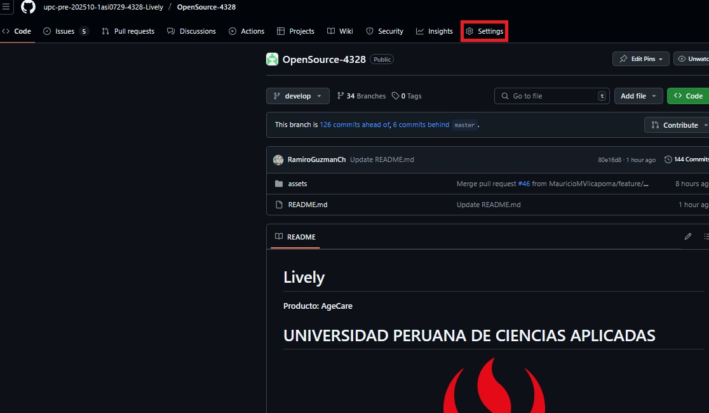

   &nbsp;

3. Dentro del menú de ajustes, seleccionamos la opción "Pages".

   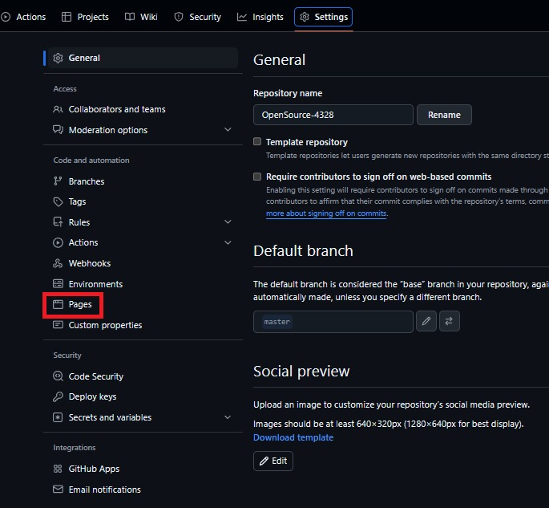
   
---

#### Control de Versiones

**Uso de Git**: Es importante mantener un historial completo de los cambios para gestionar las diferentes versiones del código de manera eficiente.

En la sección de **GitHub Pages**, elegimos la rama principal (`main`) en el menú desplegable de la opción "Branch" y luego hacemos clic en "Save" para guardar los cambios. Después de un breve periodo de espera, obtendremos el enlace a nuestro sitio web, ahora publicado en GitHub Pages.

---

### 5.2. Landing Page, Services & Applications Implementation
#### 5.2.1. Sprint 1

En esta sección se registra el avance del producto y las acciones colaborativas realizadas por el equipo para el Sprint 2.

##### 5.2.1.1. Sprint Planning 1
El Sprint Planning 1 es una reunión esencial para iniciar el primer sprint de un proyecto, donde el equipo define los objetivos y la estrategia para cumplirlos. En este caso, nuestro objetivo principal es implementar la landing page de la aplicación, asegurando una presentación efectiva del producto.

| Sprint #                             | Sprint 1                                                                                               |
|--------------------------------|--------------------------------------------------------------------------------------------------------|
| **Date**       |     2025-04-24        |
| Time           | 1:00 PM                      |
| Location       | Virtual - Meet               |
| Prepared By    | Jeremy Quijada               |
| Attendees (to planning meeting)| Jeremy Quijada, Franco Huang, Fatima Asmad, Mauricio Muñoz, Ramiro Guzman                    |
| Sprint n - 1 Review Summary    | Este es el primer Sprint, por lo que este campo no aplica.                                            |
| Sprint n - 1 Retrospective Summary | Este es el primer Sprint, por lo que este campo no aplica.                                       |
| Sprint 1 Goal                  | Nuestra prioridad en este sprint es implementar la landing page de nuestra aplicación. Creemos que esto brindará una presentación satisfactoria de nuestro producto a los posibles usuarios. Esto se confirmará cuando las visitas a nuestra landing page superen un cierto índice. |
| Sprint 1 Velocity              | Nuestro equipo puede aceptar hasta 17 Story Points.                                                  |
| Sum of Story Points            | La suma de Story Points atendidos es de  22.                                            |

##### 5.2.1.2. Aspect Leaders and Collaborators
Durante este sprint, nuestro objetivo fue definir nuestros puntos base para realizar una solucion acertada a lo que el usuario necesite. La investigacion, entrevistas y datos recolectados ayudaron a que se pueda generar una vision mas clara del objetivo en el grupo. Por ello aqui se presentan los roles que cada uno de los participantes tuvo a lo largo de este sprint.

| Team Member (Last Name, First Name)       | GitHub Username   | Aspect Name 1 (L/C) 
|------------------------------------------|-------------------|---------------------|
| Mauricio Muñoz Vilcapoma | MauricioMVilcapoma  | L  | 
| Fatima Asmad Padilla   |  FatimaAP05    | C         |  
| Jeremy Quijada Magro   | jhonson2021    | C         | 
| Franco Huang Liu       | St4rLght05     | C         |  
| Ramiro Guzman Chavéz   | RamiroGuzmanCh | C         |  

##### 5.2.1.3. Sprint Backlog 1

Esta sección ofrece un resumen del objetivo central del sprint, resaltando las metas propuestas y las funcionalidades que se planean desarrollar. Seguidamente, se incluye una captura del tablero del sprint en la herramienta de gestión elegida, Trello, junto con su enlace público. También se presenta una tabla con las User Stories asignadas al sprint, los Work-items o tareas derivadas, y otras actividades adicionales requeridas para alcanzar los objetivos generales del sprint.

Este es nuestro link de invitación a nuestro Trello:
[https://trello.com/invite/b/68267bff8d17b7cdedc81fc0/ATTI9b222886c42338db28af15f683f5af1554589F3D/si729-20251-4328-grupo-1](https://trello.com/invite/b/68267bff8d17b7cdedc81fc0/ATTI9b222886c42338db28af15f683f5af1554589F3D/si729-20251-4328-grupo-1)

<p align="center">
  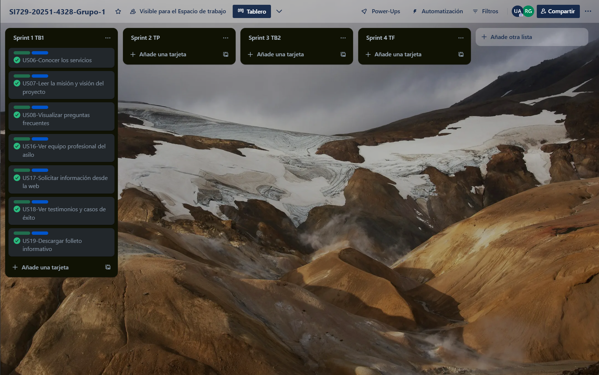
</p>  

| **Sprint #**   | Sprint 1   |             |             |             |             |             |             |
|----------------|-------------|-------------|-------------|-------------|-------------|-------------|-------------|
| **User Story** |             | **Work-Item/task** |             |             |             |             |             |
| **ID**         | **Título**  | **ID**             | **Título**   | **Descripción**        | **Estimación (hrs)** | **Assigned to**    | **Status** |
| US-06 | Conocer los servicios	 | TS001 | Diseño UI sección servicios | Crear el diseño visual para la sección de servicios. | 3 | Jeremy Quijada | Done |
| US-06 | Conocer los servicios	 | TS002 | Implementar sección servicios | Codificar la sección para mostrar los servicios. | 4 | Jeremy Quijada | Done |
| US-07 | Leer la misión y visión del proyecto | TS003 | 	Diseño UI sección misión y visión | Crear diseño para la sección de misión y visión. | 2 | Jeremy Quijada | Done |
| US-07 | Leer la misión y visión del proyecto | TS004 | 	Implementar sección misión y visión | Programar la sección con el contenido correspondiente. | 3 | Jeremy Quijada | Done |
| US-08 | Visualizar preguntas frecuentes | TS005 | Diseño UI sección FAQ | Definir el diseño para la sección de preguntas frecuentes. | 2 | Jeremy Quijada | Done |
| US-08 | Visualizar preguntas frecuentes | TS006 | 	Implementar sección FAQ | Programar funcionalidad para mostrar preguntas y respuestas. | 3 | Jeremy Quijada | Done |
| US-16 | Ver equipo profesional del asilo | TS007 | Diseño UI sección equipo profesional | Diseño visual para mostrar el equipo profesional. | 2 | Jeremy Quijada | Done |
| US-16 | Ver equipo profesional del asilo | TS008 | Implementar sección equipo profesional | Implementar la sección para listar el equipo. | 3 | Jeremy Quijada | Done |
| US-17 | Solicitar información desde la web | TS009 | Diseño UI formulario de contacto | Diseñar formulario para solicitud de información. | 2 | Jeremy Quijada | Done |
| US-17 | Solicitar información desde la web | TS010 | Implementar formulario contacto | Programar formulario. | 2 | Jeremy Quijada | Done |
| US-18 | Ver testimonios y casos de éxito | TS011 | 	Diseño UI sección testimonios | Diseñar presentación para testimonios y casos. | 2 | Jeremy Quijada | Done |
| US-18 | Ver testimonios y casos de éxito | TS012 | Implementar sección testimonios | Codificar funcionalidad para mostrar testimonios. | 3 | Jeremy Quijada | Done |

##### 5.2.1.4. Development Evidence for Sprint Review
 En esta sección presentamos el flujo de trabajo para la creación y actuallización de la landing page.

| Repository                           | Branch   | Commit ID | Commit Message                  | Commit Message Body          | Commited on  (Date) |
|-------------------------------------|---------|-----------|----------------------------------|------------------------------|---------------------|
| upc-pre-202510-1asi0729-4328-Lively/LandingPage | develop | 6fce4ba   | feat/update landing page content and images   |    | 21/04/2025          |
| upc-pre-202510-1asi0729-4328-Lively/LandingPage | develop | 410b1fb   | feat/update landing page content and images |       | 21/04/2025          |
| upc-pre-202510-1asi0729-4328-Lively/LandingPage | develop | 2c9f56d   | feature/improving the lading page and adding scripts   |     | 21/04/2025          |
| upc-pre-202510-1asi0729-4328-Lively/LandingPage | feature/questions section | ab33510   | feature/questions section |              | 25/04/2025          |
| upc-pre-202510-1asi0729-4328-Lively/LandingPage | release/v1.0.0 | 7531047   | adding feature/questions section |            | 25/04/2025          |
| upc-pre-202510-1asi0729-4328-Lively/LandingPage | main | 50e9881   | Release/v1.0.0 |       | 25/04/2025          |

##### 5.2.1.5. Execution Evidence for Sprint Review

| **Epic / Story ID** | **Título**                    | **Criterios de Aceptación**                                                                                     |
|----------------------|------------------------------|----------------------------------------------------------------------------------------------------------------|
| US31                | Navegación por el landing page | Dado que el usuario está en la página principal, cuando haga clic en cualquier ítem del menú, entonces va redirigido a la sección correspondiente. |
| US32                | Ver información del startup   | Dado que voy a "Sobre Nosotros", cuando hago scroll, entonces veo informacion sobre la startup como misión y visión.                    |
| US33                | Conocer los servicios |Dado que voy a "Nuestros Servicios", cuando hago scroll, entonces veo informacion sobre los servicos que ofrece la aplicación. |
| US34                | Contactar al equipo de soporte | Dado que completo el formulario, cuando hago clic en "Enviar", entonces recibo un email de confirmación.       |


 En esta entrega, nuestro equipo ha desplegado con éxito la landing page.
 Enlace de la Landing Page: https://upc-pre-202510-1asi0729-4328-lively.github.io/landing-page/


##### 5.2.1.6. Services Documentation Evidence for Sprint Review

Durante este Sprint, nos enfocamos exclusivamente en el desarrollo del frontend estático de la Landing Page del proyecto AgeCare. En consecuencia, no se implementaron endpoints ni funcionalidades relacionadas con servicios web o APIs RESTful.

La creación de la documentación de Web Services mediante OpenAPI/Swagger se programará para Sprints futuros, una vez que comience la implementación del backend del sistema.

##### 5.2.1.7. Software Deployment Evidence for Sprint Review

Se realizó el despliegue de la **landing page** del proyecto *AgeCare*, marcando el primer paso hacia la publicación progresiva de los productos del sistema. Este trabajo tuvo como objetivo validar visualmente los avances en diseño e interacción con el cliente y el equipo docente.

##### Actividades Realizadas

- Configuración del repositorio **GitHub** y definición de la estructura inicial de carpetas.
- Implementación del flujo de trabajo **Git Flow**, manteniendo los cambios en la rama *develop*.
- Realización de un **merge** desde *develop* hacia la rama *main*, siguiendo las convenciones definidas en la sección *5.1.2*.
- Activación de **GitHub Pages** como servicio de despliegue estático, apuntando al contenido de la rama *main*.
- Publicación exitosa de la **landing page**, accesible mediante una URL pública.

##### Evidencias Visuales

* Configuración del repositorio GitHub y estructura inicial de carpetas.
  * Creamos un repositorio para la landing page dentro de la organizacion. La configuramos para que sea de tipo publico:
  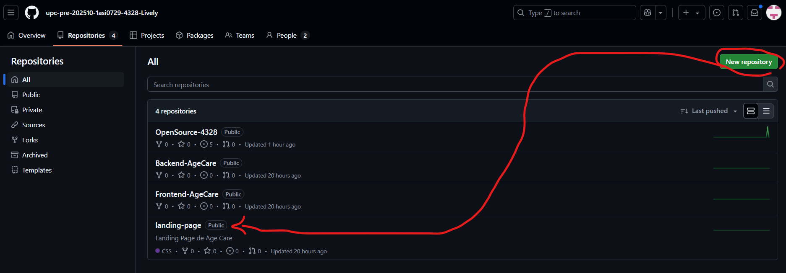

  * Una vez dentro copiamos la direccion HTTPS del repositorio y la clonamos en nuestro entorno local con el comando git clone. Preparamos una estructura de carpetas similar a la siguiente en nuestra maquina:
  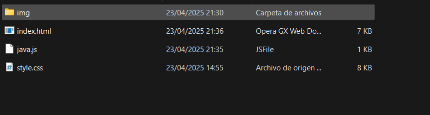

* Implementación de flujo de trabajo con Git Flow, manteniendo los cambios en la rama develop.

  * Desde la consola, creamos un push inicial en la rama remota main usando el comando git push origin main con un mensaje commit descriptivo.
  initial-commit-landing

  * El siguiente paso es crear la rama local develop usando el comando git checkout -b develop, la creamos de manera remota con git push origin develop. Las ramas feature/* se crearan de la misma forma, pero hay que tener en cuenta que siempre se deben crear a partir de la rama develop, por lo que un paso previo es asegurarnos que estamos en la rama correcta con git checkout develop.

* Realización de un merge desde develop hacia la rama main, de acuerdo a las convenciones definidas en la sección 5.1.2.

  * Antes de realizar el merge, se revisaron los cambios mediante un pull request en GitHub, asegurando que no existieran conflictos y que el código cumpliera con los estándares definidos.

  * Se realizaron pruebas manuales usando la extension Live Server para verificar la funcionalidad de la landing page antes de fusionar los cambios.

* Activación de GitHub Pages como servicio de despliegue estático, apuntando al contenido de la rama main.

  * En la configuración del repositorio, se seleccionó la rama main como fuente para GitHub Pages. Esto se realizó desde la pestaña "Settings" > "Pages" en GitHub.

  * Se verificó que la URL generada por GitHub Pages estuviera activa y mostrara correctamente el contenido de la landing page.

  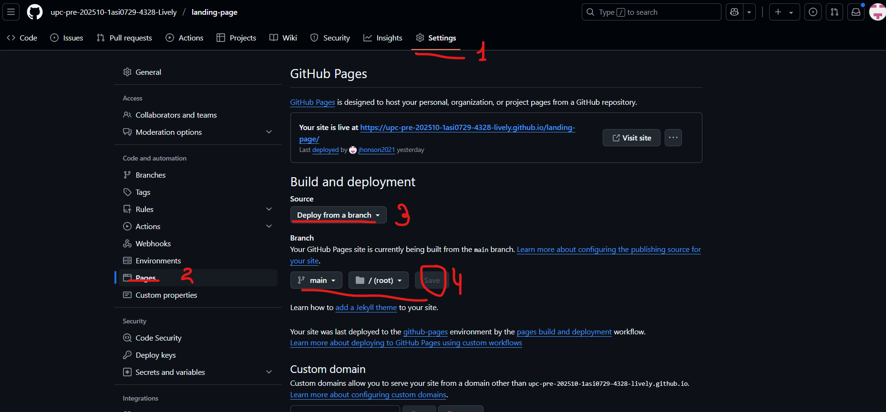


* Publicacion exitosa de la Landing Page

  

  

  

    


##### 5.2.1.8. Team Collaboration Insights during Sprint

Para este sprint, las tareas de diseño, implementación y documentación de la landing page se distribuyó entre los integrantes del equipo. La implementación y despliegue de la landing page fue llevado a cabo principalmente por Jeremy Quijada.

<p align="center">
  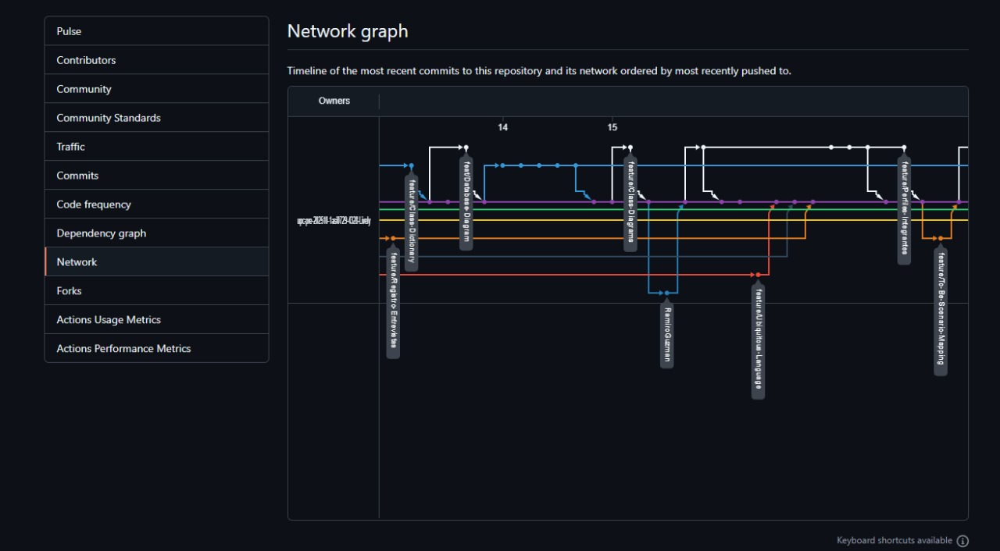
</p>  

<p align="center">
  
</p>  

#### 5.2.2. Sprint 2

En esta sección se registra el avance del producto y las acciones colaborativas realizadas por el equipo para el Sprint 2.

##### 5.2.2.1. Sprint Planning 2
En esta sección se resumen los puntos clave del Sprint Planning, incluyendo los objetivos, entregables y tareas asignadas para el sprint. A continuación, se presenta un cuadro con los detalles acordados.

| Sprint #                             | Sprint 2                                                                                              |
|--------------------------------|--------------------------------------------------------------------------------------------------------|
| **Date**       |     2025-05-10        |
| Time           | 10:00 PM                      |
| Location       | Virtual - Meet               |
| Prepared By    | Mauricio Muñoz               |
| Attendees (to planning meeting)| Jeremy Quijada, Franco Huang, Fatima Asmad, Mauricio Muñoz, Ramiro Guzman                    |
| Sprint 2 - 1 Review Summary    | Se han realizado mejoras en varios aspectos del informe según las sugerencias del profesor, además de haber desarrollado una primera versión de nuestra aplicación Front End, la cual continuará evolucionando en próximas entregas. |
| Sprint 2 - 1 Retrospective Summary | Se logró un progreso razonable durante el sprint 2: si bien no se completaron tantas pantallas como se había previsto, el equipo mejoró significativamente en comunicación y trabajo colaborativo, lo que permitió alcanzar un avance satisfactorio en el desarrollo de la aplicación. |
| Sprint 2 Goal                  | En este sprint, nos enfocamos principalmente en mejorar la calidad de la información presentada en los reportes e implementar la primera versión del Front End de la aplicación. Durante esta fase, desarrollamos diversos módulos con operaciones CRUD (crear, leer, actualizar y eliminar) que permiten gestionar distintos recursos del sistema. Esperamos que esta versión inicial proporcione una visualización clara de las funcionalidades esenciales y del diseño de la interfaz. La efectividad de este avance se validará mediante la interacción de los usuarios con las funcionalidades desarrolladas y la retroalimentación positiva sobre la experiencia de uso. |
| Sprint 2 Velocity              | Nuestro equipo puede aceptar hasta 17 Story Points.                                                  |
| Sum of Story Points            | La suma de Story Points atendidos es de  22. |

##### 5.2.2.2. Aspect Leaders and Collaborators

Durante este sprint, nuestro objetivo fue definir nuestros puntos base para realizar una solucion acertada a lo que el usuario necesite. La investigacion, entrevistas y datos recolectados ayudaron a que se pueda generar una vision mas clara del objetivo en el grupo. Por ello aqui se presentan los roles que cada uno de los participantes tuvo a lo largo de este sprint.

| Team Member (Last Name, First Name)       | GitHub Username   | Aspect Name 1 (L/C) 
|------------------------------------------|-------------------|---------------------|
| Mauricio Muñoz Vilcapoma | MauricioMVilcapoma  | L  | 
| Fatima Asmad Padilla   |  FatimaAP05    | C         |  
| Jeremy Quijada Magro   | jhonson2021    | C         | 
| Franco Huang Liu       | St4rLght05     | C         |  
| Ramiro Guzman Chavéz   | RamiroGuzmanCh | C         |  

##### 5.2.2.3. Sprint Backlog 2

Esta sección ofrece un resumen del objetivo central del sprint, resaltando las metas propuestas y las funcionalidades que se planean desarrollar. Seguidamente, se incluye una captura del tablero del sprint en la herramienta de gestión elegida, Trello, junto con su enlace público. También se presenta una tabla con las User Stories asignadas al sprint, los Work-items o tareas derivadas, y otras actividades adicionales requeridas para alcanzar los objetivos generales del sprint.

Este es nuestro link de invitación a nuestro Trello:
[https://trello.com/invite/b/68267bff8d17b7cdedc81fc0/ATTI9b222886c42338db28af15f683f5af1554589F3D/si729-20251-4328-grupo-1](https://trello.com/invite/b/68267bff8d17b7cdedc81fc0/ATTI9b222886c42338db28af15f683f5af1554589F3D/si729-20251-4328-grupo-1)

<p align="center">
  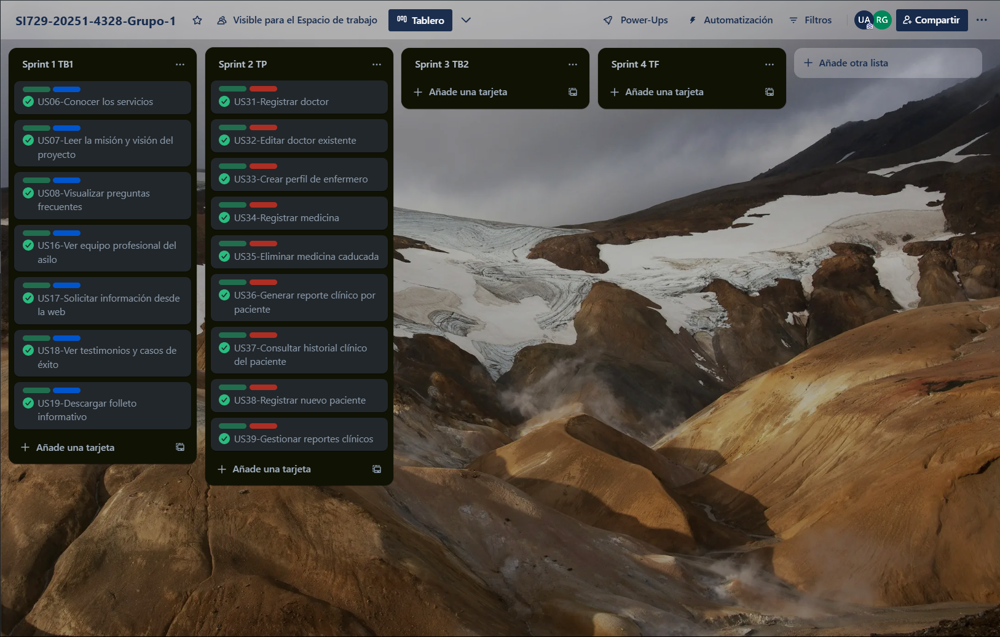
</p>  

| User Story ID | User Story | Work-Item / Task ID | Work-Item / Task Title | Description | Estimation (Hours) | Status |
|---------------|------------|---------------------|------------------------|-------------|--------------------|--------|
| US-31 | Registrar doctor | TS001 | Crear formulario de registro |  Crear componente visual para registrar un doctor | 3  | Done  |
| US-31 | Registrar doctor | TS002 | Implementar validaciones	 | Añadir validaciones básicas para el formulario de registro  |  2 | Done  |
| US-31 | Registrar doctor | TS003 | Integrar API de registro	 | Enviar datos del formulario al backend usando una API  | 3  |  Done |
| US-31 | Registrar doctor | TS004 | Actualizar UI tras registro	 | Refrescar o redirigir la vista una vez se haya registrado correctamente  | 2  | Done  |
| US-32	 | Editar doctor existente | TS005 | Crear formulario de edición | Crear componente para editar datos de un doctor ya existente | 3 |  Done | 
| US-32	 | Editar doctor existente | TS006 | Implementar validaciones | Validar los campos editables del formulario | 2 | Done  |
| US-32	 | Editar doctor existente | TS007 | Integrar API de edición | Conectar con el backend para actualizar los datos del doctor | 3 |  Done |
| US-32	 | Editar doctor existente | TS008 | Feedback visual | Mostrar resultado de la operación al usuario | 2 | Done  |
| US-33	 | Crear perfil de enfermero | TS008 | Crear formulario de registro | Componente visual para registrar un enfermero | 3 | Done  |
| US-33	 | Crear perfil de enfermero | TS009 | Validaciones del formulario | Añadir validaciones básicas en los campos del formulario | 2 | Done  |
| US-33	 | Crear perfil de enfermero | TS010 | Enviar datos a API | Enviar los datos del formulario al backend | 3 |  Done |
| US-33	 | Crear perfil de enfermero | TS011 | Mostrar mensajes al usuario | Mensajes de éxito o error tras envío de datos | 2 | Done  |
| US-34	 | Registrar medicina | TS012 | Crear formulario de registro | Componente para registrar nueva medicina | 3 |  Done  |
| US-34	 | Registrar medicina | TS013 | Validaciones del formulario | Validaciones generales en campos del formulario | 2 | Done  | 
| US-34	 | Registrar medicina | TS014 | Integrar con API | Enviar los datos al backend usando una API | 3 | Done  |
| US-34	 | Registrar medicina | TS015 | Feedback al usuario | Confirmación de acción realizada o error | 2 |  Done |
| US-35	 | Eliminar medicina caducada | TS016 | Crear lista de medicinas | Mostrar listado de medicinas con opción para eliminar | 3 |  Done |
| US-35	 | Eliminar medicina caducada | TS017 | Confirmación antes de eliminar | Mostrar diálogo para confirmar eliminación | 2 | Done  |
| US-35	 | Eliminar medicina caducada | TS018 | Llamar API de eliminación | Conectar con API DELETE del backend | 2 | Done  |
| US-35	 | Eliminar medicina caducada | TS019 | Actualizar UI | Refrescar vista tras eliminación exitosa | 2 |  Done |
| US-38	 | Registrar nuevo paciente | TS020 | Crear formulario de registro | Componente visual para registrar un paciente | 3 |  Done |
| US-38	 | Registrar nuevo paciente | TS021 | Añadir validaciones | Validaciones generales en formulario | 2 |  Done |
| US-38	 | Registrar nuevo paciente | TS022 | Conectar con API | Enviar los datos del formulario al backend | 3 | Done  | 
| US-38	 | Registrar nuevo paciente | TS023 | Feedback de operación | Mostrar mensajes de resultado al usuario | 2 | Done  |
| US-37	 | Consultar historial de paciente | TS024 | Crear componente de historial | Vista que muestre el historial del paciente | 3 |  Done |
| US-37	 | Consultar historial de paciente | TS025 | Llamar API para obtener datos | Obtener historial clínico desde el backend | 3 | Done  |
| US-37	 | Consultar historial de paciente | TS026 | Mostrar datos en UI | Presentar los datos de forma clara en pantalla | 2 |  Done |
| US-39	 | Gestionar reportes clínicos | TS027 | Crear formulario para nuevo reporte clínico | Incluir todos los campos pertinentes | 2 | Done  |
| US-39	 | Gestionar reportes clínicos | TS028 | 	Implementar validaciones en frontend | Campos obligatorios, formatos válidos | 2 |  Done |
| US-39	 | Gestionar reportes clínicos | TS029 | Enviar reporte a backend | 	Conectar con API para crear reporte (POST /reports) | 2 | Done  |
| US-39	 | Gestionar reportes clínicos | TS030 | Habilitar edición de reportes (PUT /reports/{id}) | Precarga de datos + lógica de actualización | 2 | Done  |
| US-39	 | Gestionar reportes clínicos | TS031 | Habilitar eliminación de reportes (DELETE /reports/{id}) | Botón, confirmación y actualización de UI | 1 | Done  |

##### 5.2.2.4. Development Evidence for Sprint Review


En la siguiente tabla se presentan los commits realizados durante el Sprint 2. En este sprint nos enfocamos en corregir observaciones clave de la primera entrega, como reformular los antecedentes y problemáticas, ajustar los Lean UX statements, completar el Impact Mapping y rehacer los diagramas de arquitectura, clases y base de datos. Además, se desarrolló y desplegó una versión inicial del backend con los principales CRUDs.

| Repository                           | Branch   | Commit ID | Commit Message                  | Commit Message Body          | Commited on  (Date) |
|-------------------------------------|---------|-----------|----------------------------------|------------------------------|---------------------|
| upc-pre-202510-1asi0729-4328-Lively/OpenSource-4328 | fix: update and correct Sprint Backlog 1 | e149c75   | fix: update and correct Sprint Backlog 1  |    | 15/05/2025        |
| upc-pre-202510-1asi0729-4328-Lively/OpenSource-4328 | fix: update and correct Sprint Planning 1 |  c5a02fc   | fix: update and correct Sprint Planning 1 |       | 15/05/2025          |
| upc-pre-202510-1asi0729-4328-Lively/OpenSource-4328 | fix: revise and improve Lean UX Hypothesis Statements | 5225de6   | fix: revise and improve Lean UX Hypothesis Statements   |     | 15/05/2025          |
| upc-pre-202510-1asi0729-4328-Lively/OpenSource-4328 | fix: revise and correct Antecedentes y Problematica | 6e0553c   | fix: revise and correct Antecedentes y Problematica |              | 15/05/2025         |
| upc-pre-202510-1asi0729-4328-Lively/OpenSource-4328 | fix/Domain-Driven | 00a905a   | fix: Domain Container |              | 15/05/2025         |

##### 5.2.2.5. Execution Evidence for Sprint Review


En este segundo sprint, el equipo completó exitosamente las funcionalidades clave de la Landing Page orientadas a la navegación, visualización de información institucional y contacto. Se logró el despliegue del sitio en GitHub Pages y estas funcionalidades permiten a los usuarios explorar la misión y visión de la startup, conocer los servicios ofrecidos y contactar directamente al equipo de soporte. El objetivo principal del sprint fue alcanzado satisfactoriamente con la publicación activa de la landing page. Por otro lado, cada integrante del equipo implementó y desplegó su propio CRUD del backend, consolidando así el progreso técnico del proyecto.

- Landing Page
<p align="center">
  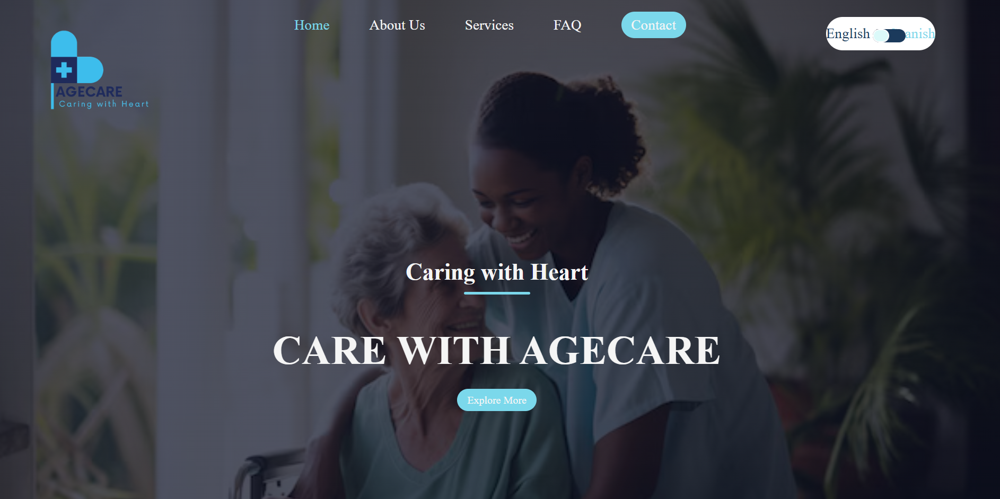
</p> 

<p align="center">
  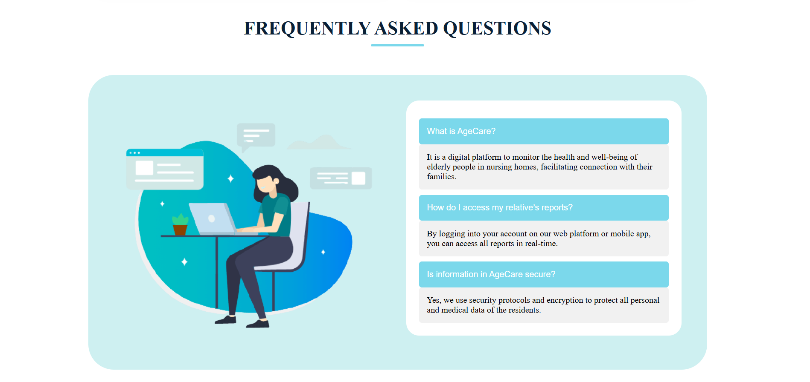
</p> 

[https://upc-pre-202510-1asi0729-4328-lively.github.io/landing-page/](https://upc-pre-202510-1asi0729-4328-lively.github.io/landing-page/)

- Backend

  - CRUD Doctores
    
<p align="center">
  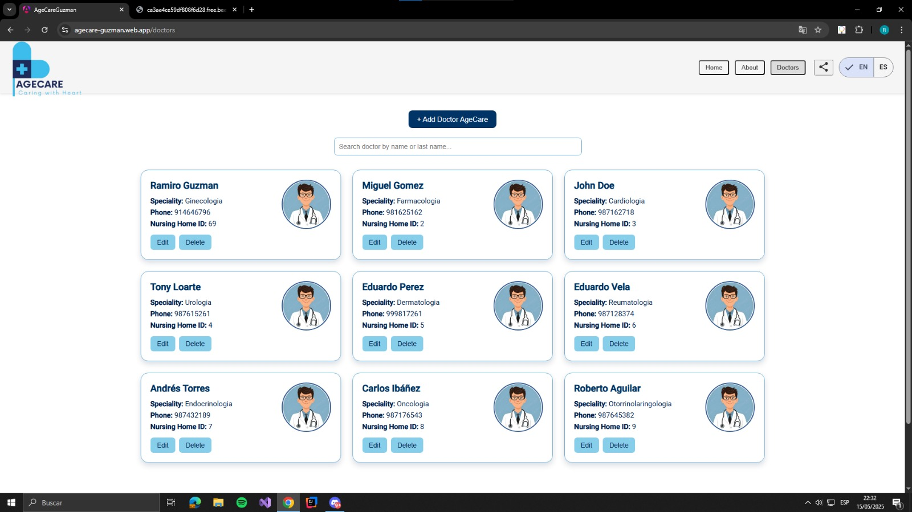
</p> 

[https://agecare-guzman.web.app/doctors](https://agecare-guzman.web.app/doctors)
  - CRUD Enfermeras
  
<p align="center">
  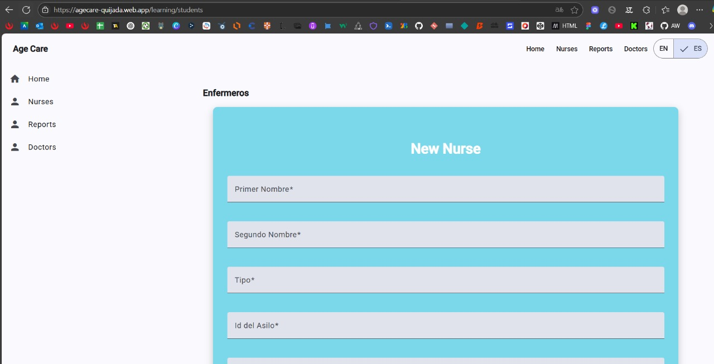
</p> 
<p align="center">
  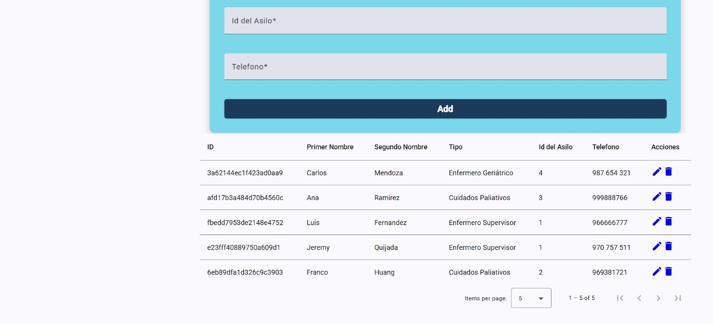
</p> 

[https://agecare-quijada.web.app/learning/students](https://agecare-quijada.web.app/learning/students)

  - CRUD Pacientes
    
<p align="center">
  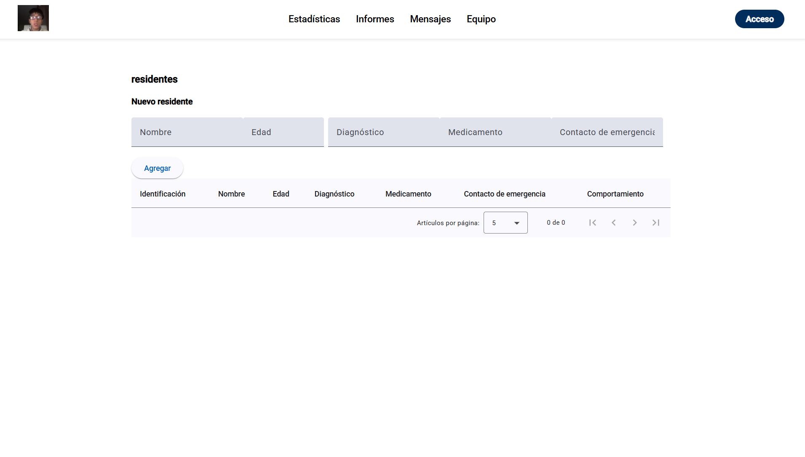
</p> 

[https://frontend-agecare.web.app/core/residents](https://frontend-agecare.web.app/core/residents)

  - CRUD Reportes
    
<p align="center">
  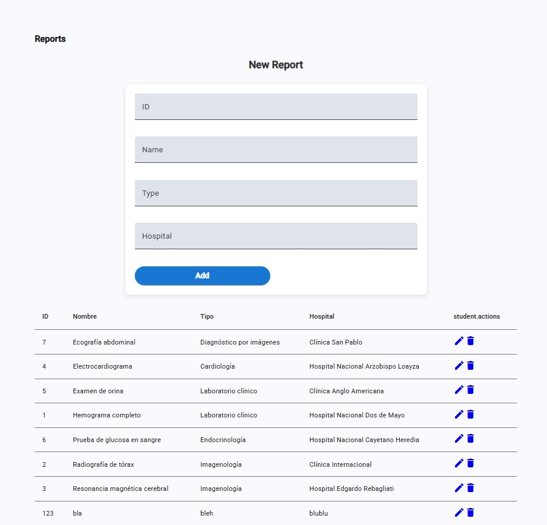
</p> 

##### 5.2.2.6. Services Documentation Evidence for Sprint Review
Durante este sprint, logramos desplegar una aplicación web funcional que consume datos desde un servidor JSON previamente configurado y desplegado. Este servidor, implementado mediante Beeceptor, simula la base de datos del proyecto y proporciona la información principal visualizada en la interfaz.


| Nombre del Endpoint | Acciones Implementadas      | Sintaxis de Llamada                                                                                                                                          | Especificación de Parámetros | Ejemplo de Llamada                                                           | Explicación del Response                                         |
|---------------------|-----------------------------|--------------------------------------------------------------------------------------------------------------------------------------------------------------|-------------------------------|------------------------------------------------------------------------------|------------------------------------------------------------------|
| `base.service.ts`   | `GET`, `POST`, `PUT`, `DELETE` | ```export const environment = {  production: true,  serverBasePath: 'https://ca3ae4ce59df808f6d28.free.beeceptor.com/api/v1',  'http://localhost:8090/api/v1',  doctorsEndpointPath: '/doctors'};``` | No requiere parámetros         | `https://ca3ae4ce59df808f6d28.free.beeceptor.com/api/v1/doctors/`           | Muestra la información de la base de datos en formato JSON.     |

Además de capturas que muestran el contenido de db.json ya desplegado en Beeceptor
<p align="center">
  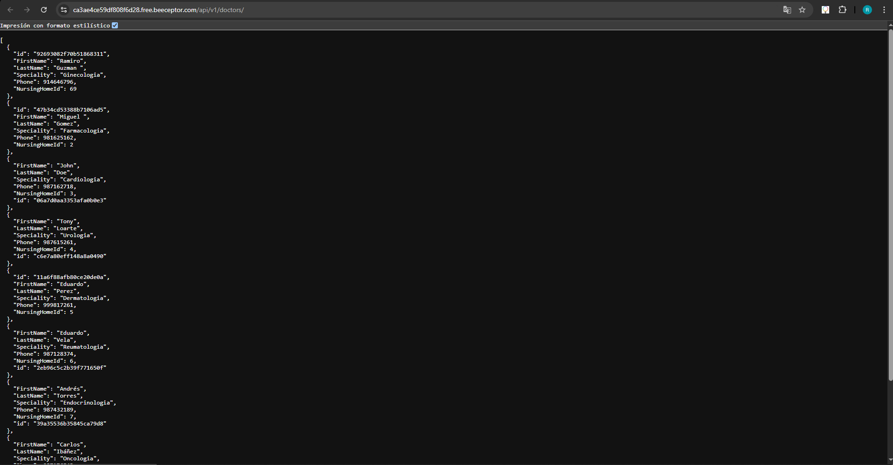
</p>

##### 5.2.2.7. Software Deployment Evidence for Sprint Review

Landing Page Para hacer el deployment de la landing page se utilizó Github Pages, una funcionalidad de Github que permite hacer el deployment de páginas web de forma rápida y pública. Dentro del repositorio, en el apartado de settings , se encuentra la opcion de Pages.

##### Actividades Realizadas

- Configuración del repositorio **GitHub** y definición de la estructura inicial de carpetas.
- Implementación del flujo de trabajo **Git Flow**, manteniendo los cambios en la rama *develop*.
- Realización de un **merge** desde *develop* hacia la rama *main*, siguiendo las convenciones definidas en la sección *5.1.2*.
- Activación de **GitHub Pages** como servicio de despliegue estático, apuntando al contenido de la rama *main*.
- Publicación exitosa de la **landing page**, accesible mediante una URL pública.

##### Evidencias Visuales

* Configuración del repositorio GitHub y estructura inicial de carpetas.
  * Creamos un repositorio para la landing page dentro de la organizacion. La configuramos para que sea de tipo publico:
  

  * Una vez dentro copiamos la direccion HTTPS del repositorio y la clonamos en nuestro entorno local con el comando git clone. Preparamos una estructura de carpetas similar a la siguiente en nuestra maquina:
  

* Implementación de flujo de trabajo con Git Flow, manteniendo los cambios en la rama develop.

  * Desde la consola, creamos un push inicial en la rama remota main usando el comando git push origin main con un mensaje commit descriptivo.
  initial-commit-landing

  * El siguiente paso es crear la rama local develop usando el comando git checkout -b develop, la creamos de manera remota con git push origin develop. Las ramas feature/* se crearan de la misma forma, pero hay que tener en cuenta que siempre se deben crear a partir de la rama develop, por lo que un paso previo es asegurarnos que estamos en la rama correcta con git checkout develop.

* Realización de un merge desde develop hacia la rama main, de acuerdo a las convenciones definidas en la sección 5.1.2.

  * Antes de realizar el merge, se revisaron los cambios mediante un pull request en GitHub, asegurando que no existieran conflictos y que el código cumpliera con los estándares definidos.

  * Se realizaron pruebas manuales usando la extension Live Server para verificar la funcionalidad de la landing page antes de fusionar los cambios.

* Activación de GitHub Pages como servicio de despliegue estático, apuntando al contenido de la rama main.

  * En la configuración del repositorio, se seleccionó la rama main como fuente para GitHub Pages. Esto se realizó desde la pestaña "Settings" > "Pages" en GitHub.

  * Se verificó que la URL generada por GitHub Pages estuviera activa y mostrara correctamente el contenido de la landing page.

  


* Publicacion exitosa de la Landing Page

  

  

  
  
  

  

  FrontEnd Para el FrontEnd, se utilizó Firebase para el despliegue de la página.
<p align="center">
  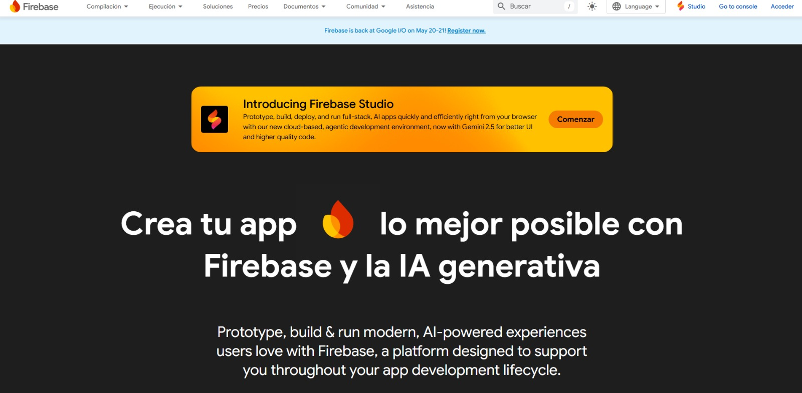
</p>
Antes del despliegue, debemos crear una cuenta, por lo que continuaremos con google.
<p align="center">
  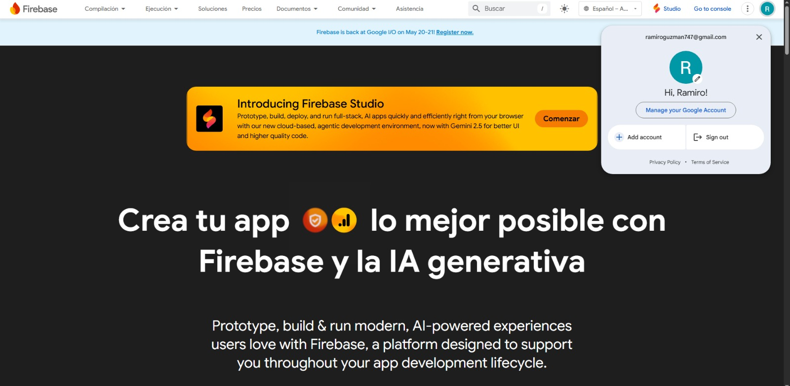
</p>
Una vez tenemos la cuenta creada vamos a la parte de arriba a la izquierda "go to console" y creamos un nuevo proyecto de Firebase.
<p align="center">
  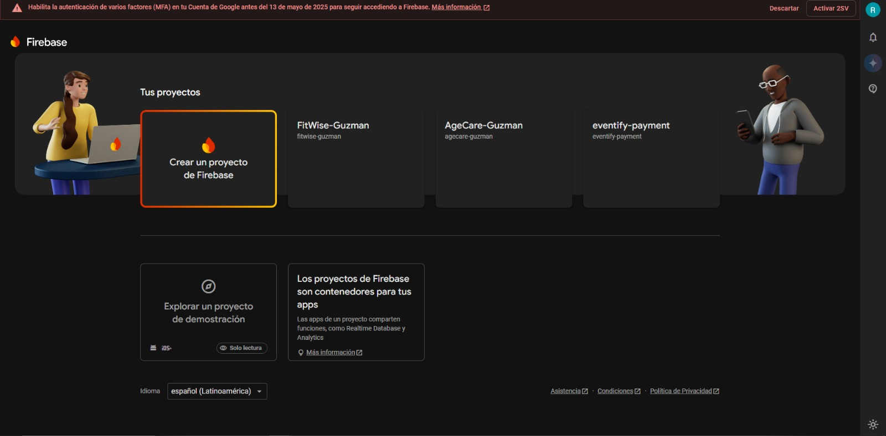
</p>
Le colocamos un nombre correspondiente al proyecto a realizar.
<p align="center">
  
</p>
Una vez tenemos el proyecto creado, desde nuestro editor, en este caso IntelliJ IDEA Ultimate conectamos nuestro proyecto local al proyecto Firebase.
<p align="center">
  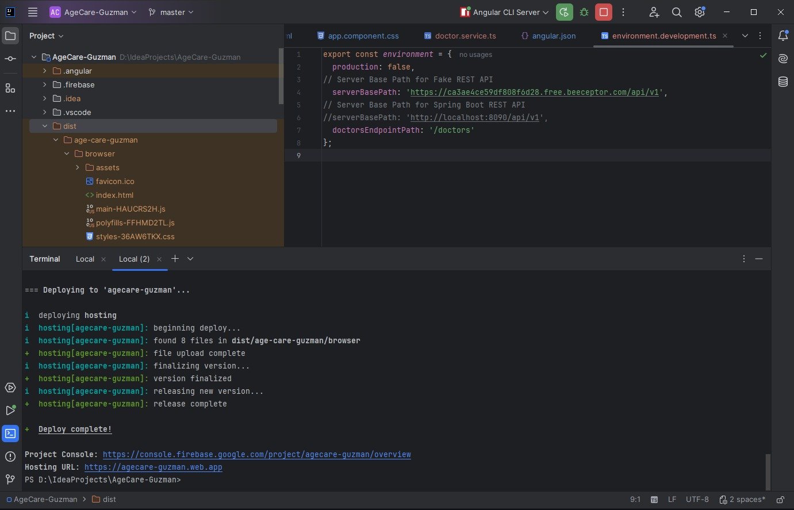
</p>
Al acceder al link, podemos ver la página correctamente desplegada.
<p align="center">
  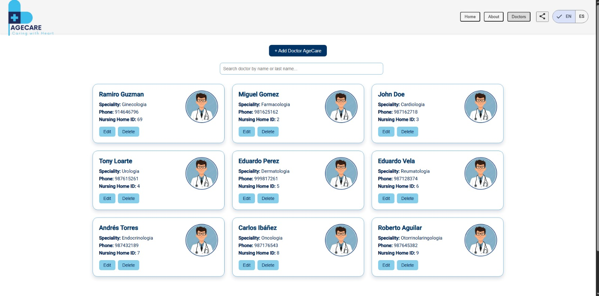
</p>

##### 5.2.2.8. Team Collaboration Insights during Sprint

A continuación se muestra evidencia de la coolaboración del equipo mediante insights de GitHub.

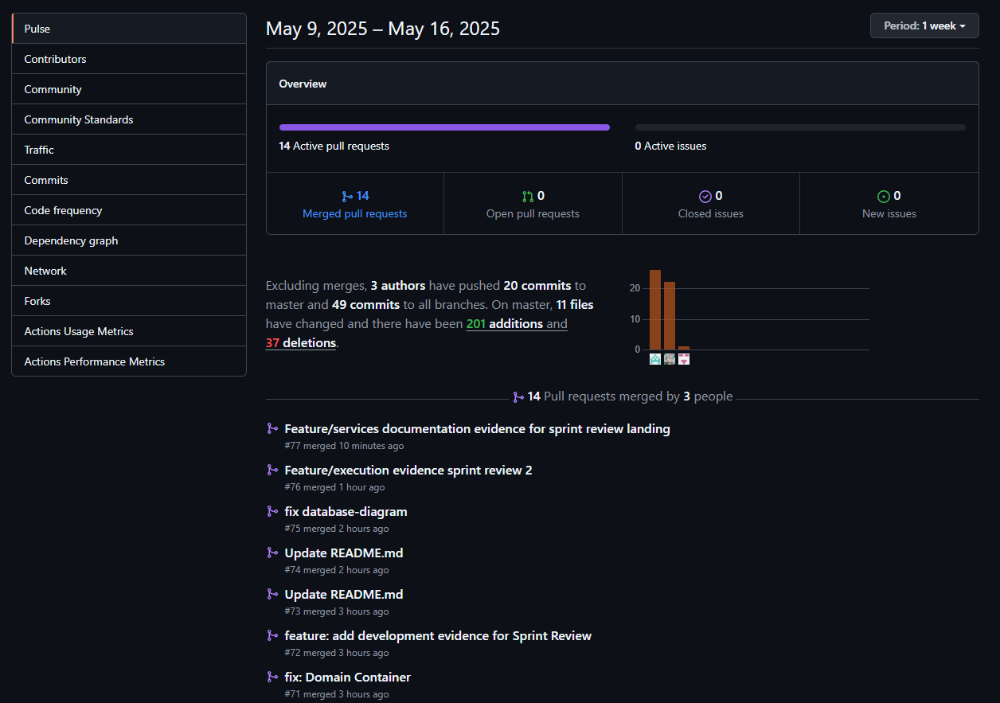

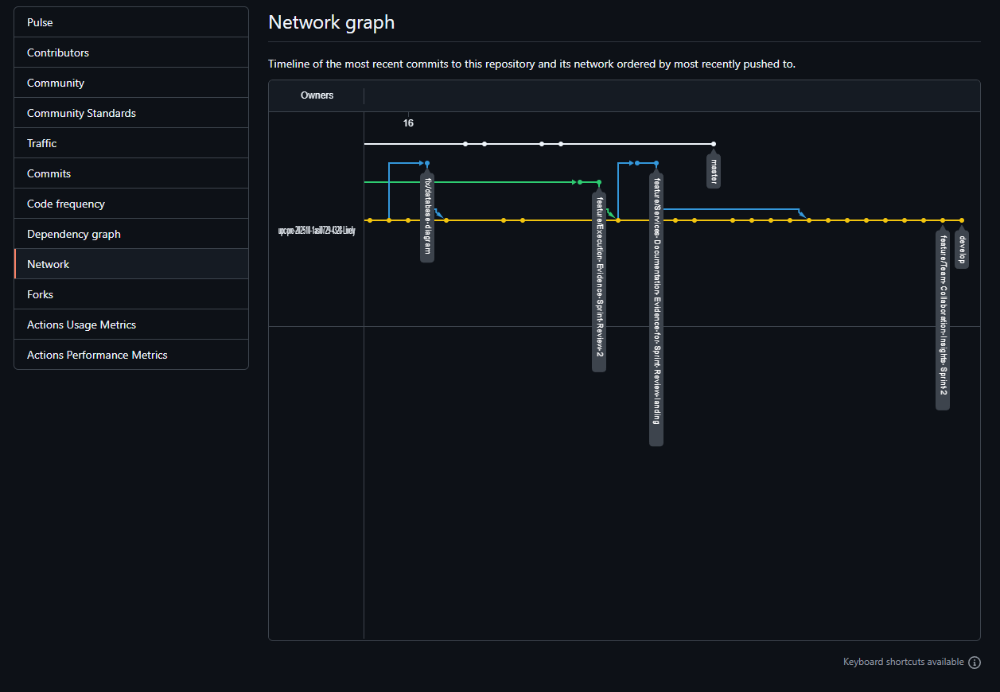

Frontend

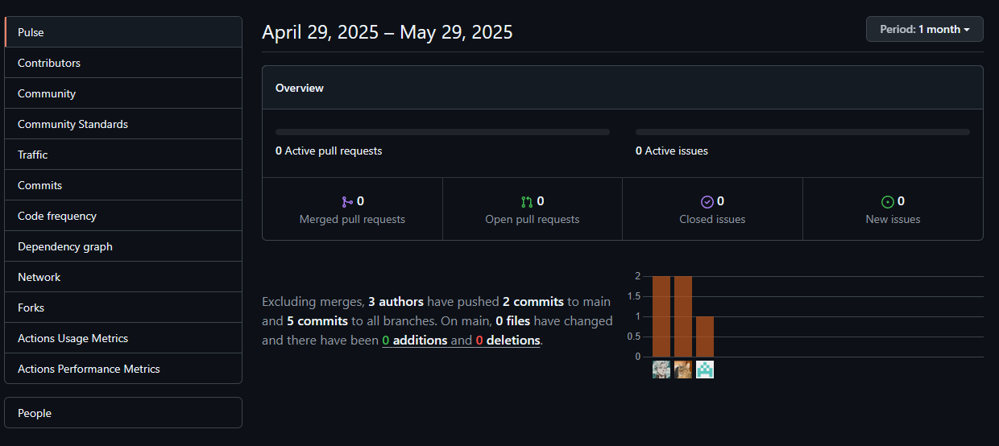

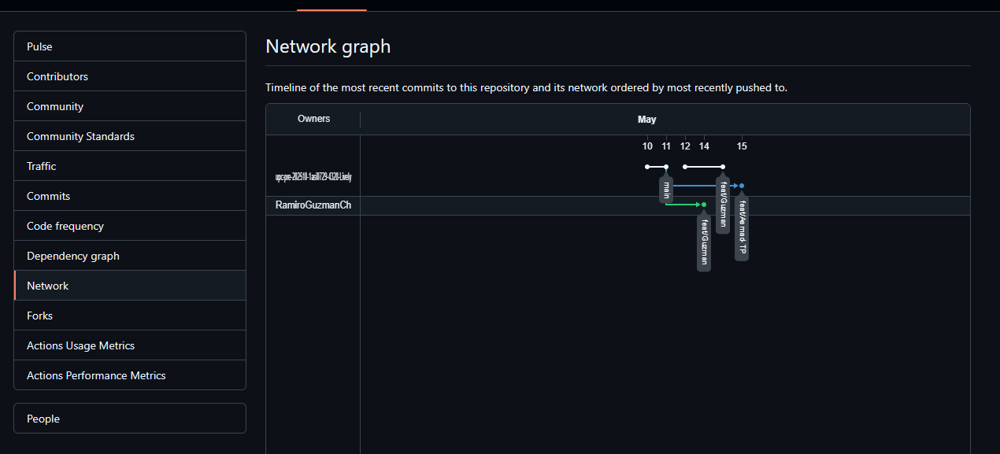


Landing

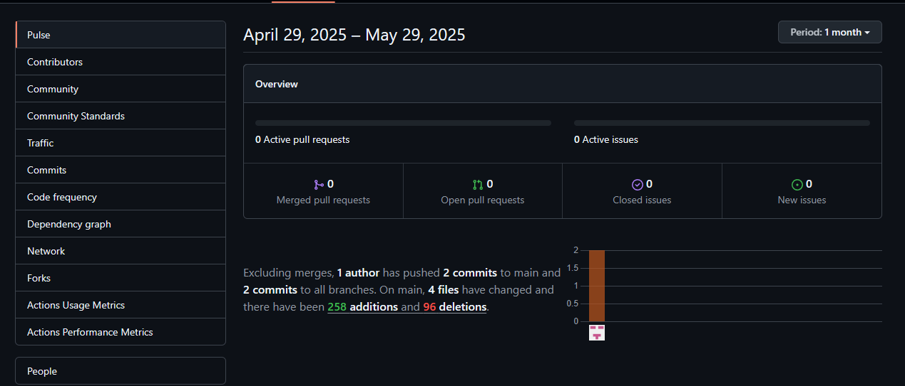

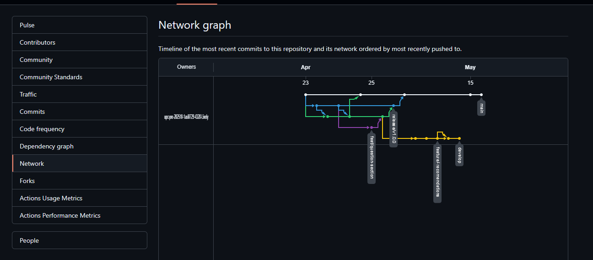

#### 5.2.3. Sprint 3

En esta sección se registra el avance del producto y las acciones colaborativas realizadas por el equipo para el Sprint 3.

##### 5.2.3.1.Sprint Planning 3.

En esta sección se resumen los puntos clave del Sprint Planning, incluyendo los objetivos, entregables y tareas asignadas para el sprint. A continuación, se presenta un cuadro con los detalles acordados.

| Sprint #                             | Sprint 3                                                                                              |
|--------------------------------|--------------------------------------------------------------------------------------------------------|
| **Date**       |     2025-06-10        |
| Time           | 10:00 PM                      |
| Location       | Virtual - Meet               |
| Prepared By    | Mauricio Muñoz               |
| Attendees (to planning meeting)| Jeremy Quijada, Franco Huang, Fatima Asmad, Mauricio Muñoz, Ramiro Guzman                    |
| Sprint 3 - 1 Review Summary    | Se han realizado mejoras en varios aspectos del informe según las sugerencias del profesor, además de haber desarrollado una primera versión de nuestra aplicación Front End, la cual continuará evolucionando en próximas entregas. |
| Sprint 3 - 1 Retrospective Summary | Se logró un progreso razonable durante el sprint 3: se completo las tareas esperadas además, el equipo mejoró significativamente en comunicación y trabajo colaborativo, lo que permitió alcanzar un avance satisfactorio en el desarrollo de la aplicación. |
| Sprint 3 Goal                  | En este sprint, nos enfocamos en completar el desarrollo del backend de cada Bounded Context (BC) siguiendo la arquitectura DDD definida, asegurando que cada módulo cuente con sus respectivas operaciones CRUD y lógica de negocio. Además, se implementaron mejoras en el landing page, alineándolas con la estructura y necesidades funcionales derivadas de los BC. Estas mejoras buscan ofrecer una presentación más clara y coherente del propósito de la plataforma y de sus principales beneficios para los usuarios. La validación de este avance se realizará a través de pruebas funcionales y de la evaluación del diseño e integración general del sistema. |
| Sprint 2 Velocity              | Nuestro equipo puede aceptar hasta - Story Points.                                                  |
| Sum of Story Points            | La suma de Story Points atendidos es de  -. |

##### 5.2.3.2. Aspect Leaders and Collaborators.

Durante este sprint, nuestro objetivo fue definir nuestros puntos base para realizar una solucion acertada a lo que el usuario necesite. La investigacion, entrevistas y datos recolectados ayudaron a que se pueda generar una vision mas clara del objetivo en el grupo. Por ello aqui se presentan los roles que cada uno de los participantes tuvo a lo largo de este sprint.

| Team Member (Last Name, First Name)       | GitHub Username   | Aspect Name 1 (L/C) 
|------------------------------------------|-------------------|---------------------|
| Mauricio Muñoz Vilcapoma | MauricioMVilcapoma  | L  | 
| Fatima Asmad Padilla   |  FatimaAP05    | C         |  
| Jeremy Quijada Magro   | jhonson2021    | C         | 
| Franco Huang Liu       | St4rLght05     | C         |  
| Ramiro Guzman Chavéz   | RamiroGuzmanCh | C         |  

##### 5.2.3.3.Sprint Backlog 3.

Esta sección ofrece un resumen del objetivo central del sprint, resaltando las metas propuestas y las funcionalidades que se planean desarrollar. Seguidamente, se incluye una captura del tablero del sprint en la herramienta de gestión elegida, Trello, junto con su enlace público. También se presenta una tabla con las User Stories asignadas al sprint, los Work-items o tareas derivadas, y otras actividades adicionales requeridas para alcanzar los objetivos generales del sprint.

Este es nuestro link de invitación a nuestro Trello:
[https://trello.com/invite/b/68267bff8d17b7cdedc81fc0/ATTI9b222886c42338db28af15f683f5af1554589F3D/si729-20251-4328-grupo-1](https://trello.com/invite/b/68267bff8d17b7cdedc81fc0/ATTI9b222886c42338db28af15f683f5af1554589F3D/si729-20251-4328-grupo-1)

  ##### 5.2.3.4.Development Evidence for Sprint Review.

  En esta sección se explica y presenta los avances en implementación con relación a los productos de la solución según el alcance del Sprint: **Landing Page**, **Web Applications (Frontend)** y **Web Services (Backend)**.  
La sección inicia con una introducción que resume los principales avances en la implementación.

Durante este Sprint se lograron avances importantes en los diferentes componentes del sistema:

- **Web Services (Backend)**: Se implementaron y desplegaron los servicios principales en Azure, con integración a base de datos PostgreSQL. Se agregaron funcionalidades como usuarios, notificaciones, residentes y configuración de la infraestructura para despliegue automático.
- **Web Applications (Frontend)**: Se avanzó en la implementación de funcionalidades de la interfaz de usuario, incluyendo recomendaciones, cambio de idioma y ajustes en la estructura del proyecto.
- **Landing Page**: Se desarrollaron y ajustaron secciones informativas, se implementó un conmutador de idiomas y se realizaron mejoras en la navegación y estilo.

A continuación se detallan los **commits** relevantes asociados a cada uno de los repositorios:

 Web Services (Backend) — `upc-pre-202510-1asi0729-4328-Lively/Backend-AgeCare`
 
  | Repository | Branch | Commit ID | Commit Message | Commit Message Body | Commited on (Date) |
|------------|--------|-----------|----------------|--------------------|-------------------|
| upc-pre-202510-1asi0729-4328-Lively/Backend-AgeCare | develop | cd9269f | Update application.properties | Update application.properties | 24/06/2025 |
| upc-pre-202510-1asi0729-4328-Lively/Backend-AgeCare | develop | 6c6bb5c | Update application.properties | Update application.properties | 24/06/2025 |
| upc-pre-202510-1asi0729-4328-Lively/Backend-AgeCare | develop | 948cba2 | Update application.properties | Update application.properties | 24/06/2025 |
| upc-pre-202510-1asi0729-4328-Lively/Backend-AgeCare | develop | 65cc0f8 | Update application.properties | Update application.properties | 24/06/2025 |
| upc-pre-202510-1asi0729-4328-Lively/Backend-AgeCare | develop | c43e985 | Update develop_livelyagecare-opensource.yml | Update develop_livelyagecare-opensource.yml | 24/06/2025 |
| upc-pre-202510-1asi0729-4328-Lively/Backend-AgeCare | develop | 914d8b3 | Update pom.xml | Update pom.xml | 24/06/2025 |
| upc-pre-202510-1asi0729-4328-Lively/Backend-AgeCare | develop | 499653 | Update application.properties | Update application.properties | 24/06/2025 |
| upc-pre-202510-1asi0729-4328-Lively/Backend-AgeCare | develop | 4397de0 | Update develop_livelyagecare-opensource.yml | Update develop_livelyagecare-opensource.yml | 24/06/2025 |
| upc-pre-202510-1asi0729-4328-Lively/Backend-AgeCare | develop | 349a17d | Update pom.xml | Update pom.xml | 24/06/2025 |
| upc-pre-202510-1asi0729-4328-Lively/Backend-AgeCare | develop | 5bdc038 | Add or update the Azure App Service build and deployment workflow config | Add or update the Azure App Service build and deployment workflow config | 24/06/2025 |
| upc-pre-202510-1asi0729-4328-Lively/Backend-AgeCare | develop | 5438e84 | Add or update the Azure App Service build and deployment workflow config | Add or update the Azure App Service build and deployment workflow config | 24/06/2025 |
| upc-pre-202510-1asi0729-4328-Lively/Backend-AgeCare | develop | 2a8a2fc | feat(notification): add Swagger documentation to NotificationControll | feat(notification): add Swagger documentation to NotificationControll | 23/06/2025 |
| upc-pre-202510-1asi0729-4328-Lively/Backend-AgeCare | feat/users | 901fe64 | docs(controllers): add Swagger documentation for User, Doctor, Family | docs(controllers): add Swagger documentation for User, Doctor, Family | 23/06/2025 |
| upc-pre-202510-1asi0729-4328-Lively/Backend-AgeCare | feat/users | 9bfda2e | feat(users): implement CRUD for FamilyMember and Doctor with resource | feat(users): implement CRUD for FamilyMember and Doctor with resource | 23/06/2025 |
| upc-pre-202510-1asi0729-4328-Lively/Backend-AgeCare | feat/users | 360ab32 | feat(users): implement user features | feat(users): implement user features | 22/06/2025 |
| upc-pre-202510-1asi0729-4328-Lively/Backend-AgeCare | feat/users | 22b6e40 | feat(users): implement user features | feat(users): implement user features | 22/06/2025 |
| upc-pre-202510-1asi0729-4328-Lively/Backend-AgeCare | feat/users | 360ab32 | fix: Correct errors for response data in residentresource and residen | fix: Correct errors for response data in residentresource and residen | 22/06/2025 |
| upc-pre-202510-1asi0729-4328-Lively/Backend-AgeCare | feat/appointment | 498123f | feat: Adding configurations and limitations | feat: Adding configurations and limitations | 22/06/2025 |
| upc-pre-202510-1asi0729-4328-Lively/Backend-AgeCare | feat/payment | f19f8a7 | Revert 'Feat/payment' | Revert 'Feat/payment' | 21/06/2025 |
| upc-pre-202510-1asi0729-4328-Lively/Backend-AgeCare | feat/notification | 6efda4d | fix: documentation | fix: documentation | 20/06/2025 |
| upc-pre-202510-1asi0729-4328-Lively/Backend-AgeCare | feat/appointment | 5045ce3 | add: querys and controllers | add: querys and controllers | 17/06/2025 |
| upc-pre-202510-1asi0729-4328-Lively/Backend-AgeCare | feat/residents | f065a2d | fix: Delete valueobjects not corresponding in branch feat/residents | fix: Delete valueobjects not corresponding in branch feat/residents | 16/06/2025 |
| upc-pre-202510-1asi0729-4328-Lively/Backend-AgeCare | feat/appointment | 59c5ba5 | fix/erros | fix/erros | 15/06/2025 |
| upc-pre-202510-1asi0729-4328-Lively/Backend-AgeCare | feat/appointment | 59d5fe9 | Add/ Commands and Services | Add/ Commands and Services | 15/06/2025 |
| upc-pre-202510-1asi0729-4328-Lively/Backend-AgeCare | feat/payments | 771598d | Add files via upload | Add files via upload | 15/06/2025 |
| upc-pre-202510-1asi0729-4328-Lively/Backend-AgeCare | feat/payments | 06d0649 | Create test | Create test | 15/06/2025 |
| upc-pre-202510-1asi0729-4328-Lively/Backend-AgeCare | feat/residents | 9fa152e | feat: Add ResidentsController | feat: Add ResidentsController | 10/06/2025 |
| upc-pre-202510-1asi0729-4328-Lively/Backend-AgeCare | feat/residents | 9fa152e | feat: Add package shared | feat: Add package shared | 10/06/2025 |
| upc-pre-202510-1asi0729-4328-Lively/Backend-AgeCare | main | 46b62c4 | Initial commit | Initial commit | 23/04/2025 |

 Web Applications (Frontend) — `upc-pre-202510-1asi0729-4328-Lively/Frontend-AgeCare`


| Repository | Branch | Commit ID | Commit Message | Commit Message Body | Commited on (Date) |
|------------|--------|-----------|----------------|--------------------|-------------------|
| upc-pre-202510-1asi0729-4328-Lively/Frontend-AgeCare | feat/payments | 0c52088 | Merge pull request #1 from upc-pre-202510-1asi0729-4328-Lively/feat/r | Merge pull request #1 from upc-pre-202510-1asi0729-4328-Lively/feat/r | 15/06/2025 |
| upc-pre-202510-1asi0729-4328-Lively/Frontend-AgeCare | feat/payments | (sin commit ID visible) | Deleted branch | Deleted branch | 15/06/2025 |
| upc-pre-202510-1asi0729-4328-Lively/Frontend-AgeCare | feat/payments | ab62e6b | Add files via upload | Add files via upload | 15/06/2025 |
| upc-pre-202510-1asi0729-4328-Lively/Frontend-AgeCare | feat/payments | ab62e6b | Primer commit | Primer commit | 15/06/2025 |
| upc-pre-202510-1asi0729-4328-Lively/Frontend-AgeCare | feat/appointment | 0c52088 | add/ valueobjects | add/ valueobjects | 14/06/2025 |
| upc-pre-202510-1asi0729-4328-Lively/Frontend-AgeCare | feat/residents | 69017fa | add/ value Objects | add/ value Objects | 14/06/2025 |
| upc-pre-202510-1asi0729-4328-Lively/Frontend-AgeCare | feat/appointment | 0c52088 | Merge pull request #1 from upc-pre-202510-1asi0729-4328-Lively/feat/r | Merge pull request #1 from upc-pre-202510-1asi0729-4328-Lively/feat/r | 14/06/2025 |
| upc-pre-202510-1asi0729-4328-Lively/Frontend-AgeCare | develop | f9a152e | Merge pull request #1 from upc-pre-202510-1asi0729-4328-Lively/feat/r | Merge pull request #1 from upc-pre-202510-1asi0729-4328-Lively/feat/r | 11/06/2025 |
| upc-pre-202510-1asi0729-4328-Lively/Frontend-AgeCare | feat/residents | 3dfe1e7 | Update README.md | Update README.md | 11/06/2025 |
| upc-pre-202510-1asi0729-4328-Lively/Frontend-AgeCare | feat/residents | f9a152e | feat: Add ResidentsController | feat: Add ResidentsController | 10/06/2025 |
| upc-pre-202510-1asi0729-4328-Lively/Frontend-AgeCare | feat/residents | f9a152e | feat: Add package shared | feat: Add package shared | 10/06/2025 |
| upc-pre-202510-1asi0729-4328-Lively/Frontend-AgeCare | develop | ab62e6b | feat: Add package shared | feat: Add package shared | 10/06/2025 |
| upc-pre-202510-1asi0729-4328-Lively/Frontend-AgeCare | develop | ab62e6b | Primer commit | Primer commit | 10/06/2025 |
| upc-pre-202510-1asi0729-4328-Lively/Frontend-AgeCare | main | 46b62c4 | Primer commit | Primer commit | 10/06/2025 |


Landing Page — `upc-pre-202510-1asi0729-4328-Lively/landing-page`


| Repository | Branch | Commit ID | Commit Message | Commit Message Body | Commited on (Date) |
|------------|--------|-----------|----------------|--------------------|-------------------|
| upc-pre-202510-1asi0729-4328-Lively/landing-page | main | 7cec419 | fix: WHAT DOES AGACARE OFFER? | fix: WHAT DOES AGACARE OFFER? | 21/06/2025 |
| upc-pre-202510-1asi0729-4328-Lively/landing-page | develop | ccae42e | Merge pull request #9 from upc-pre-202510-1asi0729-4328-Lively/seccio... | Merge pull request #9 from upc-pre-202510-1asi0729-4328-Lively/seccio... | 14/06/2025 |
| upc-pre-202510-1asi0729-4328-Lively/landing-page | seccion/Guía-de-la-Aplicación | 406ef6b | fix: navbar how it works? | fix: navbar how it works? | 14/06/2025 |
| upc-pre-202510-1asi0729-4328-Lively/landing-page | revert-8-seccion/Guía-de-la-Aplicación | (sin commit ID visible) | Deleted branch | Deleted branch | 14/06/2025 |
| upc-pre-202510-1asi0729-4328-Lively/landing-page | revert-8-seccion/Guía-de-la-Aplicación | 04e5155 | Revert "feat: agregar sección “¿Cómo funciona AgeCareDB?” en landing ..." | Revert "feat: agregar sección “¿Cómo funciona AgeCareDB?” en landing ..." | 14/06/2025 |
| upc-pre-202510-1asi0729-4328-Lively/landing-page | develop | ccae42e | Merge pull request #8 from upc-pre-202510-1asi0729-4328-Lively/seccio... | Merge pull request #8 from upc-pre-202510-1asi0729-4328-Lively/seccio... | 14/06/2025 |
| upc-pre-202510-1asi0729-4328-Lively/landing-page | seccion/Guía-de-la-Aplicación | 406ef6b | feat: agregar sección “¿Cómo funciona AgeCareDB?” en landing page | feat: agregar sección “¿Cómo funciona AgeCareDB?” en landing page | 14/06/2025 |
| upc-pre-202510-1asi0729-4328-Lively/landing-page | main | 5e3d72c | fix: switcher language | fix: switcher language | 15/05/2025 |
| upc-pre-202510-1asi0729-4328-Lively/landing-page | main | 50e9881 | feat: language toggle | feat: language toggle | 15/05/2025 |
| upc-pre-202510-1asi0729-4328-Lively/landing-page | develop | 9c628a1 | feature/fixing mistakes | feature/fixing mistakes | 25/04/2025 |
| upc-pre-202510-1asi0729-4328-Lively/landing-page | develop | fa9c8d8 | Merge pull request #7 from upc-pre-202510-1asi0729-4328-Lively/featur... | Merge pull request #7 from upc-pre-202510-1asi0729-4328-Lively/featur... | 25/04/2025 |
| upc-pre-202510-1asi0729-4328-Lively/landing-page | feature/-recomendations | be40acd | java.js | java.js | 25/04/2025 |
| upc-pre-202510-1asi0729-4328-Lively/landing-page | feature/-recomendations | 279d15d | style.css | style.css | 25/04/2025 |
| upc-pre-202510-1asi0729-4328-Lively/landing-page | feature/-recomendations | fa3cd8 | index.html | index.html | 25/04/2025 |

##### 5.2.3.5.Execution Evidence for Sprint Review.

Todas las vistas han sido desplegadas. Ver anexos para los enlaces


Enalce about the product

https://upcedupe-my.sharepoint.com/personal/u202217212_upc_edu_pe/_layouts/15/stream.aspx?id=%2Fpersonal%2Fu202217212%5Fupc%5Fedu%5Fpe%2FDocuments%2Fupc%2Dpre%2D202510%2D1asi0729%2D4328%2Dlively%2Dabout%2Dthe%2Dteam%2Dsprint%2D3%2Emp4&referrer=StreamWebApp%2EWeb&referrerScenario=AddressBarCopied%2Eview%2E15aababf%2D8d63%2D43ea%2Daf71%2De122053f15aa&isDarkMode=true

##### 5.2.3.6.Services Documentation Evidence for Sprint Review.
En la siguiente tabla se presentan los commits realizados durante el Sprint 3. En este sprint nos enfocamos en implementar los servicios clave del backend, como la creación, actualización y consulta de datos. Además, se integraron validaciones esenciales para garantizar la integridad de los datos, se mejoró la estructura de los controladores y servicios, y se realizó la documentación técnica de endpoints y entidades. Paralelamente, se avanzó en el desarrollo del frontend. Esta documentación respalda el progreso funcional alcanzado durante el sprint y sienta las bases para las funcionalidades finales de validación y monitoreo.

| Repository                           | Branch   | Commit ID | Commit Message                  | Commit Message Body          | Commited on  (Date) |
|-------------------------------------|---------|-----------|----------------------------------|------------------------------|---------------------|
| upc-pre-202510-1asi0729-4328-Lively/Backend-AgeCare | feat/residents | 0c52088   | Add BC residents  |    | 11/06/2025        |
| upc-pre-202510-1asi0729-4328-Lively/Frontend-AgeCare | bc/user | ba1572a | Add Resident Management v1  |    | 13/06/2025        |
| upc-pre-202510-1asi0729-4328-Lively/Backend-AgeCare | feat/appointment | ea9fcd5 | Feat/ adding appointment querys  |    | 16/06/2025        |
| upc-pre-202510-1asi0729-4328-Lively/Backend-AgeCare | feat/notification | 08efcbc | Feat/notification  |    | 19/06/2025        |
| upc-pre-202510-1asi0729-4328-Lively/Backend-AgeCare | feat/payment | b6ddaef | Add files via upload  |    | 20/06/2025        |
| upc-pre-202510-1asi0729-4328-Lively/Frontend-AgeCare | bc/notification | edf0025 | fix: app style  |    | 20/06/2025        |
| upc-pre-202510-1asi0729-4328-Lively/Frontend-AgeCare | bc/payment | 79436e1 | Add files via upload  |    | 21/06/2025        |
| upc-pre-202510-1asi0729-4328-Lively/Backend-AgeCare | feat/payment | 0e3cee4 | Feat/payment  |    | 23/06/2025        |
| upc-pre-202510-1asi0729-4328-Lively/Frontend-AgeCare | bc/notification | bede5d1 | Adding: Appoinment pages, list and managment  |    | 23/06/2025        |


##### 5.2.3.7.Software Deployment Evidence for Sprint Review.

##### 5.2.3.8.Team Collaboration Insights during Sprint.
A continuación se muestra evidencia de la coolaboración del equipo mediante insights de GitHub.
**Documento:**
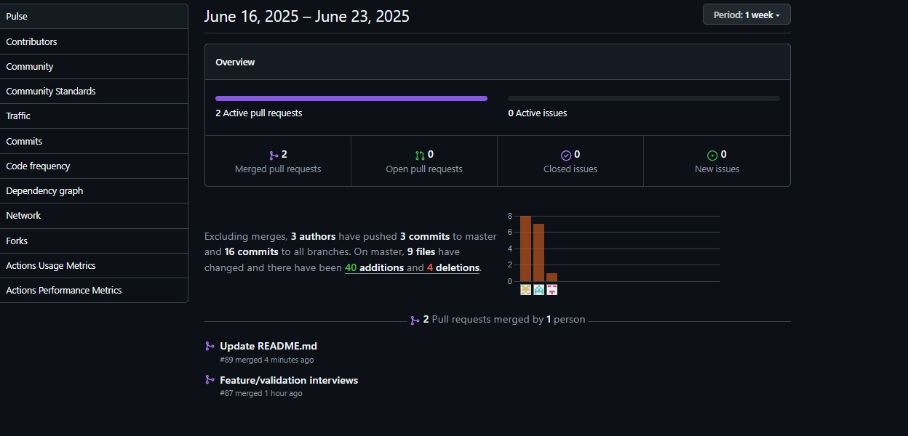
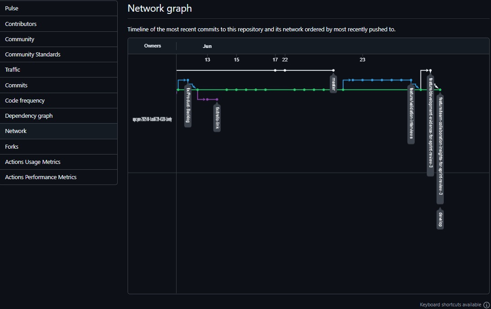

**Frontend:**
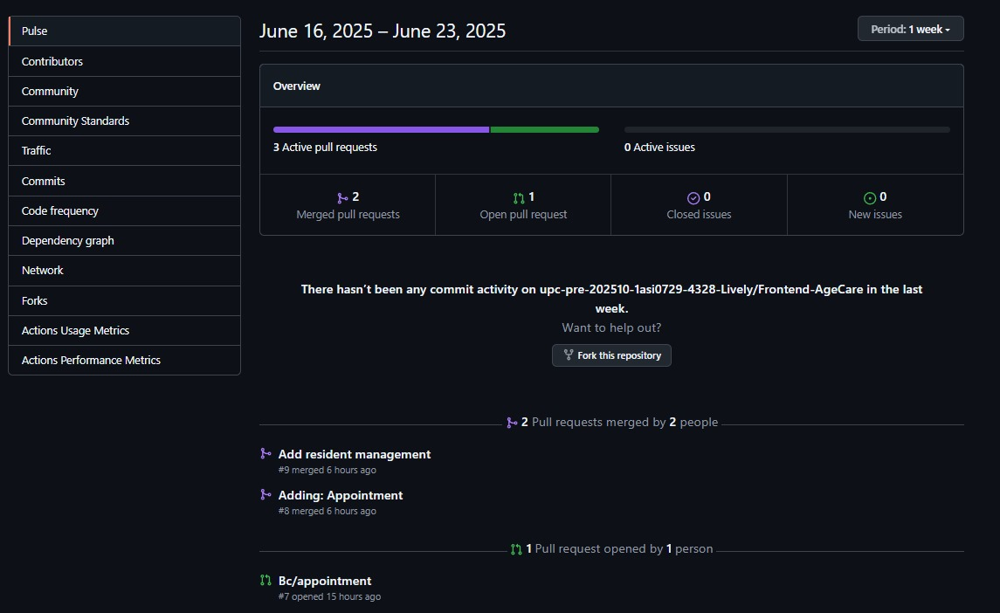
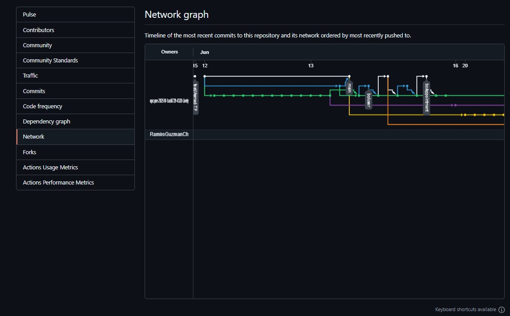

**Backend:**
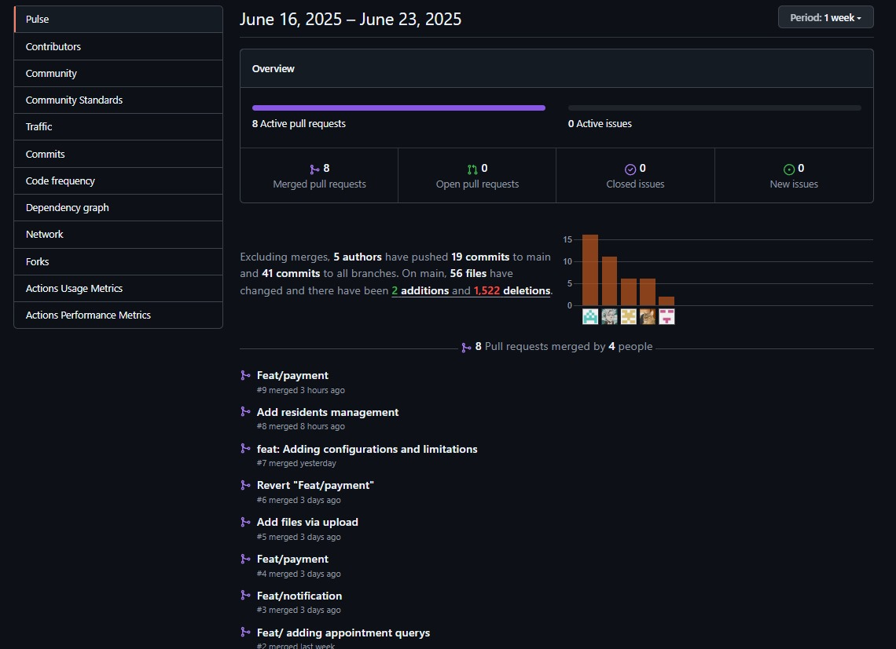
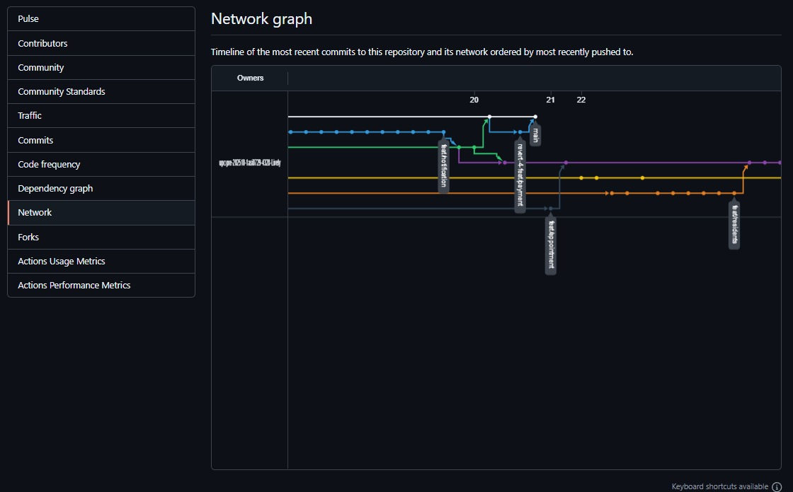

#### 5.3. Validation Interviews.
Como parte del proceso de validación del sistema AgeCareDB, se realizaron entrevistas semiestructuradas con distintos tipos de usuarios para evaluar la utilidad, usabilidad y aceptación de la plataforma en contextos reales. Estas entrevistas permitieron recopilar información cualitativa sobre la experiencia de uso desde la perspectiva de familiares, personal de salud y administradores de asilos. A través de preguntas abiertas, se exploraron aspectos como la facilidad de uso, la percepción de valor, la comprensión del sistema, y el impacto percibido en la comunicación y seguimiento del estado de los residentes. Los hallazgos de estas entrevistas sirvieron para confirmar hipótesis de diseño, identificar oportunidades de mejora y validar que el producto responde a las necesidades clave detectadas en etapas previas del proceso de diseño centrado en el usuario.

##### 5.3.1. Diseño de Entrevistas.
**Segmento 1: Familiar del residente**
1. ¿Cuál es su rol actual con respecto al cuidado de adultos mayores?
2. ¿Qué herramientas o métodos utiliza actualmente para informarse o registrar el estado de los residentes?
3. ¿Con qué frecuencia necesita consultar o registrar información sobre el residente?
4. ¿Cómo describiría su experiencia general usando AgeCareDB?
5. ¿Qué tan fácil fue para usted entender cómo funciona el sistema?
6. ¿Hubo algo que le resultó confuso o poco intuitivo?
7. ¿Pudo encontrar fácilmente información importante como el estado de salud, pagos o actividades del residente?
8. ¿Qué tan útil le resultó el sistema para mantenerse informado o registrar datos?
9. ¿Considera que la plataforma mejora la comunicación con otros involucrados (familiares, personal, administración)?
10. ¿Siente que su nivel de preocupación o incertidumbre se ha reducido gracias al uso del sistema?
11. ¿Qué beneficios principales ha encontrado al usar AgeCareDB?
12. ¿Hay algo que le gustaría mejorar o cambiar?

**Segmento 2: Personal de salud**
1. ¿Cuál es su rol actual en el asilo?
2. ¿Cuántos adultos mayores atiende en promedio diariamente?
3. ¿Cómo lleva actualmente el registro de información médica o emocional de los residentes?
4. ¿Qué desafíos enfrenta en esa tarea?
5. ¿Cómo fue su experiencia al utilizar la plataforma AgeCareDB por primera vez?
6. ¿Considera que el sistema es fácil de aprender y usar?
7. ¿Qué tan accesible le parece el sistema durante sus turnos o rutinas de cuidado?
8. ¿El sistema le permitió registrar de forma rápida el estado de salud y emociones del residente?
9. ¿Pudo identificar mejoras en la organización o acceso a la información del residente?
10. ¿Sintió que le ayudó a reducir el uso de papel o registros duplicados?
11. ¿Le ayudó a detectar signos de alerta o a tomar decisiones más rápidas?
12. ¿Cómo evaluaría la comunicación que se facilita con los familiares a través del sistema?
13. ¿Qué aspectos del sistema le parecieron más útiles?
14. ¿Hubo algo que dificultó su uso o que le gustaría mejorar?
15. ¿Estaría dispuesto/a a seguir usándolo a largo plazo si se implementa de manera oficial?

##### 5.3.2. Registro de Entrevistas.
**Entrevista N°1: Gabriel Torres**
<p align="center">

</p>
Link: [Entrevista Gabriel](https://youtu.be/6W5zOnc9PkY)


**Entrevista N°2: Rodrigo Camus**
<p align="center">

</p>
Link: [Entrevista Rodrigo](https://youtu.be/BSvZhg22R-U)


**Entrevista N°3: Sinaí Girón**
<p align="center">

</p>
Link: [Entrevista Sinai](https://youtu.be/BSvZhg22R-U)

##### 5.3.3. Evaluaciones según heurísticas.

Para asegurar una experiencia de usuario efectiva, accesible y centrada en las necesidades reales de los distintos perfiles de usuario de AgeCareDB, se llevó a cabo una evaluación heurística basada en las 10 heurísticas de usabilidad de Jakob Nielsen. Este enfoque permite identificar fortalezas y áreas de mejora en la interfaz y funcionalidad del sistema sin necesidad de pruebas con usuarios reales. Cada heurística fue analizada en el contexto de los flujos clave de la plataforma: consulta de información sobre residentes, registro de datos por el personal, visualización de pagos y comunicación entre actores. A continuación, se presentan los resultados de esta evaluación junto con recomendaciones para optimizar la experiencia del usuario final.

| # | Heruística | Evaluación | Recomendaciónes |
|---|------------|------------|-----------------|
|1| **Visivilidad  del estado del sistema** | El sistema proporciona información actualizada del estado de salud, pagos y actividades de los residentes. | Asegurar retroalimentación visual inmediata tras acciones como guardar, editar o eliminar datos.|
|2| **Concordancia entre el sistema y el mundo real** | El lenguaje utilizado es comprensible para familiares y personal médico. | Incluir glosarios o tooltips para términos clínicos menos familiares. |
|3| **Control y libertad del usuario** | Se evidencia de manera clara opciones para deshacer o cancelar acciones | Incluir más botones de "Cancelar" y confirmaciones al eliminar o modificar registros |
|4| **Consistencia y estándares** | Uso consistente de Material Design y términos. | Revisar que todos los formularios, botones y flujos mantengan coherencia visual y funcional. |
|5| **Prevención de errores** | Hay validaciones básicas, pero no se especifica su cobertura. | Implementar validaciones completas (fechas lógicas, número positivo, campos obligatorios). |
|6| **Reconocimiento antes que recuerdo** | Se muestran listas y detalles relevantes. | Agregar autocompletado en formularios, sugerencias y accesos rápidos. |
|7| **Flexibilidad y eficiencia de uso** | No hay diferenciación entre usuarios nuevos y frecuentes. | Incluir filtros, atajos, y personalización de vistas para distintos perfiles.. |
|8| **Estética y diseño minimalista** | Interfaz limpia y organizada. | Mantener una jerarquía visual clara, evitar sobrecarga de información en paneles. |
|9| **Ayuda con errores** | No se especifica presencia de mensajes de error informativos. | RIncluir mensajes claros con posibles soluciones y lenguaje empático. |
|10| **Ayuda y documentación** | No hay evidencia de secciones de ayuda o tutoriales. | Incluir una sección de "Ayuda", FAQs o videos introductorios para cada tipo de usuario. |

#### 5.4. Video About-the-Product.
Se muestra la secuencia de nuestro video del proyecto cubriendo todas las funcionalidades core.

[Link en Microsoft stream
](https://upcedupe-my.sharepoint.com/personal/u202217212_upc_edu_pe/_layouts/15/stream.aspx?id=%2Fpersonal%2Fu202217212%5Fupc%5Fedu%5Fpe%2FDocuments%2Fupc%2Dpre%2D202510%2D1asi0729%2D4328%2Dlively%2Dabout%2Dthe%2Dteam%2Dsprint%2D3%2Emp4&referrer=StreamWebApp%2EWeb&referrerScenario=AddressBarCopied%2Eview%2E15aababf%2D8d63%2D43ea%2Daf71%2De122053f15aa&isDarkMode=true)

https://upcedupe-my.sharepoint.com/personal/u202217212_upc_edu_pe/_layouts/15/stream.aspx?id=%2Fpersonal%2Fu202217212%5Fupc%5Fedu%5Fpe%2FDocuments%2Fupc%2Dpre%2D202510%2D1asi0729%2D4328%2Dlively%2Dabout%2Dthe%2Dteam%2Dsprint%2D3%2Emp4&referrer=StreamWebApp%2EWeb&referrerScenario=AddressBarCopied%2Eview%2E15aababf%2D8d63%2D43ea%2Daf71%2De122053f15aa&isDarkMode=true

## Conclusiones
### Conclusiones y recomendaciones

* **Conclusiónes:**
1. **Problema real y vigente:**
   La desconexión  y la falta de información en tiempo real entre los familiares y los asilos es un problema significativo en Lima, especialmente considerando el crecimiento de la población adulta mayor y la alta demanda de servicios geriátricos.
2. **Solución alineada a las necesidades del usuario:**
   Este producto responde de forma clara a las necesidades de los tres grupos clave: familiares, personal de salud y administradores. Cada grupo tiene funcionalidades dedicadas que abordan directamente sus principales frustraciones o carencias.
3. **Alta viabilidad tecnológica:**
   El nivel de acceso a Internet y familiaridad con herramientas digitales en Lima es suficientemente alto para garantizar la adopción inicial del sistema, tanto por parte de los familiares como del personal de salud.
4. **Impacto potencial alto:**
   La implementación de la aplicación puede mejorar la calidad de vida de los residentes, reducir la ansiedad de los familiares y optimizar la eficiencia operativa del personal del asilo, generando un cambio significativo en el ecosistema de cuidado geriátrico.
5. **Base sólida para futuras integraciones:**
La implementación de los CRUDs establece una estructura robusta y escalable que permitirá conectar el backend con interfaces móviles y web, facilitando futuras integraciones con sistemas de notificaciones, analítica o mensajería.
6. **Mejora en la gestión de datos sensibles:**
Al desarrollar operaciones seguras para crear, leer, actualizar y eliminar información, se ha avanzado en el tratamiento responsable de datos sensibles relacionados con la salud y bienestar de los residentes, lo que refuerza el cumplimiento de buenas prácticas en protección de datos.

* **Recomendaciónes:**
1. **Incluir un módulo de accesibilidad y soporte técnico:**
   Se debe de considerar de que existe la posibilidad de que los usuarios experimenten dificultades tecnológicas y/o limitaciónes fisicas. Agregar opciones como: lectura fácil, notificaciónes por Whatsapp y una linea de ayuda básica
2. **Insentivar el uso de la aplicación para el personal:**
   Añadir logros o reconocimientos internos al personal puede motivar el uso regular de la plataforma y mantener la calidad de los datos.
3. **Expandirlo de manera progresiva:**
   Empezar a trabajar poco a poco con entidades cada vez de mayor reconocimiento y tener la posibilidad de llevarlo a cabo en zonas rurales con poca conectividad o señal limitada apoyandonos con dichas entidades mayores.

## Bibliografía

Casas-Vasquez, P., Apaza-Pino, R., Juan, D. C. Y. D., & Chávez-Jimeno, H. (2016, April 1). _Atención sociosanitaria de los adultos mayores en el Perú._ https://repositorio.essalud.gob.pe/handle/20.500.12959/173

González, J. G., Martínez-Sala, A. M., Ramos-Soler, I., & Saucedo, N. L. S. (2024). _eSalud para adultos mayores: un análisis de la adopción de tecnologías en la prevención y control de enfermedades. Conexión, 22, 19–44._ https://doi.org/10.18800/conexion.202402.001

Luis, C. V. J., Fiorella, C. O. C., Leonor, O. T. A., & Gloria, R. S. C. (2020). _Servicio de telemonitoreo a través de dispositivos portátiles para adultos mayores con patologías asociadas en Lima Metropolitana._ https://repositorio.esan.edu.pe/items/883afed3-7ac5-4276-abed-d2f33956daf9

Luis, M. Z. J. (2023, November 22). _Diseño de un sistema inteligente de monitoreo intradomiciliario y remoto para el cuidado de la población adulta mayor._ https://tesis.pucp.edu.pe/items/6c5bd18d-e18d-4e1a-a273-4a0c5799435a

Romero-Albino, Z., Tenorio-Mucha, J., & Cuba-Fuentes, M. S. (2022). _Telemonitoreo y teleorientación psicosocial para adultos mayores del Seguro Social de Salud (EsSalud) durante los primeros seis meses de la pandemia por COVID-19 en el Perú. Revista Del Cuerpo Médico Hospital Nacional Almanzor Aguinaga Asenjo, 15(3), 392–396._ https://doi.org/10.35434/rcmhnaaa.2022.153.1386

## Anexos  
- Deployment Landing AgeCare: [Landing Deployment](https://upc-pre-202510-1asi0729-4328-lively.github.io/landing-page/)
- Deployment FrontEnd Guzman: [FrotEnd Guzman](https://agecare-guzman.web.app/doctors)
- Deployment JsonServer Guzman: [JsonServer Guzman](https://ca3ae4ce59df808f6d28.free.beeceptor.com/api/v1/doctors/)
- Deployment FrontEnd Quijada: [FrotEnd Quijada](https://agecare-quijada.web.app/learning/students)
- Deployment JsonServer Quijada: [JsonServer Quijada](https://caa1b4a7c41b04644ec5.free.beeceptor.com/api/v1/nurses/)
- Deployment FrontEnd Asmad: [FrotEnd Asmad](https://frontend-agecare.web.app/core/residents)
- Deployment JsonServer Asmad: [JsonServer Asmad](https://ca46f759261bd14f42fd.free.beeceptor.com/api/v1/residents)
- Deployment FrontEnd Liu: [FrotEnd Liu](https://agecare-reports-huang.web.app/learning/students)
- Deployment JsonServer Liu: [JsonServer Liu](https://cafae7074d3302b3a432.free.beeceptor.com/api/v1/reports/)
- Deployment FRONT TB2 https://agecare-7630e.web.app/home
- Deployment BACK TB2 https://livelyagecare-opensource-bke7czhsgfcdfffk.eastus-01.azurewebsites.net/swagger-ui/index.html#
- VIDEO ABOUT THE PRODUCT  https://upcedupe-my.sharepoint.com/personal/u202217212_upc_edu_pe/_layouts/15/stream.aspx?id=%2Fpersonal%2Fu202217212%5Fupc%5Fedu%5Fpe%2FDocuments%2Fupc%2Dpre%2D202510%2D1asi0729%2D4328%2Dlively%2Dabout%2Dthe%2Dteam%2Dsprint%2D3%2Emp4&referrer=StreamWebApp%2EWeb&referrerScenario=AddressBarCopied%2Eview%2E15aababf%2D8d63%2D43ea%2Daf71%2De122053f15aa&isDarkMode=true
- VIDEO ABOUT THE TEAM  https://upcedupe-my.sharepoint.com/personal/u202217212_upc_edu_pe/_layouts/15/stream.aspx?id=%2Fpersonal%2Fu202217212%5Fupc%5Fedu%5Fpe%2FDocuments%2Fupc%2Dpre%2D202510%2D1asi0729%2D4328%2Dlively%2Dabout%2Dthe%2Dproduct%2Dsprint%2D3%2Emp4&referrer=StreamWebApp%2EWeb&referrerScenario=AddressBarCopied%2Eview%2E8d79a6f9%2D976f%2D497b%2D9f30%2Dbd4a04ff290a&isDarkMode=true&mode=Edit
- LANDING PAGE DEPLOY https://upc-pre-202510-1asi0729-4328-lively.github.io/landing-page/
