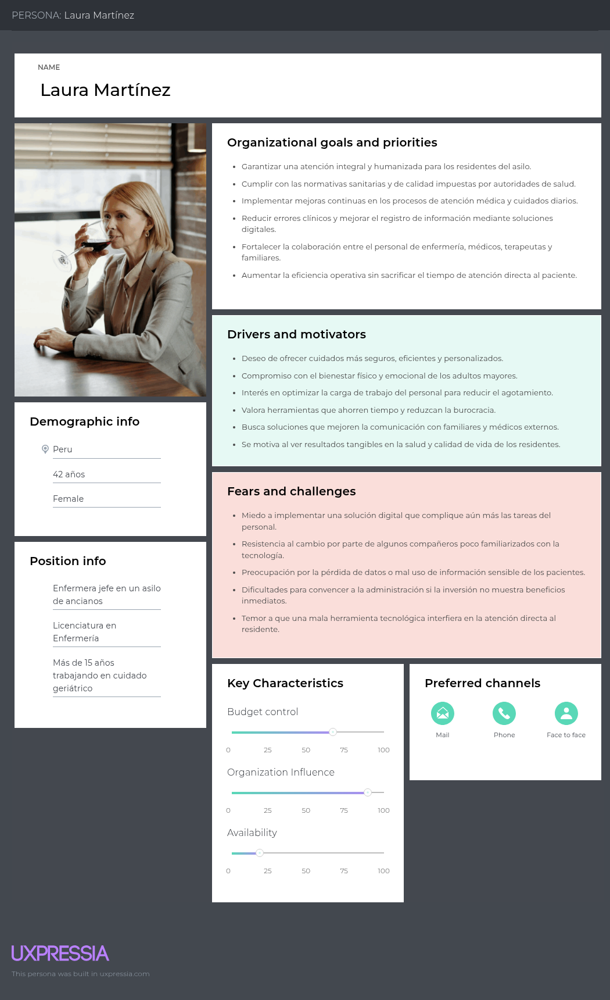
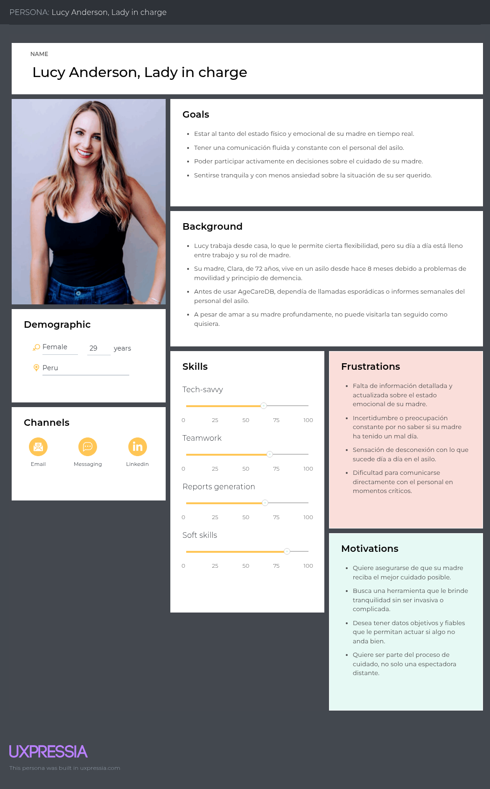
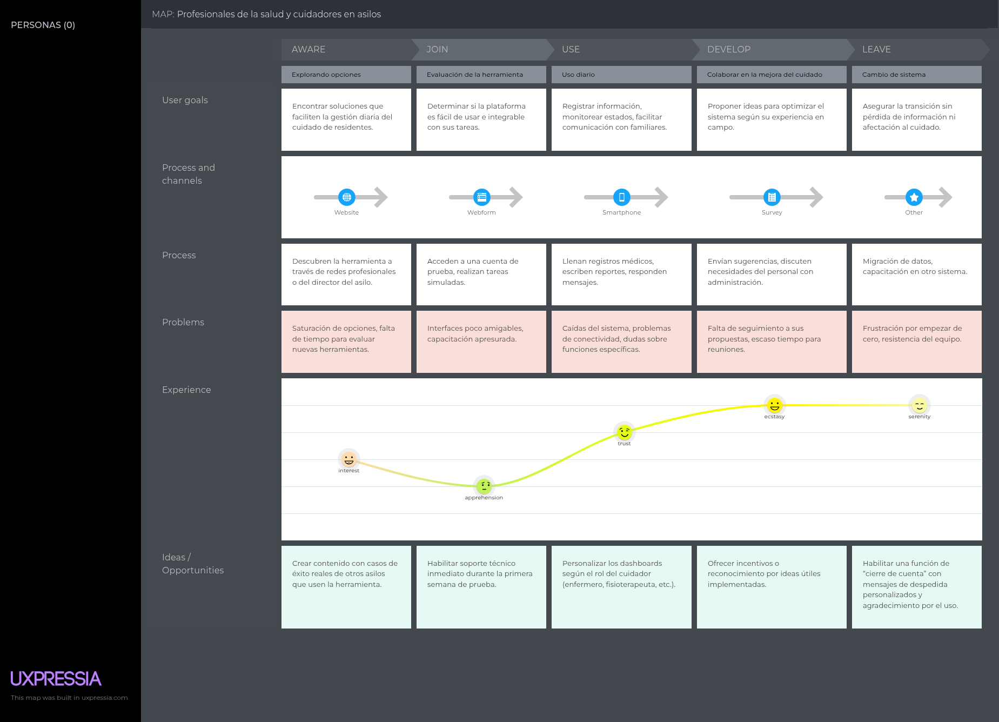
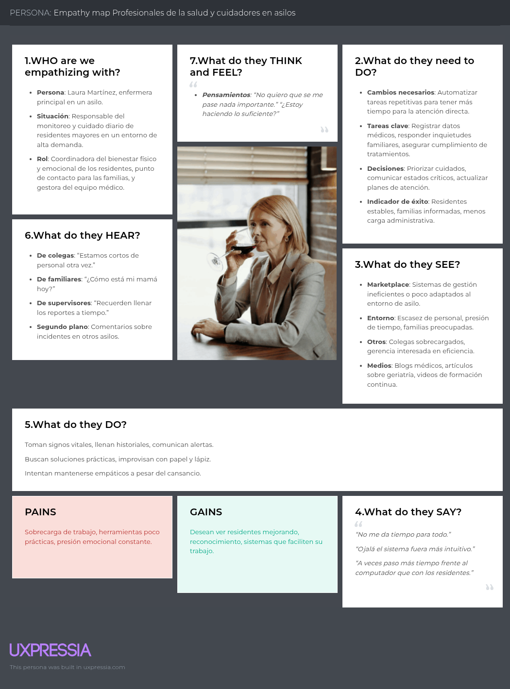
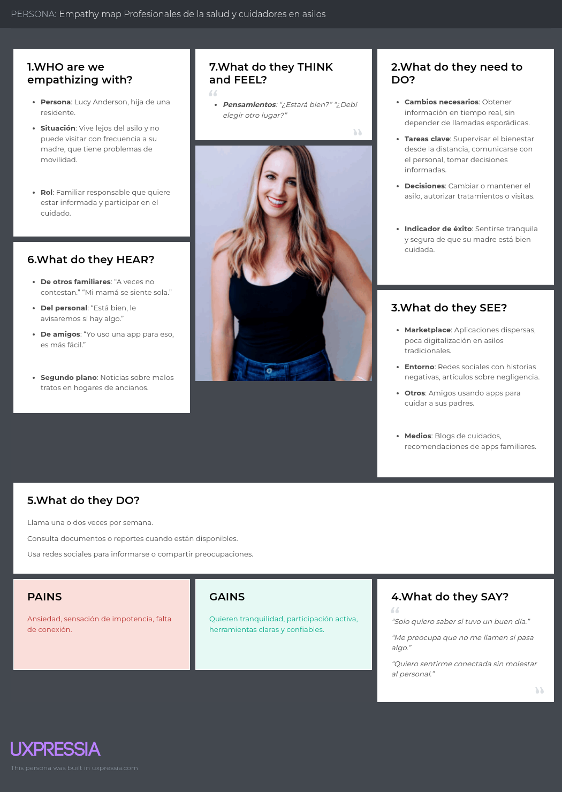

# Lively  
**Producto: GrandPad**  
# UNIVERSIDAD PERUANA DE CIENCIAS APLICADAS

  

### Carrera: Ingeniería de Software  
### Ciclo: 5° ciclo  
### Curso: Desarrollo de Aplicaciones Open Source  
### Sección: 1ASI0729  
### Profesor: Juan Antonio Flores Moroco 

## Informe de Trabajo Final  
**"Lively"**  
**Producto: "GrandPad"**

### Integrantes:
- Ramiro Alexander Guzmán Chávez – U202217062  
- Fátima Andrea Asmad Padilla – U20221B490  
- Jeremy Alexander Quijada Magro – U202219657  
- Gabriel Huang Liu Franco – U202310345  
- Mauricio Rigoberto Muñoz Vilcapoma – U202217212  

**Abril, 2025**  
**URL del proyecto:** [https://github.com/MauricioMVilcapoma/OpenSource-4328](https://github.com/MauricioMVilcapoma/OpenSource-4328)

---

## Registro de Versiones del Informe

| Versión | Fecha       | Autor | Descripción |
|---------|-------------|-------|-------------|
| TB1     | XX/XX/XXXX  |       |             |
| TB1     | XX/XX/XXXX  |       |             |
| TB1     | XX/XX/XXXX  |       |             |
| TB1     | XX/XX/XXXX  |       |             |
| TB1     | XX/XX/XXXX  |       |             |
| TB1     | XX/XX/XXXX  |       |             |
| TB1     | XX/XX/XXXX  |       |             |
| TB1     | XX/XX/XXXX  |       |             |
| TB1     | XX/XX/XXXX  |       |             |
| TB1     | XX/XX/XXXX  |       |             |
| TB1     | XX/XX/XXXX  |       |             |
| TB1     | XX/XX/XXXX  |       |             |
| TB1     | XX/XX/XXXX  |       |             |

---

## Project Report Collaboration Insights

- **URL de la organización del proyecto:**  
  [https://github.com/MauricioMVilcapoma/OpenSource-4328](https://github.com/MauricioMVilcapoma/OpenSource-4328)  
- **URL del repositorio del informe:**  
  [https://github.com/MauricioMVilcapoma/OpenSource-4328](https://github.com/MauricioMVilcapoma/OpenSource-4328)

## Contenido  
**Tabla de Contenidos:**
- **Student Outcome**
- **Capítulo I: Introducción**
  - 1.1. Startup Profile  
    - 1.1.1. Descripción de la startup  
    - 1.1.2. Perfiles de los integrantes del equipo  
  - 1.2. Solution Profile  
    - 1.2.1. Antecedentes y problemática  
    - 1.2.2. Lean UX Process  
      - 1.2.2.1. Lean UX Problem Statements  
      - 1.2.2.2. Lean UX Assumptions  
      - 1.2.2.3. Lean UX Hypothesis Statements  
      - 1.2.2.4. Lean UX Canvas  
  - 1.3. Segmentos objetivo  
- **Capítulo II: Requirements Elicitation & Analysis**
  - 2.1. Competidores  
    - 2.1.1. Análisis competitivo  
    - 2.1.2. Estrategias y tácticas frente a competidores  
  - 2.2. Entrevistas  
    - 2.2.1. Diseño de entrevistas  
    - 2.2.2. Registro de entrevistas  
    - 2.2.3. Análisis de entrevistas  
  - 2.3. Needfinding  
    - 2.3.1. User Personas  
    - 2.3.2. User Task Matrix  
    - 2.3.3. User Journey Mapping  
    - 2.3.4. Empathy Mapping  
    - 2.3.5. As-is Scenario Mapping  
  - 2.4. Ubiquitous Language  
- **Capítulo III: Requirements Specification**
  - 3.1. To-Be Scenario Mapping  
  - 3.2. User Stories  
  - 3.3. Impact Mapping  
  - 3.4. Product Backlog  
- **Capítulo IV: Product Design**
  - 4.1. Style Guidelines  
    - 4.1.1. General Style Guidelines  
    - 4.1.2. Web Style Guidelines  
  - 4.2. Information Architecture  
    - 4.2.1. Organization Systems  
    - 4.2.2. Labeling Systems  
    - 4.2.3. SEO Tags and Meta Tags  
    - 4.2.4. Searching Systems  
    - 4.2.5. Navigation Systems  
  - 4.3. Landing Page UI Design  
    - 4.3.1. Landing Page Wireframe  
      - Desktop Web Browser  
      - Mobile Web Browser  
    - 4.3.2. Landing Page Mock-up  
      - Desktop Web Browser  
      - Mobile Web Browser  
  - 4.4. Web Applications UX/UI Design  
    - 4.4.1. Web Applications Wireframes  
    - 4.4.2. Web Applications Wireflow Diagrams  
    - 4.4.3. Web Applications Mock-ups  
    - 4.4.4. Web Applications User Flow Diagrams  
  - 4.5. Web Applications Prototyping  
  - 4.6. Domain-Driven Software Architecture  
    - 4.6.1. Software Architecture Context Diagram  
    - 4.6.2. Software Architecture Container Diagrams  
    - 4.6.3. Software Architecture Components Diagrams  
  - 4.7. Software Object-Oriented Design  
    - 4.7.1. Class Diagrams  
  - 4.8. Database Design  
    - 4.8.1. Database Dictionary  
    - 4.8.2. Database Diagram  
- **Capítulo V: Product Implementation, Validation & Deployment**
  - 5.1. Software Configuration Management  
    - 5.1.1. Software Development Environment Configuration  
    - 5.1.2. Source Code Management  
    - 5.1.3. Source Code Style Guide & Conventions  
    - 5.1.4. Software Deployment Configuration  
  - 5.2. Landing Page, Services & Applications Implementation  
    - 5.2.1. Sprint 1  
      - 5.2.1.1. Sprint Planning 1  
      - 5.2.1.2. Sprint Backlog 1  
      - 5.2.1.3. Development Evidence for Sprint Review  
      - 5.2.1.4. Testing Suite Evidence for Sprint Review  
      - 5.2.1.5. Execution Evidence for Sprint Review  
      - 5.2.1.6. Software Deployment Evidence for Sprint Review  
      - 5.2.1.7. Team Collaboration Insights during Sprint  

- **Conclusiones**  
- **Bibliografía**  
- **Anexos**  

---

## Student Outcome  
**ABET – EAC - Student Outcome 3**  
**Criterio:** Capacidad de comunicarse efectivamente con un rango de audiencias.  

En el siguiente cuadro se describen las acciones realizadas y conclusiones del equipo que sustentan el logro del ABET - EAC - Student Outcome 3:

| Criterio específico | Acciones realizadas | Conclusiones |
|---------------------|---------------------|--------------|
| 1. Comunica oralmente con efectividad a diferentes rangos de audiencia |                     |              |
| 2. Comunica por escrito con efectividad a diferentes rangos de audiencia |                     |              |

# Capitulo I: Introducción
## **1.1. Startup Profile**
### **1.1.1. Descripción del Startup**
**AgeCareDB** es una *startup* dedicada a mejorar la calidad de vida de los residentes de asilos de ancianos y brindar tranquilidad a sus familiares a través de soluciones tecnológicas innovadoras.

Nuestra principal solución, **AgeCareDB**, es una plataforma digital diseñada para recopilar y proporcionar información detallada sobre el bienestar físico y mental de los residentes en tiempo real.

### 1.2.1.Antecedentes y problemática

**WHAT** 
**AgeCareDB** es una plataforma que recopila datos sobre el bienestar de los residentes en asilos de ancianos en Lima, Perú.

**WHY** 
La plataforma mejora la transparencia y comunicación entre los asilos y los familiares de los residentes.

**WHERE** 
Se utiliza en asilos de ancianos en Lima, Perú, pero los familiares pueden acceder desde cualquier lugar.

**WHO** 
Los usuarios son las **enfermeras**, **cuidadores** y **familiares** de los residentes.  
- Las enfermeras y cuidadores ingresan datos sobre el bienestar de los residentes.  
- Los familiares acceden a la plataforma para obtener información en tiempo real.

**WHEN** 
La información se actualiza en **tiempo real**.

**HOW** 
La plataforma permite ingresar y consultar datos de salud física y mental, facilitando el monitoreo constante del estado de los residentes.

**HOW MUCH** 
AgeCareDB atiende a **cientos de adultos mayores** en asilos en Lima, formando parte de los **3.9 millones de adultos mayores en situación de vulnerabilidad** en el país.

### **1.2.2.1. Lean UX Problem Statements**

**Problem Statment 1:** 
**Usuarios:** Familiares de adultos mayores que residen en asilos. 
**Necesdad:** Necesitan mantenerse informados sobre el estado de salud y bienestar de sus seres queridos, pero actualmente no tienen acceso a información en tiempo real ni canales efectivos de comunicación. 
**Solución:** Nuestra plataforma proporciona actualizaciones en tiempo real sobre el estado físico y emocional de los residentes, así como herramientas para una comunicación fluida con el personal del asilo. 

**Problem Statment 2:** 
**Usuarios:** Personal de cuidado en asilos de ancianos. 
**Necesdad:** Necesitan una forma más eficiente de registrar, organizar y compartir información sobre la salud y el estado emocional de los residentes, sin interrumpir sus labores cotidianas. 
**Solución:** AgeCareDB ofrece una interfaz intuitiva para el registro de datos clínicos y emocionales, facilitando el seguimiento del estado de cada residente y mejorando la coordinación del equipo de atención. 

**Problem Statment 3:** 
**Usuarios:** Directores o administradores de asilos. 
**Necesdad:** Buscan garantizar una atención de calidad y mantener la confianza de las familias, pero carecen de herramientas que respalden decisiones basadas en datos y evidencias. 
**Solución:** Nuestra plataforma genera reportes detallados y visualizaciones del bienestar general de los residentes, permitiendo tomar decisiones informadas y demostrar compromiso con la calidad del servicio. 

### **1.2.2.2. Lean UX Assumptions**

**¿Quiénes son nuestros usuarios?** 
**R:** Familiares de adultos mayores que viven en asilos, personal de cuidado (enfermeros, cuidadores) y administradores de centros geriátricos. También incluye a profesionales de la salud interesados en mejorar la atención de los residentes a través del uso de tecnología. 

**¿Dónde encaja muestro producto en su trabajo o vida?**  

**R:** AgeCareDB facilita el seguimiento del bienestar físico y emocional de los adultos mayores en asilos. Para los familiares, representa una fuente confiable de información y tranquilidad. Para el personal, mejora el registro y análisis de datos de salud. Y para los administradores, permite una supervisión más clara del servicio brindado y una mejor comunicación con los familiares. 

**¿Qué problema podría afrontar nuestro producto y cómo podemos resolverlo?** 

**Problema:** Los familiares suelen sentirse desconectados o preocupados por la falta de información sobre el estado de salud de sus seres queridos en los asilos. Al mismo tiempo, el personal se ve sobrecargado con registros manuales y comunicación informal. 
**Solución:** AgeCareDB centraliza la información clínica y emocional de los residentes, proporciona actualizaciones en tiempo real a los familiares y optimiza el trabajo del personal con herramientas intuitivas de registro, alertas inteligentes y comunicación directa. 

**¿Cuándo y cómo se utiliza?** 

**R:** AgeCareDB puede utilizarse en cualquier momento desde un dispositivo móvil o computadora. El personal del asilo lo emplea durante las rutinas de cuidado para registrar observaciones; los familiares acceden para revisar el estado de sus seres queridos y comunicarse con el equipo de atención; los administradores lo usan para generar reportes y evaluar la calidad del servicio. 

**¿Qué características son importantes?** 

- Registro fácil y rápido del estado físico y emocional de los residentes.
- Actualizaciones en tiempo real accesibles para los familiares.
- Alertas inteligentes ante signos de riesgo o cambios importantes.
- Panel de control para los administradores con reportes visuales.
- Canal de comunicación directa entre familia y personal del asilo.

**¿Cómo debe verse nuestro producto y cómo comportarse?** 

**R:** La plataforma debe tener un diseño cálido, humano y profesional, con una interfaz clara y amigable tanto para personal médico como para familiares no técnicos. Debe transmitir confianza, ser accesible y mostrar los datos de manera visual y comprensible. Su comportamiento debe ser fluido, confiable y siempre centrado en facilitar el bienestar del residente y la conexión emocional entre familias y cuidadores. 

### **1.2.2.3. Lean UX Hypothesis Statements**

**Creemos que** al implementar una sección de reportes visuales sobre el estado físico y emocional del residente, los familiares se sentirán más tranquilos y confiados respecto al cuidado que recibe su ser querido. 
**Sabremos que** hemos tenido éxito cuando más del 70% de los familiares califiquen como útil o muy útil esta sección en las encuestas de satisfacción. 
**Sabremos que** esto es verdad porque los reportes han sido visualizados con frecuencia y han generado comentarios positivos sobre la mejora en la comunicación y transparencia. 
**Creemos que** al implementar un canal directo de mensajería entre familiares y el personal del asilo, se reducirá la ansiedad de los familiares y se fortalecerá la relación entre ambas partes. 
**Sabremos que** hemos tenido éxito cuando al menos el 60% de los usuarios activos utilicen este canal para comunicarse y lo califiquen como efectivo. 
**Sabremos que** esto es verdad porque veremos una reducción en las llamadas de quejas o incertidumbre, y un aumento en interacciones positivas vía plataforma. 
**Creemos que** al implementar un sistema de alertas automatizadas cuando un residente muestra signos tempranos de deterioro en su salud, el personal podrá actuar más rápido y con mayor precisión. 
**Sabremos que** hemos tenido éxito cuando el número de intervenciones tempranas registradas aumente y se refleje una disminución en emergencias médicas inesperadas. 
**Sabremos que** esto es verdad porque el sistema de alertas será usado regularmente por el personal y reportado como útil en las reuniones de seguimiento clínico. 

### **1.2.2.4. Lean UX Canva**

## **2.3. Needfinding**
### **2.3.1 User Personas**

**Profesionales de la salud y cuidadores en asilos**

  
  
**Familiares preocupados por sus seres queridos**

  

### **2.3.2 User Task Matrix**

En este cuadro, se presentan las tareas realizadas por los dos **User Personas**:  
1. **Laura Martínez** (Profesional de la salud y cuidadora en un asilo de ancianos).  
2. **Lucy Anderson** (Familiar preocupado por el bienestar de su ser querido en un asilo).

Cada fila muestra una tarea clave y su frecuencia e importancia para cada persona.

| **Tareas**                                                                                  | **Laura Martínez (Profesional de salud)** |           | **Lucy Anderson (Familiar)**          |           |
|---------------------------------------------------------------------------------------------|-------------------|------------|-------------------|------------|
|                                                                                             | **Frecuencia**    | **Importancia** | **Frecuencia**    | **Importancia** |
| Registrar información médica de los residentes                                              | Alta              | Alta       | Baja              | Baja       |
| Comunicar el estado físico y emocional de los residentes a los familiares                   | Media             | Alta       | Alta              | Alta       |
| Actualizar el plan de cuidado individual de los residentes                                  | Alta              | Alta       | Baja              | Baja       |
| Responder preguntas o inquietudes de los familiares                                          | Alta              | Alta       | Alta              | Alta       |
| Acceder a historiales médicos de los residentes                                              | Alta              | Alta       | Baja              | Baja       |
| Participar en la toma de decisiones médicas                                                  | Alta              | Alta       | Baja              | Baja       |
| Gestionar la comunicación diaria entre el personal de salud                                 | Alta              | Alta       | Baja              | Baja       |
| Verificar el cumplimiento de la medicación de los residentes                                | Alta              | Alta       | Baja              | Baja       |
| Solicitar informes sobre el estado de los residentes                                        | Baja              | Alta       | Alta              | Alta       |
| Revisar las alertas de salud (por ejemplo, caídas, cambios en la salud)                     | Alta              | Alta       | Baja              | Baja       |
| Establecer contacto con el personal para coordinar visitas o cuidados adicionales           | Baja              | Media      | Alta              | Alta       |
| Monitorear el bienestar emocional de los residentes                                          | Media             | Alta       | Baja              | Baja       |
| Tomar decisiones sobre el cambio de residencia o cuidados adicionales                       | Baja              | Media      | Alta              | Alta       |
| Tener acceso a información sobre actividades recreativas y sociales de los residentes       | Baja              | Baja       | Alta              | Alta       |
| Obtener feedback o recomendaciones del personal del asilo sobre el bienestar de su ser querido | Baja              | Alta       | Alta              | Alta       |

 **Explicación de las Tareas con Mayor Frecuencia e Importancia**

 **Laura Martínez (Profesional de la salud y cuidador):**
- **Registrar información médica de los residentes:** Alta frecuencia e importancia. Como enfermera jefe, Laura debe asegurarse de que todos los datos médicos estén correctamente documentados para brindar un cuidado adecuado.
- **Actualizar el plan de cuidado individual de los residentes:** Laura es responsable de adaptar los cuidados a las necesidades de cada residente, lo que debe ser una tarea constante.
- **Responder preguntas o inquietudes de los familiares:** Alta frecuencia e importancia, ya que los familiares de los residentes suelen tener preguntas sobre el bienestar de sus seres queridos.

 **Lucy Anderson (Familiar):**
- **Comunicar el estado físico y emocional de los residentes a los familiares:** Lucy tiene una alta prioridad en recibir esta información de manera constante y en tiempo real para mantener su tranquilidad.
- **Solicitar informes sobre el estado de los residentes:** Lucy busca información objetiva y detallada que le permita estar al tanto de la situación de su madre, por lo que esta tarea es muy importante.
- **Establecer contacto con el personal para coordinar visitas o cuidados adicionales:** Lucy tiene una alta frecuencia en esta tarea, ya que, al ser hija de la residente, desea involucrarse en la toma de decisiones y asegurarse de que el cuidado sea el adecuado.

 **Principales Diferencias**

- **Enfoque de la tarea:** Laura está más enfocada en las actividades operativas, como el registro de información médica y la gestión interna del cuidado. En contraste, Lucy se enfoca en obtener información sobre el bienestar de su madre y mantener una comunicación constante con el personal del asilo.
- **Importancia de la toma de decisiones:** Para Laura, las decisiones médicas y operativas son fundamentales, mientras que para Lucy, la toma de decisiones se refiere principalmente a asegurar que su madre esté bien cuidada y que su comunicación con el personal sea efectiva.

 **Coincidencias**

- Ambas comparten la tarea de **comunicar el estado de los residentes**. Aunque Laura es quien tiene la responsabilidad directa de gestionar la atención, Lucy necesita esta información para asegurarse de que su madre esté siendo bien cuidada.
- La **respuesta a preguntas o inquietudes** es una tarea común en ambos casos, aunque la frecuencia e importancia varían según el rol.

### **2.3.3 User Journey Mapping**

**Profesionales de la salud y cuidadores en asilos**

  
  
**Familiares preocupados por sus seres queridos**

  

### **2.3.4 Empathy Mapping**

**Profesionales de la salud y cuidadores en asilos**

  
  
**Familiares preocupados por sus seres queridos**

  

