# Lively  
**Producto: GrandPad**  
# UNIVERSIDAD PERUANA DE CIENCIAS APLICADAS

<p align="center">
  
</p>

### Carrera: Ingeniería de Software  
### Ciclo: 5° ciclo  
### Curso: Desarrollo de Aplicaciones Open Source  
### Sección: 1ASI0729  
### Profesor: Juan Antonio Flores Moroco 

## Informe de Trabajo Final  
**"Lively"**  
**Producto: "GrandPad"**

### Integrantes:
- Ramiro Alexander Guzmán Chávez – U202217062  
- Fátima Andrea Asmad Padilla – U20221B490  
- Jeremy Alexander Quijada Magro – U202219657  
- Gabriel Huang Liu Franco – U202310345  
- Mauricio Rigoberto Muñoz Vilcapoma – U202217212  

**Abril, 2025**  
**URL del proyecto:** [https://github.com/MauricioMVilcapoma/OpenSource-4328](https://github.com/MauricioMVilcapoma/OpenSource-4328)

---

## Registro de Versiones del Informe

| Versión | Fecha       | Autor | Descripción |
|---------|-------------|-------|-------------|
| TB1     | 15/04/2025  |  Ramiro Alexander Guzman Chavez   |    Desarrollé la carátula del repositorio, el diagrama de clases, el diagrama de la base de datos y el class dictionary.      |
| TB1     | 17/04/2025  |  Ramiro Alexander Guzman Chavez     |     Añadí mi registro de entrevistas realizadas por segmento objetivo.     |
| TB1     | 18/04/2025  |  Franco Gabriel Huang Liu     |    Realicé los wireframes, wireflows y la sección de Lean UX        |
| TB1     | 23/04/2025  |  Franco Gabriel Huang Liu     |   Se terminó el mockup y el userflow          |
| TB1     | XX/XX/XXXX  |       |             |
| TB1     | XX/XX/XXXX  |       |             |
| TB1     | XX/XX/XXXX  |       |             |
| TB1     | XX/XX/XXXX  |       |             |
| TB1     | XX/XX/XXXX  |       |             |
| TB1     | XX/XX/XXXX  |       |             |
| TB1     | XX/XX/XXXX  |       |             |
| TB1     | XX/XX/XXXX  |       |             |
| TB1     | XX/XX/XXXX  |       |             |

---

## Project Report Collaboration Insights

- **URL de la organización del proyecto:**  
  [https://github.com/MauricioMVilcapoma/OpenSource-4328](https://github.com/MauricioMVilcapoma/OpenSource-4328)  
- **URL del repositorio del informe:**  
  [https://github.com/MauricioMVilcapoma/OpenSource-4328](https://github.com/MauricioMVilcapoma/OpenSource-4328)
---
## Contenido
#### Tabla de contenidos

- [Student Outcome](#student-outcome)
- [Capítulo I: Introducción](#capítulo-i-introducción)
  - [1.1. Startup Profile](#11-startup-profile)
    - [1.1.1. Descripción de la startup](#111-descripción-de-la-startup)
    - [1.1.2. Perfiles de los integrantes del equipo](#112-perfiles-de-los-integrantes-del-equipo)
  - [1.2. Solution Profile](#12-solution-profile)
    - [1.2.1. Antecedentes y problemática](#121-antecedentes-y-problemática)
    - [1.2.2. Lean UX Process](#122-lean-ux-process)
      - [1.2.2.1. Lean UX Problem Statements](#1221-lean-ux-problem-statements)
      - [1.2.2.2. Lean UX Assumptions](#1222-lean-ux-assumptions)
      - [1.2.2.3. Lean UX Hypothesis Statements](#1223-lean-ux-hypothesis-statements)
      - [1.2.2.4. Lean UX Canvas](#1224-lean-ux-canvas)
  - [1.3. Segmentos objetivo](#13-segmentos-objetivo)
- [Capítulo II: Requirements Elicitation & Analysis](#capítulo-ii-requirements-elicitation--analysis)
  - [2.1. Competidores](#21-competidores)
    - [2.1.1. Análisis competitivo](#211-análisis-competitivo)
    - [2.1.2. Estrategias y tácticas frente a competidores](#212-estrategias-y-tácticas-frente-a-competidores)
  - [2.2. Entrevistas](#22-entrevistas)
    - [2.2.1. Diseño de entrevistas](#221-diseño-de-entrevistas)
    - [2.2.2. Registro de entrevistas](#222-registro-de-entrevistas)
    - [2.2.3. Análisis de entrevistas](#223-análisis-de-entrevistas)
  - [2.3. Needfinding](#23-needfinding)
    - [2.3.1. User Personas](#231-user-personas)
    - [2.3.2. User Task Matrix](#232-user-task-matrix)
    - [2.3.3. User Journey Mapping](#233-user-journey-mapping)
    - [2.3.4. Empathy Mapping](#234-empathy-mapping)
    - [2.3.5. As-is Scenario Mapping](#235-as-is-scenario-mapping)
  - [2.4. Ubiquitous Language](#24-ubiquitous-language)
- [Capítulo III: Requirements Specification](#capítulo-iii-requirements-specification)
  - [3.1. To-Be Scenario Mapping](#31-to-be-scenario-mapping)
  - [3.2. User Stories](#32-user-stories)
  - [3.3. Impact Mapping](#33-impact-mapping)
  - [3.4. Product Backlog](#34-product-backlog)
- [Capítulo IV: Product Design](#capítulo-iv-product-design)
  - [4.1. Style Guidelines](#41-style-guidelines)
    - [4.1.1. General Style Guidelines](#411-general-style-guidelines)
    - [4.1.2. Web Style Guidelines](#412-web-style-guidelines)
  - [4.2. Information Architecture](#42-information-architecture)
    - [4.2.1. Organization Systems](#421-organization-systems)
    - [4.2.2. Labeling Systems](#422-labeling-systems)
    - [4.2.3. SEO Tags and Meta Tags](#423-seo-tags-and-meta-tags)
    - [4.2.4. Searching Systems](#424-searching-systems)
    - [4.2.5. Navigation Systems](#425-navigation-systems)
  - [4.3. Landing Page UI Design](#43-landing-page-ui-design)
    - [4.3.1. Landing Page Wireframe](#431-landing-page-wireframe)
    - [4.3.2. Landing Page Mock-up](#432-landing-page-mock-up)
  - [4.4. Web Applications UX/UI Design](#44-web-applications-uxui-design)
    - [4.4.1. Web Applications Wireframes](#441-web-applications-wireframes)
    - [4.4.2. Web Applications Wireflow Diagrams](#442-web-applications-wireflow-diagrams)
    - [4.4.3. Web Applications Mock-ups](#443-web-applications-mock-ups)
    - [4.4.4. Web Applications User Flow Diagrams](#444-web-applications-user-flow-diagrams)
  - [4.5. Web Applications Prototyping](#45-web-applications-prototyping)
  - [4.6. Domain-Driven Software Architecture](#46-domain-driven-software-architecture)
    - [4.6.1. Software Architecture Context Diagram](#461-software-architecture-context-diagram)
    - [4.6.2. Software Architecture Container Diagrams](#462-software-architecture-container-diagrams)
    - [4.6.3. Software Architecture Components Diagrams](#463-software-architecture-components-diagrams)
  - [4.7. Software Object-Oriented Design](#47-software-object-oriented-design)
    - [4.7.1. Class Diagrams](#471-class-diagrams)
  - [4.7.2. Class Dictionary](#472-class-dictionary)
  - [4.8. Database Design](#48-database-design)
    - [4.8.1. Database Diagram](#481-database-diagram)
- [Capítulo V: Product Implementation, Validation & Deployment](#capítulo-v-product-implementation-validation--deployment)
  - [5.1. Software Configuration Management](#51-software-configuration-management)
    - [5.1.1. Software Development Environment Configuration](#511-software-development-environment-configuration)
    - [5.1.2. Source Code Management](#512-source-code-management)
    - [5.1.3. Source Code Style Guide & Conventions](#513-source-code-style-guide--conventions)
    - [5.1.4. Software Deployment Configuration](#514-software-deployment-configuration)
  - [5.2. Landing Page, Services & Applications Implementation](#52-landing-page-services--applications-implementation)
    - [5.2.X. Sprint n](#52x-sprint-n)
      - [5.2.X.1. Sprint Planning n](#52x1-sprint-planning-n)
      - [5.2.X.2. Aspect Leaders and Collaborators](#52x2-aspect-leaders-and-collaborators)
      - [5.2.X.3. Sprint Backlog n](#52x3-sprint-backlog-n)
      - [5.2.X.4. Development Evidence for Sprint Review](#52x4-development-evidence-for-sprint-review)
      - [5.2.X.5. Execution Evidence for Sprint Review](#52x5-execution-evidence-for-sprint-review)
      - [5.2.X.6. Services Documentation Evidence for Sprint Review](#52x6-services-documentation-evidence-for-sprint-review)
      - [5.2.X.7. Software Deployment Evidence for Sprint Review](#52x7-software-deployment-evidence-for-sprint-review)
      - [5.2.X.8. Team Collaboration Insights during Sprint](#52x8-team-collaboration-insights-during-sprint)
  - [5.3. Validation Interviews](#53-validation-interviews)
    - [5.3.1. Diseño de Entrevistas](#531-diseño-de-entrevistas)
    - [5.3.2. Registro de Entrevistas](#532-registro-de-entrevistas)
    - [5.3.3. Evaluaciones según heurísticas](#533-evaluaciones-según-heurísticas)
  - [5.4. Video About-the-Product](#54-video-about-the-product)
- [Conclusiones](#conclusiones)
  - [Conclusiones y recomendaciones](#conclusiones-y-recomendaciones)
- [Video About-the-Team](#video-about-the-team)
- [Bibliografía](#bibliografía)
- [Anexos](#anexos)

## Student Outcome

---

**ABET – EAC - Student Outcome 3**  
**Criterio:** Capacidad de comunicarse efectivamente con un rango de audiencias.  

En el siguiente cuadro se describen las acciones realizadas y conclusiones del equipo que sustentan el logro del ABET - EAC - Student Outcome 3:

| Criterio específico | Acciones realizadas | Conclusiones |
|---------------------|---------------------|--------------|
| 1. Comunica oralmente con efectividad a diferentes rangos de audiencia |                     |              |
| 2. Comunica por escrito con efectividad a diferentes rangos de audiencia |                     |              |

---


## Capítulo I: Introducción

### 1.1. Startup Profile

#### 1.1.1. Descripción de la startup
**AgeCareDB** es una *startup* dedicada a mejorar la calidad de vida de los residentes de asilos de ancianos y brindar tranquilidad a sus familiares a través de soluciones tecnológicas innovadoras.

Nuestra principal solución, **AgeCareDB**, es una plataforma digital diseñada para recopilar y proporcionar información detallada sobre el bienestar físico y mental de los residentes en tiempo real.

#### 1.1.2. Perfiles de los integrantes del equipo

---

#### **Muñoz Vilcapoma Mauricio – Ingeniería de Software – U202217212**  


Soy xxxxxxxxxxxxxxxxxxxxxxxxxxxxxxxxxxxxxxx.

---

#### **Ramiro Alexander Guzman Chavez – Ingeniería de Software – U202217062**  


Mi perfil se basa en ser una persona responsable, disciplinada en todo aspecto y comprometida con las actividades que me puedan tocar.
Considero que tengo una experiencia altamente capacitada para este tipo de tareas. Suelo desarrollarme de manera positiva en los trabajos grupales y tengo conocimientos en bases de datos, lo cual puede aportar de manera importante al equipo.
Además, cuento con conocimientos en lenguajes de programación como Java y JavaScript, lo que me permite desarrollar soluciones tanto del lado del backend como del frontend, contribuyendo a proyectos de desarrollo de software de manera integral.

---

#### **Franco Gabrel Huang Liu – Ingeniería de Software – U202301345**  


Soy estudiante de Ingeniería de Software con un fuerte interés en el desarrollo de productos digitales y la tecnología. En mi tiempo libre, me gusta jugar videojuegos, escuchar y tocar musica, jugar basquet.Cuento con habilidades en gestión de bases de datos y tengo experiencia en análisis de datos, lo que me ayuda a tomar decisiones informadas y crear soluciones efectivas. Me gusta trabajar en equipo y tratar de ayudar en la medida de lo posible.

---

#### **Quijada Magro Jeremy Alexander – Ingeniería de Software - U202219657**


Soy estudiante de Ingeniería de Software con habilidades en programación, especialmente en el manejo de bases de datos. Me destaco en el trabajo en equipo gracias a mi capacidad de cooperación y comunicación efectiva. Me apasiona desarrollar soluciones eficientes y aportar al crecimiento de los proyectos en los que participo.

---

#### **Fatima Andrea Asmad Padilla – Ingeniería de Software – U20221B490**  


Mi perfil se caracteriza por la responsabilidad, disciplina y compromiso en cada tarea que realizo, buscando siempre dar lo mejor de mí en cualquier proyecto o actividad asignada. Actualmente curso el sexto ciclo de la carrera de Ingeniería de Software, lo cual me ha permitido adquirir una base sólida en distintas áreas del desarrollo tecnológico.


---

### 1.2. Solution Profile


#### 1.2.1. Antecedentes y problemática
**WHAT**
**AgeCareDB** es una plataforma que recopila datos sobre el bienestar de los residentes en asilos de ancianos en Lima, Perú.

**WHY**
La plataforma mejora la transparencia y comunicación entre los asilos y los familiares de los residentes.

**WHERE**
Se utiliza en asilos de ancianos en Lima, Perú, pero los familiares pueden acceder desde cualquier lugar.

**WHO**
Los usuarios son las **enfermeras**, **cuidadores** y **familiares** de los residentes.  
- Las enfermeras y cuidadores ingresan datos sobre el bienestar de los residentes.  
- Los familiares acceden a la plataforma para obtener información en tiempo real.

**WHEN**
La información se actualiza en **tiempo real**.

**HOW**
La plataforma permite ingresar y consultar datos de salud física y mental, facilitando el monitoreo constante del estado de los residentes.

**HOW MUCH**
AgeCareDB atiende a **cientos de adultos mayores** en asilos en Lima, formando parte de los **3.9 millones de adultos mayores en situación de vulnerabilidad** en el país.
#### 1.2.2. Lean UX Process
##### 1.2.2.1. Lean UX Problem Statements
**Problem Statment 1:**
**Usuarios:** Familiares de adultos mayores que residen en asilos.
**Necesdad:** Necesitan mantenerse informados sobre el estado de salud y bienestar de sus seres queridos, pero actualmente no tienen acceso a información en tiempo real ni canales efectivos de comunicación.
**Solución:** Nuestra plataforma proporciona actualizaciones en tiempo real sobre el estado físico y emocional de los residentes, así como herramientas para una comunicación fluida con el personal del asilo.

**Problem Statment 2:**
**Usuarios:** Personal de cuidado en asilos de ancianos.
**Necesdad:** Necesitan una forma más eficiente de registrar, organizar y compartir información sobre la salud y el estado emocional de los residentes, sin interrumpir sus labores cotidianas.
**Solución:** AgeCareDB ofrece una interfaz intuitiva para el registro de datos clínicos y emocionales, facilitando el seguimiento del estado de cada residente y mejorando la coordinación del equipo de atención.

**Problem Statment 3:**
**Usuarios:** Directores o administradores de asilos.
**Necesdad:** Buscan garantizar una atención de calidad y mantener la confianza de las familias, pero carecen de herramientas que respalden decisiones basadas en datos y evidencias.
**Solución:** Nuestra plataforma genera reportes detallados y visualizaciones del bienestar general de los residentes, permitiendo tomar decisiones informadas y demostrar compromiso con la calidad del servicio.

##### 1.2.2.2. Lean UX Assumptions
**¿Quiénes son nuestros usuarios?**
**R:** Familiares de adultos mayores que viven en asilos, personal de cuidado (enfermeros, cuidadores) y administradores de centros geriátricos. También incluye a profesionales de la salud interesados en mejorar la atención de los residentes a través del uso de tecnología.

**¿Dónde encaja muestro producto en su trabajo o vida?**

**R:** AgeCareDB facilita el seguimiento del bienestar físico y emocional de los adultos mayores en asilos. Para los familiares, representa una fuente confiable de información y tranquilidad. Para el personal, mejora el registro y análisis de datos de salud. Y para los administradores, permite una supervisión más clara del servicio brindado y una mejor comunicación con los familiares.

**¿Qué problema podría afrontar nuestro producto y cómo podemos resolverlo?**

**Problema:** Los familiares suelen sentirse desconectados o preocupados por la falta de información sobre el estado de salud de sus seres queridos en los asilos. Al mismo tiempo, el personal se ve sobrecargado con registros manuales y comunicación informal.
**Solución:** AgeCareDB centraliza la información clínica y emocional de los residentes, proporciona actualizaciones en tiempo real a los familiares y optimiza el trabajo del personal con herramientas intuitivas de registro, alertas inteligentes y comunicación directa.

**¿Cuándo y cómo se utiliza?**

**R:** AgeCareDB puede utilizarse en cualquier momento desde un dispositivo móvil o computadora. El personal del asilo lo emplea durante las rutinas de cuidado para registrar observaciones; los familiares acceden para revisar el estado de sus seres queridos y comunicarse con el equipo de atención; los administradores lo usan para generar reportes y evaluar la calidad del servicio.

**¿Qué características son importantes?**

- Registro fácil y rápido del estado físico y emocional de los residentes.
- Actualizaciones en tiempo real accesibles para los familiares.
- Alertas inteligentes ante signos de riesgo o cambios importantes.
- Panel de control para los administradores con reportes visuales.
- Canal de comunicación directa entre familia y personal del asilo.

**¿Cómo debe verse nuestro producto y cómo comportarse?**

**R:** La plataforma debe tener un diseño cálido, humano y profesional, con una interfaz clara y amigable tanto para personal médico como para familiares no técnicos. Debe transmitir confianza, ser accesible y mostrar los datos de manera visual y comprensible. Su comportamiento debe ser fluido, confiable y siempre centrado en facilitar el bienestar del residente y la conexión emocional entre familias y cuidadores.

##### 1.2.2.3. Lean UX Hypothesis Statements
**Creemos que** al implementar una sección de reportes visuales sobre el estado físico y emocional del residente, los familiares se sentirán más tranquilos y confiados respecto al cuidado que recibe su ser querido.
**Sabremos que** hemos tenido éxito cuando más del 70% de los familiares califiquen como útil o muy útil esta sección en las encuestas de satisfacción.
**Sabremos que** esto es verdad porque los reportes han sido visualizados con frecuencia y han generado comentarios positivos sobre la mejora en la comunicación y transparencia.
**Creemos que** al implementar un canal directo de mensajería entre familiares y el personal del asilo, se reducirá la ansiedad de los familiares y se fortalecerá la relación entre ambas partes.
**Sabremos que** hemos tenido éxito cuando al menos el 60% de los usuarios activos utilicen este canal para comunicarse y lo califiquen como efectivo.
**Sabremos que** esto es verdad porque veremos una reducción en las llamadas de quejas o incertidumbre, y un aumento en interacciones positivas vía plataforma.
**Creemos que** al implementar un sistema de alertas automatizadas cuando un residente muestra signos tempranos de deterioro en su salud, el personal podrá actuar más rápido y con mayor precisión.
**Sabremos que** hemos tenido éxito cuando el número de intervenciones tempranas registradas aumente y se refleje una disminución en emergencias médicas inesperadas.
**Sabremos que** esto es verdad porque el sistema de alertas será usado regularmente por el personal y reportado como útil en las reuniones de seguimiento clínico.
##### 1.2.2.4. Lean UX Canvas

### 1.3. Segmentos objetivo
**Segmentos Objetivos de AgeCareDB**

**a) Familiares mayores de 18 años preocupados por el bienestar de sus seres queridos**

**Descripción del segmento:**  
Este grupo incluye a hijos, nietos u otros parientes adultos que tienen familiares mayores residiendo en asilos de ancianos. Están motivados por el deseo de asegurar una buena calidad de vida y atención para sus seres queridos, especialmente en contextos donde no pueden estar presentes físicamente.


**Características demográficas:**
- Edad: Mayores de 18 años.
- Ubicación: Principalmente en Lima Metropolitana, pero también en otras regiones del Perú e incluso en el extranjero.
- Nivel educativo: Mayormente con educación secundaria completa o superior.
- Uso de tecnología: Usuarios activos de smartphones y redes sociales; familiarizados con herramientas digitales.

**Información estadística de sustento:**
- Según el INEI (2022), el 69.7% de los hogares en Lima tienen acceso a Internet, lo que facilita el uso de plataformas como AgeCareDB para el monitoreo remoto.
- En Perú, se estima que por cada adulto mayor hay al menos dos familiares directos responsables o interesados en su cuidado (fuente: MIMP).

---

**b) Profesionales de la salud y cuidadores en asilos de ancianos**

**Descripción del segmento:**  
Incluye a enfermeras, técnicos en enfermería, médicos geriatras, y cuidadores formales que trabajan directamente en el cuidado diario de adultos mayores en instituciones geriátricas. Son los principales encargados de registrar la información en la plataforma.

**Características demográficas:**
- Edad: Entre 25 y 60 años.
- Nivel educativo: Formación técnica o universitaria en salud.
- Ubicación: Laboran en asilos de Lima, tanto públicos como privados.
- Uso de tecnología: Experiencia previa con sistemas electrónicos de registro o dispositivos móviles en el entorno laboral.

**Información estadística de sustento:**
- Según el Minsa, existen más de 1,300 instituciones de cuidado de adultos mayores en Lima.
- El 81% del personal de salud en instituciones geriátricas reporta necesidad de herramientas digitales para mejorar la atención (fuente: Observatorio de Salud Pública del Perú).

### 2.3.5. As-is Scenario Mapping. 

En esta sección se presenta un análisis detallado de la situación actual (AS-IS) para los diferentes usuarios involucrados en el cuidado de los residentes en asilos de ancianos. A través de este mapeo, identificamos los procesos, las interacciones y las emociones clave de los familiares, el personal del asilo y los administradores, proporcionando una visión clara de los puntos críticos y áreas de oportunidad en la gestión de la atención. 

Este análisis ha sido realizado y visualizado mediante la herramienta Lucidchart. Se puede acceder al diagrama completo en el siguiente [enlace](https://lucid.app/lucidspark/6a41f4d0-d91e-468b-b59d-43df6f388e11/edit?viewport_loc=3256%2C-2135%2C5072%2C2879%2C0_0&invitationId=inv_8453e7bd-4629-41c1-bcbe-ab31de734325)<br> 

Figura # :<br>
AS - IS de User Persona 1: Familiares de los residentes <br>

<br>
Nota: Este mapeo describe las experiencias actuales de los familiares de los residentes en asilos de ancianos.<br>


Figura # :<br>
AS - IS de User Persona 2: Personal del asilo (enfermeras y cuidadores)<br>

<br>
Nota: Este mapeo describe las experiencias actuales del personal del asilo de ancianos.<br>

## 2.4. Ubiquitous Language 

El Lenguaje Ubicuo de Tempo establece un vocabulario común entre desarrolladores, profesionales de la salud y usuarios, asegurando una comunicación clara y coherente durante todo el desarrollo del sistema. Este glosario define los términos clave del dominio y se utiliza de forma consistente en la plataforma, documentación e interacción con los stakeholders.

<table>
  <tr>
    <td>Term</td>
    <td >Definition</td>
  </tr>
  <tr>
    <td >Resident (Residente)</td>
    <td >Persona adulta mayor que vive en un asilo y es usuaria directa del sistema de atención.</td> 
  </tr>
  <tr>
    <td >Family Member(Familiar)</td>
    <td >Pariente o tutor legal del residente que tiene acceso a la información sobre su bienestar a través de la plataforma.</td>
    <tr>
      <td >Caregiver(Cuidador)</td>
      <td >Personal del asilo encargado del cuidado directo del residente, incluyendo tareas físicas, emocionales y sociales.</td>
    </tr>
    <tr>>
    <td >Nurse (Enfermera)</td>
    <td >Profesional de salud que realiza evaluaciones médicas y seguimiento clínico del residente.</td>
    </tr>
   <tr>
     <td >Asylum (Asilo)</td>
     <td >Institución donde residen y reciben atención adultos mayores; cliente directo de AgeCareDB.</td>
   </tr>    
    <tr>
      <td >Medical Report (Informe Médico)</td>
      <td >Documento digital generado por el personal de salud con el historial clínico y reportes actuales del residente.</td>
    </tr>
    <tr>
      <td >Daily Activity Log (Registro de Actividades Diarias)</td>
      <td >Bitácora de las actividades físicas, sociales y recreativas en las que participa un residente cada día.</td>
    </tr>
</table>

## Capítulo II: Requirements Elicitation & Analysis

### 2.1. Competidores
**CarePredict**

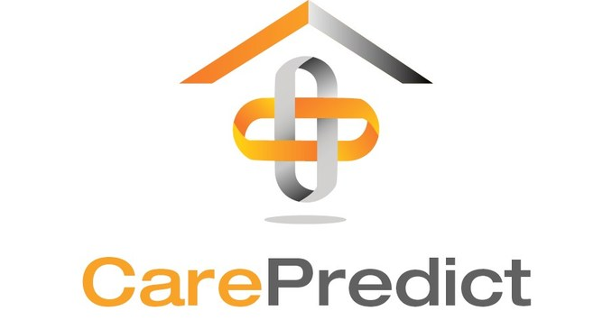

Es una startup estadounidense que ha desarrollado un sistema de monitoreo basado en inteligencia artificial para el seguimiento del comportamiento y salud de adultos mayores. Su producto estrella, **Tempo**, es un wearable que detecta cambios en patrones de actividad que pueden indicar problemas de salud o bienestar.

**Birdie**

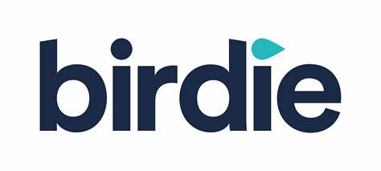

Empresa británica que ofrece una plataforma digital para el cuidado domiciliario de adultos mayores. Su software permite a cuidadores realizar seguimientos, reportar visitas, documentar medicación y generar reportes en tiempo real para familiares y proveedores de salud.

**GrandPad**


Es una compañía que ofrece tablets simplificadas y diseñadas especialmente para adultos mayores. Incluyen videollamadas, acceso fácil a fotos, música y correo electrónico, con una interfaz muy accesible. Están enfocadas en combatir la soledad y promover la conexión social.
#### 2.1.1. Análisis competitivo
### **¿Por qué llevar a cabo este análisis?**

Llevar a cabo este análisis permite identificar y comparar las fortalezas, debilidades y propuestas de valor de los principales competidores, con el fin de mejorar la estrategia de **AgeCare**, detectar oportunidades en el mercado y definir una ventaja competitiva clara y sostenible.

---

### Perfil 
| Perfil       | AgeCare                                                                 | CarePredict                                                                 | Birdie                                                                              | GrandPad                                                                 |
|--------------|-------------------------------------------------------------------------|------------------------------------------------------------------------------|-------------------------------------------------------------------------------------|---------------------------------------------------------------------------|
| Overview     | Plataforma digital para el monitoreo físico, emocional y social en geriátricos. | Sistema de monitoreo inteligente para la salud de adultos mayores basado en wearables y IA. | Plataforma digital para la gestión de cuidado domiciliario, enfocada en agencias y cuidadores. | Tablets simplificadas diseñadas para adultos mayores, centradas en la conexión social. |
| Ventaja Competitiva      | Mejora del bienestar integral y prevención temprana en centros geriátricos. | Predicción temprana de problemas de salud, previniendo emergencias y optimizando la atención médica. | Mejora en la calidad del cuidado y comunicación en tiempo real entre cuidadores, pacientes y familiares. | Conexión social accesible y uso intuitivo para adultos mayores.        |


### Perfil de Marketing
| Perfil de Markteing     | AgeCare                                                     | CarePredict                                                 | Birdie                                                                 | GrandPad                                                   |
|----------------------|-------------------------------------------------------------|-------------------------------------------------------------|------------------------------------------------------------------------|-------------------------------------------------------------|
| Mercado Objetivo | Geriátricos e instituciones de cuidado de largo plazo.      | Centros geriátricos y residencias para adultos mayores.     | Centros de salud y hogares para adultos mayores que buscan monitoreo. | Agencias de cuidado a domicilio, familias y cuidadores.     |
| Estrategias de Marketing    | Alianzas estratégicas, demostraciones de valor, participación en eventos del sector salud. | Participación en eventos de salud, conferencias geriátricas, marketing digital a instituciones. | Publicidad en publicaciones médicas, eventos de salud y asociaciones de cuidado.        | Estrategias en redes sociales, marketing de contenido y participación en ferias de salud.   |

### Perfil de Producto 
| Perfil de Producto | AgeCare                                                                 | CarePredict                                                            | Birdie                                                                 | GrandPad                                           |
|-----------------------|-------------------------------------------------------------------------|------------------------------------------------------------------------|------------------------------------------------------------------------|---------------------------------------------------|
| Productos & Servicios                | Plataforma web con dashboards, alertas, historial de bienestar, módulo social. | Wearable con sensores, app móvil, reportes automáticos.                | Software en la nube, app para cuidadores, alertas familiares.         | Tablet con apps preinstaladas, soporte técnico 24/7. |
| Precios & Costos           | SaaS por suscripción mensual, escalable según número de residentes.         | Suscripción mensual (wearables incluidos), con costos iniciales altos. | Suscripción por cuidador o paquete según agencia, precio medio-alto. | Compra única del dispositivo + suscripción mensual (desde $49/mes).     |
| Canales de Distribucion      | Web, móvil (Android/iOS) para profesionales de salud. | Web y App móvil, integración con sistemas médicos. | Web, App móvil para cuidadores y familiares.            | Venta directa en web, retail tech y asociaciones de retiro. |


### Análisis SWTO 
| Analisis SWTO | AgeCare                            | CarePredict                              | Birdie                                      | GrandPad                                             |
|------------|------------------------------------|-------------------------------------------|---------------------------------------------|------------------------------------------------------|
|        Fortalezas    | Plataforma integral (social, emocional, física).Interfaz amigable. Orientación al bienestar. | Tecnología avanzada de IA. Wearables precisos. Detección temprana de emergencias. | Fuerte automatización de procesos. Buen diseño UX. Escalabilidad para agencias. | Hardware diseñado específicamente para mayores. Alta adopción entre usuarios no tecnológicos. |
|    Debilidades         | Requiere colaboración del personal geriátrico. Aún en etapa de crecimiento. | Costo elevado de implementación. Dependencia del wearable. | Limitado a cuidado domiciliario. Poca personalización emocional. | Menor foco en salud o bienestar físico. Limitada interoperabilidad. |
|     Oportunidades          | Expansión a seguros y servicios médicos. Integración con dispositivos IoT. | Asociaciones con hospitales y aseguradoras. Expansión global. | Ingreso a nuevos mercados latinos o asiáticos. Servicios premium. | Aumento de la población mayor digital. Integración con salud pública. |
|    Amenazas      | Competencia con grandes empresas tech. Lenta adopción institucional. | Rápida evolución tecnológica. Problemas de privacidad de datos. | Nuevas plataformas gratuitas o de bajo costo. Regulación cambiante. | Reemplazo por dispositivos móviles más versátiles. Competencia en hardware. |AgeCare**, detectar oportunidades en el mercado y definir una ventaja competitiva clara y sostenible.
#### 2.1.2. Estrategias y tácticas frente a competidores
**Diferenciación por enfoque institucional**

- **Estrategia:** Enfocar AgeCare exclusivamente en instituciones geriátricas (asilos, residencias y centros de cuidado prolongado), en lugar de domicilios individuales.
- **Táctica:** Desarrollar funcionalidades específicas como control de turnos, historial por residente, alertas múltiples y reportes agregados para administradores y personal de salud.

> Esta estrategia **responde a las fortalezas** de Birdie y GrandPad en el cuidado domiciliario, pero se **especializa en un segmento institucional poco cubierto**, aprovechando su limitada personalización para contextos geriátricos.

**Modelo SaaS accesible y escalable**

- **Estrategia:** Ofrecer un modelo de suscripción mensual sin necesidad de inversión en hardware.
- **Táctica:** Diseñar planes escalables según el número de residentes, con opciones básicas y premium.

> Esta estrategia **aprovecha las debilidades** de CarePredict y GrandPad, cuyos modelos requieren hardware propietario y altos costos iniciales. También **mitiga amenazas económicas**, facilitando la adopción en mercados emergentes.


**Valor diferencial: bienestar emocional y social**

- **Estrategia:** Incorporar el monitoreo emocional y social como parte central de la plataforma.
- **Táctica:** Ofrecer un módulo de actividades, interacción familiar, retroalimentación emocional y seguimiento de participación.

> Esta propuesta **capitaliza las debilidades** de la competencia, que se enfocan mayormente en el aspecto físico, y **aprovecha la oportunidad** de una población mayor más conectada emocional y digitalmente.

**Interoperabilidad como ventaja competitiva**

- **Estrategia:** Diseñar AgeCare como un sistema abierto y adaptable a otros entornos digitales.
- **Táctica:** Desarrollar una API que permita integrar la plataforma con historiales médicos, CRMs institucionales, herramientas de comunicación o dispositivos IoT.

> Esta táctica **responde a la amenaza** de la rápida evolución tecnológica y **aprovecha la debilidad** de plataformas cerradas como Birdie y GrandPad que presentan baja interoperabilidad.


**Enfoque en privacidad y cumplimiento normativo**

- **Estrategia:** Incorporar políticas de privacidad desde el diseño (privacy by design).
- **Táctica:** Alinear la plataforma con normativas internacionales como GDPR y HIPAA, y destacarlo como valor agregado para instituciones preocupadas por la seguridad de los datos.

> Esta medida **mitiga amenazas legales y regulatorias**, fortaleciendo la confianza institucional y brindando un diferenciador competitivo en entornos altamente regulados.

### 2.2. Entrevistas

#### 2.2.1. Diseño de entrevistas
**Preguntas Generales**

1. ¿Cuál es su nombre completo?  
2. ¿Cuántos años tienes?  
3. ¿Cuál es su situación actual? ¿Trabaja, estudia o ambos?  
4. ¿En qué ciudad resides?  


**Preguntas sobre Personalidad**

5. ¿Te consideras una persona extrovertida o introvertida? ¿Por qué?  
6. ¿Eres una persona que toma decisiones racionales o emocionales? ¿Por qué?  


**Segmento: Familiares mayores de 18 años preocupados por el bienestar de sus seres queridos**

1. ¿Con qué frecuencia visitas o te comunicas con tu familiar en el asilo?  
2. ¿Qué aspectos del cuidado de tu familiar en el asilo te generan mayor preocupación?  
3. ¿Cómo te gustaría estar informado sobre el estado y la atención que recibe tu familiar en el asilo?  
4. ¿Qué tipo de información consideras más relevante para tomar decisiones informadas sobre el cuidado de tu familiar?  
5. ¿Qué importancia le das a la comunicación con el personal del asilo sobre el estado de tu familiar?  
6. ¿Cómo crees que una plataforma digital como AgeCareDB podría mejorar tu experiencia y tranquilidad en relación con el cuidado de tu familiar en el asilo?  
7. ¿Qué actividades o servicios adicionales te gustaría que se ofrecieran en el asilo para mejorar la calidad de vida de tu familiar?  
8. ¿Qué tan importante es para ti participar activamente en decisiones relacionadas con el cuidado de tu familiar en el asilo?  
9. ¿Cómo percibes la atención emocional y afectiva que recibe tu familiar por parte del personal del asilo?  
10. ¿Qué medidas consideras necesarias para garantizar la privacidad y seguridad de la información proporcionada a través de AgeCareDB sobre tu familiar en el asilo?  
11. ¿Qué beneficios crees que obtendrías de una plataforma como AgeCareDB que te permita estar informado sobre la salud física y mental de tu familiar en tiempo real?  
12. ¿Qué sugerencias tendrías para mejorar la comunicación y la participación de los familiares en el cuidado de los residentes en el asilo?  


**Segmento: Profesionales de la salud y cuidadores en asilos de ancianos**

1. ¿Cuáles consideras que son los mayores desafíos en la atención y cuidado de los adultos mayores en el asilo?  
2. ¿Cómo utilizas actualmente la tecnología en tu trabajo diario y qué mejoras crees que podrían implementarse?  
3. ¿Qué estrategias utilizas para mantener una comunicación efectiva con los familiares de los residentes?  
4. ¿Qué cambios o mejoras sugieres para optimizar la gestión de datos y la prestación de atención en el asilo?  
5. ¿Cómo crees que la tecnología podría ayudarte a mejorar la calidad de vida de los residentes y tu eficiencia en el trabajo?  
6. ¿Qué formación o capacitación adicional consideras necesaria para mejorar la atención y cuidado de los residentes?  
7. ¿Cómo evalúas la satisfacción de los familiares con respecto al cuidado y atención que reciben sus seres queridos?  
8. ¿Qué medidas tomas para promover un ambiente seguro y acogedor para los residentes?  
9. ¿Cómo abordarías los desafíos de la salud mental en los residentes y qué recursos utilizas para brindar apoyo?  
10. ¿Cómo gestionas la distribución de tareas y la coordinación del personal para garantizar una atención de calidad?  
11. ¿Qué medidas implementarías para garantizar la privacidad y dignidad de los residentes en el asilo?  
12. ¿Qué importancia le das a la actualización y seguimiento de las políticas y normativas en el cuidado de los adultos mayores en el asilo?

### 2.2.2. Registro de entrevistas

En esta sección se documenta la recolección de información a través de entrevistas realizadas a representantes de los segmentos objetivo. Para esta investigación, se consideraron dos grupos clave: adultos jóvenes ocupados (25 - 50 años) y jóvenes universitarios saludables en formación (18 - 24 años). El propósito es comprender sus necesidades, desafíos y expectativas para el desarrollo de la aplicación VibeFit, enfocada en promover un estilo de vida saludable y activo.

&nbsp;

| **Entrevista 1** |
|------------------|
| <strong>Nombre:</strong> Carlos Angulo Solis |
| <strong>Edad:</strong> 27 |
| <strong>Procedencia:</strong> Lima |
| <strong>Segmento:</strong> Adultos Jóvenes Ocupados (25 - 50 años) |
| <strong>Resumen:</strong> Carlos expresa que su mayor inquietud es la falta de información constante o detallada sobre temas de salud y bienestar, especialmente en relación con sus seres queridos. Le interesa una herramienta que le permita estar informado en tiempo real sobre aspectos físicos y emocionales, idealmente con alertas, reportes periódicos y un historial accesible. También destaca la importancia de la participación activa en decisiones relacionadas al cuidado. Aunque no es usuario regular de apps de salud, señala que le atraería una plataforma que combine bienestar emocional, recomendaciones personalizadas y privacidad de datos. |
| <strong>Enlace de video:</strong> [https://drive.google.com/file/d/1XyHZqSwgCH1QAF2ZZtt9kltcLSW96G-W/view?usp=sharing](https://drive.google.com/file/d/1XyHZqSwgCH1QAF2ZZtt9kltcLSW96G-W/view?usp=sharing) |
| <strong>Foto del entrevistado:</strong><br> |

&nbsp;

| **Entrevista 2** |
|------------------|
| <strong>Nombre:</strong> Christopher Adrián Carlos Urcia Tardío |
| <strong>Edad:</strong> 25 |
| <strong>Procedencia:</strong> Lima |
| <strong>Segmento:</strong> Profesionales de la salud y cuidadores en asilos de ancianos |
| <strong>Resumen:</strong> Christopher señala que uno de los mayores desafíos en el cuidado de adultos mayores es atender sus necesidades individuales, especialmente cuando hay poco personal disponible. Actualmente utilizan computadoras para registrar medicamentos y controles, pero considera que sistemas más ágiles mejorarían la eficiencia y la conexión entre el equipo. Para comunicarse con las familias, recurren a llamadas, mensajes y videollamadas, priorizando la amabilidad y la claridad. Sugiere que un sistema centralizado de datos facilitaría el trabajo y reduciría errores. También cree que la tecnología puede mejorar la calidad de vida de los residentes y su propio desempeño, al reducir el papeleo y ofrecer herramientas para terapias o ejercicios. Destaca la necesidad de más capacitación, especialmente en enfermedades como el Alzheimer y en el uso de tecnología. Evalúan la satisfacción familiar mediante reuniones y encuestas, y toman medidas para mantener un entorno seguro, limpio y acogedor. Además, promueven actividades recreativas para el bienestar mental de los residentes y aseguran la privacidad y el respeto de sus decisiones. Finalmente, remarca la importancia de mantenerse actualizados en normativas y políticas para brindar un servicio de calidad. |
| <strong>Enlace de video:</strong> [https://drive.google.com/file/d/1O6PdCJe6cACyJwkq85c6r39Jqrymv76-/view?usp=sharing](https://drive.google.com/file/d/1O6PdCJe6cACyJwkq85c6r39Jqrymv76-/view?usp=sharing) |
| <strong>Foto del entrevistado:</strong><br> |

&nbsp;

| **Entrevista 3** |
|------------------|
| <strong>Nombre:</strong> Robert Joaquín Reyna Bohorquez |
| <strong>Edad:</strong> 21 |
| <strong>Procedencia:</strong> Lima |
| <strong>Segmento:</strong> Familiares mayores de 18 años preocupados por el bienestar de sus seres queridos |
| <strong>Resumen:</strong> Robert es estudiante universitario y trabaja medio tiempo para cubrir sus gastos. Se considera una persona más introvertida y trata de tomar decisiones racionales, aunque reconoce que en situaciones emocionales puede dejarse llevar por sus sentimientos. Visita a su familiar en el asilo una vez por semana o, en su defecto, se comunica por llamada. Sus principales preocupaciones giran en torno al trato que recibe su familiar, su salud física y emocional, y que no se sienta solo. Le gustaría recibir información clara y constante a través de una aplicación, con notificaciones sobre su estado general, medicamentos, comportamiento y bienestar emocional. Valora mucho la comunicación con el personal del asilo y desea estar involucrado en las decisiones sobre su cuidado. Sugiere que una plataforma como Lively podría brindarle tranquilidad, permitiéndole sentirse presente incluso a la distancia. También propone actividades recreativas, música y terapias para mejorar la calidad de vida de los residentes. Considera crucial la privacidad de los datos, recomendando el uso de contraseñas, accesos restringidos y transparencia en el manejo de información. Finalmente, sugiere mejoras en la comunicación entre familiares y personal, como reuniones virtuales, reportes semanales y una sección en la app para mensajes o participación en decisiones importantes. |
| <strong>Enlace de video:</strong> [https://drive.google.com/file/d/1-SF7lOPblklXH5iPaLcWS9xHElqvmHlu/view?usp=sharing](https://drive.google.com/file/d/1-SF7lOPblklXH5iPaLcWS9xHElqvmHlu/view?usp=sharing) |
| <strong>Foto del entrevistado:</strong><br> |


#### 2.2.3. Análisis de entrevistas

### 2.3. Needfinding

#### 2.3.1. User Personas
**Profesionales de la salud y cuidadores en asilos**
<p align="center">
  
  
**Familiares preocupados por sus seres queridos**
<p align="center">
  
  
#### 2.3.2. User Task Matrix
En este cuadro, se presentan las tareas realizadas por los dos **User Personas**:  
1. **Laura Martínez** (Profesional de la salud y cuidadora en un asilo de ancianos).  
2. **Lucy Anderson** (Familiar preocupado por el bienestar de su ser querido en un asilo).

Cada fila muestra una tarea clave y su frecuencia e importancia para cada persona.

| **Tareas**                                                                                  | **Laura Martínez (Profesional de salud)** |           | **Lucy Anderson (Familiar)**          |           |
|---------------------------------------------------------------------------------------------|-------------------|------------|-------------------|------------|
|                                                                                             | **Frecuencia**    | **Importancia** | **Frecuencia**    | **Importancia** |
| Registrar información médica de los residentes                                              | Alta              | Alta       | Baja              | Baja       |
| Comunicar el estado físico y emocional de los residentes a los familiares                   | Media             | Alta       | Alta              | Alta       |
| Actualizar el plan de cuidado individual de los residentes                                  | Alta              | Alta       | Baja              | Baja       |
| Responder preguntas o inquietudes de los familiares                                          | Alta              | Alta       | Alta              | Alta       |
| Acceder a historiales médicos de los residentes                                              | Alta              | Alta       | Baja              | Baja       |
| Participar en la toma de decisiones médicas                                                  | Alta              | Alta       | Baja              | Baja       |
| Gestionar la comunicación diaria entre el personal de salud                                 | Alta              | Alta       | Baja              | Baja       |
| Verificar el cumplimiento de la medicación de los residentes                                | Alta              | Alta       | Baja              | Baja       |
| Solicitar informes sobre el estado de los residentes                                        | Baja              | Alta       | Alta              | Alta       |
| Revisar las alertas de salud (por ejemplo, caídas, cambios en la salud)                     | Alta              | Alta       | Baja              | Baja       |
| Establecer contacto con el personal para coordinar visitas o cuidados adicionales           | Baja              | Media      | Alta              | Alta       |
| Monitorear el bienestar emocional de los residentes                                          | Media             | Alta       | Baja              | Baja       |
| Tomar decisiones sobre el cambio de residencia o cuidados adicionales                       | Baja              | Media      | Alta              | Alta       |
| Tener acceso a información sobre actividades recreativas y sociales de los residentes       | Baja              | Baja       | Alta              | Alta       |
| Obtener feedback o recomendaciones del personal del asilo sobre el bienestar de su ser querido | Baja              | Alta       | Alta              | Alta       |


 **Explicación de las Tareas con Mayor Frecuencia e Importancia**

 **Laura Martínez (Profesional de la salud y cuidador):**
- **Registrar información médica de los residentes:** Alta frecuencia e importancia. Como enfermera jefe, Laura debe asegurarse de que todos los datos médicos estén correctamente documentados para brindar un cuidado adecuado.
- **Actualizar el plan de cuidado individual de los residentes:** Laura es responsable de adaptar los cuidados a las necesidades de cada residente, lo que debe ser una tarea constante.
- **Responder preguntas o inquietudes de los familiares:** Alta frecuencia e importancia, ya que los familiares de los residentes suelen tener preguntas sobre el bienestar de sus seres queridos.

 **Lucy Anderson (Familiar):**
- **Comunicar el estado físico y emocional de los residentes a los familiares:** Lucy tiene una alta prioridad en recibir esta información de manera constante y en tiempo real para mantener su tranquilidad.
- **Solicitar informes sobre el estado de los residentes:** Lucy busca información objetiva y detallada que le permita estar al tanto de la situación de su madre, por lo que esta tarea es muy importante.
- **Establecer contacto con el personal para coordinar visitas o cuidados adicionales:** Lucy tiene una alta frecuencia en esta tarea, ya que, al ser hija de la residente, desea involucrarse en la toma de decisiones y asegurarse de que el cuidado sea el adecuado.


 **Principales Diferencias**

- **Enfoque de la tarea:** Laura está más enfocada en las actividades operativas, como el registro de información médica y la gestión interna del cuidado. En contraste, Lucy se enfoca en obtener información sobre el bienestar de su madre y mantener una comunicación constante con el personal del asilo.
- **Importancia de la toma de decisiones:** Para Laura, las decisiones médicas y operativas son fundamentales, mientras que para Lucy, la toma de decisiones se refiere principalmente a asegurar que su madre esté bien cuidada y que su comunicación con el personal sea efectiva.

 **Coincidencias**

- Ambas comparten la tarea de **comunicar el estado de los residentes**. Aunque Laura es quien tiene la responsabilidad directa de gestionar la atención, Lucy necesita esta información para asegurarse de que su madre esté siendo bien cuidada.
- La **respuesta a preguntas o inquietudes** es una tarea común en ambos casos, aunque la frecuencia e importancia varían según el rol.
- 
#### 2.3.3. User Journey Mapping
**Profesionales de la salud y cuidadores en asilos**
<p align="center">
  
  
**Familiares preocupados por sus seres queridos**
<p align="center">
  
  
#### 2.3.4. Empathy Mapping 
**Profesionales de la salud y cuidadores en asilos**
<p align="center">
  
  
**Familiares preocupados por sus seres queridos**
<p align="center">
  
  
#### 2.3.5. As-is Scenario Mapping

### 2.4. Ubiquitous Language

## Capítulo III: Requirements Specification

### 3.1. To-Be Scenario Mapping

El TO BE Scenario Mapping describe cómo será la experiencia futura y mejorada de los usuarios tras la implementación de Tempo, centrándose en cuatro dimensiones clave: phases, doing, thinking y feeling. Este análisis ayuda a visualizar el impacto real de la solución tecnológica en el día a día de los involucrados.

Este análisis ha sido realizado y visualizado mediante la herramienta Lucidchart. Se puede acceder al diagrama completo en el siguiente enlace [https://lucid.app/lucidspark/dd6ea347-da29-4d45-a908-654729460131/edit?invitationId=inv_9aa0e46f-82f1-41da-9915-dad775d1b045](https://lucid.app/lucidspark/dd6ea347-da29-4d45-a908-654729460131/edit?invitationId=inv_9aa0e46f-82f1-41da-9915-dad775d1b045)

Figura :

User Persona 1: Familiares de los residentes


Nota: Este mapeo describe las experiencias futuras de los familiares de los residentes en asilos de ancianos. 

Figura :

User Persona 2: Personal del asilo (enfermeras y cuidadores)


Nota: Este mapeo describe las experiencias actuales del personal del asilo de ancianos. 

### 3.2. User Stories

### 3.3. Impact Mapping

### 3.4. Product Backlog

El Product Backlog representa la lista priorizada de funcionalidades, mejoras y requerimientos técnicos que forman parte del alcance del sistema AgeCareDB. Cada ítem del backlog responde a una necesidad identificada en los segmentos de usuarios principales (cuidadores y familiares), así como en actores secundarios relevantes (desarrolladores y visitantes).

Este backlog ha sido construido a partir de las historias de usuario previamente definidas, y está organizado de forma que permita una gestión iterativa e incremental del desarrollo del sistema, conforme a los principios de metodologías ágiles.

| #Orden | User Story Id | Titulo | Descripcion | Story Points |
|--------|---------------|--------|-------------|--------------|
| 1 |US-06 | Conocer los servicios del asilo | Como visitante, quiero conocer los servicios que ofrece el asilo para evaluar si es adecuado. | 3 |
| 2 | US-07 | Leer la misión y visión del proyecto | Como visitante, quiero saber la misión y visión del proyecto para entender su propósito. | 2 |
| 3 | US-08 | Visualizar preguntas frecuentes | Como visitante, quiero leer preguntas frecuentes para resolver dudas básicas. | 2 |
| 4 | US-16 | Ver equipo profesional del asilo | Como visitante, quiero conocer el equipo profesional del asilo para confiar en su experiencia y formación. | 2 |
| 5 | US-18 | Ver testimonios y casos de éxito | Como visitante, quiero leer experiencias reales para sentir confianza en el servicio. | 2 |
| 6 | US-19 | Descargar folleto informativo | Como visitante, quiero descargar un folleto para compartir la información del servicio con otros miembros de mi familia. | 3 |
| 7 | US-17 | Solicitar información desde la web | Como visitante, quiero llenar un formulario de contacto para recibir más información personalizada sobre los servicios. | 3 |
| 8 | US-01 | Ver estado de salud del residente | Como familiar, quiero ver el estado de salud actualizado del residente para estar informado. | 5 |
| 9 | US-03 | Recibir alertas críticas | Como familiar, quiero recibir una alerta cuando la salud del residente esté en riesgo. | 5 |
| 10 | US-11 | Ver actividades diarias | Como familiar, quiero ver las actividades realizadas por mi ser querido para saber si participa y está activo. | 3 |
| 11 | US-14 | Consultar historial emocional del residente | Como familiar, quiero consultar el historial emocional del residente para comprender mejor su estado mental a lo largo del tiempo. | 3 |
| 12 | US-25 | Ver reporte semanal de estado del residente | Como familiar, quiero ver un reporte semanal de salud para entender la evolución general. | 5 |
| 13 | US-30 | Recibir recordatorios para revisar informes | Como familiar, quiero recibir recordatorios semanales para revisar los reportes y estar al tanto del estado del residente. | 2 |
| 14 | US-02 | Registrar signos vitales | Como cuidador, quiero registrar los signos vitales del residente para llevar un control de su salud. | 3 |
| 15 | US-12 | Registrar actividad del residente | Como cuidador, quiero registrar las actividades del residente para tener un seguimiento de su rutina diaria. | 3 |
| 16 | US-13 | Evaluar estado emocional del residente | Como cuidador, quiero registrar una evaluación emocional diaria para dar seguimiento a su bienestar psicológico. | 3 |
| 17 | US-27 | Ver tendencias de salud por categoría | Como cuidador, quiero ver tendencias por categorías (nutrición, movilidad, ánimo) para ajustar planes de cuidado. | 5 |
| 18 | US-15 | Filtrar residentes por estado de salud | Como cuidador, quiero filtrar a los residentes según su estado de salud para priorizar la atención. | 3 |
| 19 | US-28 | Ver lista de residentes asignados | Como cuidador, quiero ver solo a los residentes que tengo asignados para optimizar mi trabajo. | 2 |
| 20 | US-04 | Enviar mensajes al personal | Como familiar, quiero enviar mensajes al personal para consultar sobre el residente. | 3 |
| 21 | US-05 | Ver respuestas del personal | Como familiar, quiero leer las respuestas a mis consultas para mantenerme informado. | 3 |
| 22 | US-29 | Evaluar la calidad del servicio | Como familiar, quiero dejar una evaluación de la atención brindada para contribuir con la mejora del servicio. | 2 |
| 23 | US-26 | Descargar reporte en PDF | Como familiar, quiero descargar el reporte semanal en formato PDF para archivarlo o compartirlo. | 2 |
| 24 | US-09 | Consultar API de residentes (GET) | Como developer, quiero consultar el listado de residentes mediante la API para integrarlo al frontend. | 2 |
| 25 | US-10 | Validar credenciales del API | Como developer, quiero autenticarme con token para acceder a los servicios protegidos del API. | 1 |
| 26 | US-20 | Registrar un nuevo residente (API) | Como developer, quiero registrar un nuevo residente en la base de datos a través del API. | 2 |
| 27 | US-21 | Actualizar datos del residente (API) | Como developer, quiero actualizar los datos personales o médicos de un residente vía API. | 2 |
| 28 | US-22 | Obtener historial de actividades (API) | Como developer, quiero obtener el historial de actividades de un residente para mostrarlo en su perfil. | 3 |
| 29 | US-23 | Eliminar registro médico (API) | Como developer, quiero eliminar un registro médico incorrecto desde el API. | 2 |
| 30 | US-24 | Consultar métricas de salud (API) | Como developer, quiero obtener métricas resumidas del estado de un residente para visualizaciones en el dashboard. | 3 |

## Capítulo IV: Product Design

### 4.1. Style Guidelines

En esta sección, sentamos las bases para contar con un repositorio central y organizado de uso común para todo el equipo, que incluye assets, fonts, etc. Esto con el fin de mantener una presentación consistente y enfocada.

#### 4.1.1. General Style Guidelines

#### Branding

Buscamos reflejar confianza, cuidado y tecnología humana. Asi que para brindar protección, salud y conexión familiar, debemos integrar íconos sutiles como corazones, hogares o siluetas de adultos mayores con una tipografía clara y moderna. El branding se construye sobre la base de:

- **Misión:** Proporcionar soluciones tecnológicas que prioricen el bienestar.  
- **Visión:** Crear entornos dignos y seguros para adultos mayores usando tecnología.

**Principios de Marca:**

- **Confiable:** Priorizamos la transparencia y exactitud de los datos.  
- **Empático:** Enfatizamos el lado humano de la tecnología.  
- **Innovador:** Usamos herramientas digitales para mejorar experiencias.

#### Typography

La tipografía debe transmitir claridad, calidez y profesionalismo. Por esa razón decidimos usar **Open Sans**, ya que tiene un diseño limpio y sencillo, lo que facilita la lectura en pantallas.

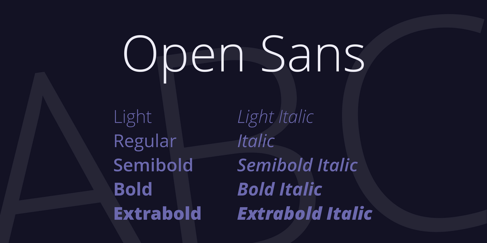

#### Colors

Elegimos los siguientes colores buscando plasmar una paleta relajante y profesional:

- **Azul claro:** Representa calma y confianza. Es ideal para el fondo o elementos principales.  
- **Verde suave:** Transmite salud y bienestar. Úsalo para botones o detalles importantes.  
- **Blanco:** Mantiene el diseño limpio y accesible, perfecto para el fondo o texto.

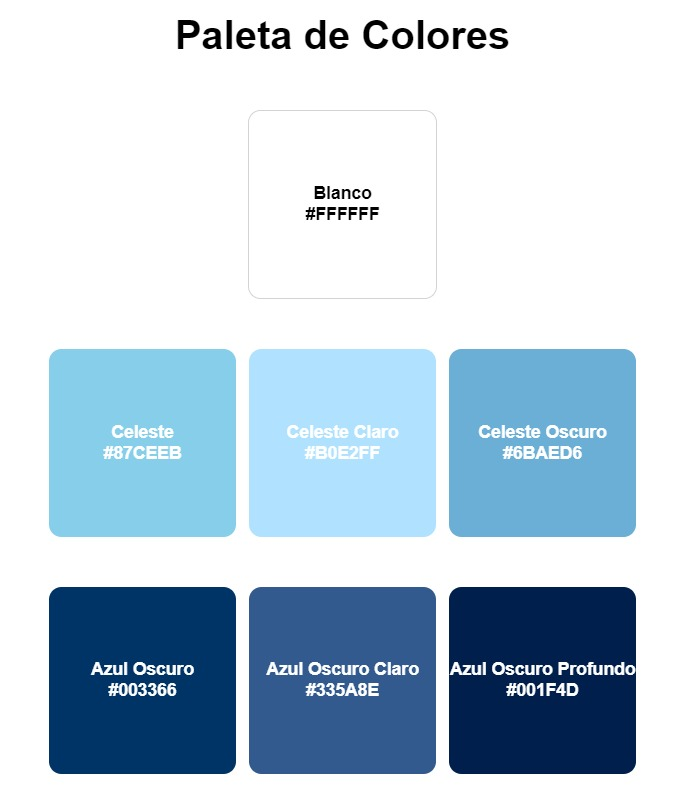

#### Spacing

Para nuestro proyecto, el espaciado es crucial para garantizar la legibilidad y accesibilidad, así que por eso tomamos estas decisiones:

- **Espaciado entre párrafos:** Dejar un espacio adicional entre párrafos, equivalente a al menos el tamaño de una línea completa. Esto ayuda a separar visualmente las ideas.  
- **Espaciado entre elementos interactivos:** 8-12 píxeles de espacio entre botones, enlaces o cualquier elemento clicable. Esto evitará errores al tocar en pantallas táctiles.  
- **Márgenes y padding:** Usar márgenes generosos de 16-24 píxeles alrededor del contenido para evitar que se sienta abarrotado.

#### Tono de Comunicación

| Dimensión              | Nivel Adoptado    |
|------------------------|-------------------|
| Divertido/Serio        | Medio-Serio       |
| Formal/Casual          | Semi-Formal       |
| Respetuoso/Irreverente | Muy Respetuoso    |
| Entusiasta/Sereno      | Sereno y Empático |

Decidimos mantener una comunicación clara, cálida y profesional, porque este enfoque nos permite conectar de manera efectiva con el público, especialmente en un contexto tan sensible como el cuidado de personas mayores. 

Optamos por un tono **medio-serio** y **semi-formal** para garantizar que la información sea accesible sin perder la seriedad y el respeto que merece. Además, priorizamos un tono **muy respetuoso** para transmitir empatía y consideración en cada interacción. 

Finalmente, elegimos un estilo **sereno y empático** para crear un ambiente de confianza y tranquilidad, permitiendo que los usuarios se sientan escuchados y apoyados. Consideramos que este balance refleja los valores esenciales de nuestra propuesta y fortalece nuestra relación con los usuarios.

#### 4.1.2. Web Style Guidelines

La interfaz está diseñada bajo el principio de *mobile-first*, asegurando que el contenido sea completamente funcional y accesible en pantallas pequeñas, y luego se adapte progresivamente a resoluciones mayores (tablet y desktop).


#### **Breakpoints definidos**

| Dispositivo     | Ancho mínimo | Ejemplo de uso            |
|-----------------|--------------|----------------------------|
| Mobile          | ≥ 320px      | Teléfonos                  |
| Tablet          | ≥ 768px      | iPad / tablets genéricas   |
| Laptop/Desktop  | ≥ 1024px     | Monitores y laptops        |
| Wide Screen     | ≥ 1440px     | Pantallas grandes o TV     |

#### **Navegación**

- **Menú tipo hamburguesa en mobile**: para conservar espacio.
- **Menú horizontal en desktop**: visibilidad directa de opciones principales.
- **Sticky navbar**: permite al usuario moverse sin perder acceso al menú.
- **Breadcrumbs en secciones profundas** (en tablets y desktop): para mejorar la navegación contextual.


#### **Tipografía Adaptada**

Se utiliza la tipografía **Open Sans**, elegida por su legibilidad en pantallas, y adaptada según el dispositivo:

| Elemento        | Mobile | Tablet | Desktop |
|-----------------|--------|--------|---------|
| Título H1       | 24px   | 32px   | 40px    |
| Subtítulo H2    | 20px   | 26px   | 32px    |
| Texto cuerpo    | 16px   | 18px   | 18px    |
| Texto secundario| 14px   | 16px   | 16px    |

### 4.2. Information Architecture

#### 4.2.1. Organization Systems

Una experiencia de usuario sólida y accesible depende no solo de un buen diseño visual, sino también de una estructura de información clara y coherente. Para garantizar una experiencia visual efectiva, se definieron tres formas principales de organizar el contenido: **jerárquica**, **secuencial** y **matricial**, las cuales se aplican estratégicamente en distintas áreas de la interfaz.

#### **Jerarquía visual (Visual Hierarchy)**

La jerarquía visual se aplica principalmente en las páginas de inicio de sesión, dashboards y vistas de resumen, donde es esencial que el usuario identifique de forma inmediata la información más relevante.  

***Esta organización prioriza datos clave como:***

- Estado actual del residente  
- Alertas médicas activas  
- Mensajes importantes del personal del asilo  

***Estos elementos se presentan con:***

- Tipografía destacada  
- Iconografía de apoyo  
- Colorimetría adecuada  

***Luego se despliega información secundaria como:***

- Actividades recientes  
- Historial clínico  
- Notas de enfermería  
- Registros emocionales  

Esta estructura mejora la toma de decisiones al reducir la carga cognitiva y dirigir la atención de manera efectiva.

#### **Organización secuencial (Step-by-Step)**

En flujos que requieren la introducción progresiva de datos o la realización de procesos paso a paso (como el registro de nuevos residentes), se emplea una organización secuencial. Este enfoque guía al usuario a través de una serie de pasos claramente definidos, reduciendo errores y asegurando la completitud de la información ingresada.

***Características clave:***

- Botones de navegación  
- Indicadores de progreso  
- Validaciones en tiempo real  

***También se aplica en:***

- Flujos de configuración inicial  
- Onboarding de nuevos usuarios  
- Actualizaciones de información crítica

#### **Organización matricial (Matrix Layout)**

En secciones analíticas, como la visualización de indicadores de salud o registros de actividades por múltiples residentes, se adopta una estructura matricial. Este enfoque facilita la comparación directa de variables entre distintos elementos, por ejemplo:

- Frecuencia de consultas médicas  
- Estado emocional registrado  
- Medicación activa  

***Características adicionales:***

- Tablas con ordenamiento dinámico  
- Filtros por categoría  
- Visualización multivariable  

Esto resulta especialmente útil para profesionales de la salud al identificar correlaciones, tendencias o casos que requieren atención inmediata.

#### **Por audiencia (User-Based Categorization)**

El contenido mostrado se adapta automáticamente al perfil del usuario:

- **Familiares**: estados emocionales, mensajes del personal, evolución general del residente  
- **Enfermeras**: registros médicos, horarios de atención, alertas clínicas  
- **Administradores**: gestión de personal, medicamentos, documentación del asilo  


#### **Cronológica (Chronological Organization)**

***Usada en módulos con seguimiento temporal, como:***

- Historial médico  
- Registros de salud mental  
- Actividades diarias  

***Permite:***

- Reconstruir el estado de salud a lo largo del tiempo  
- Identificar momentos críticos  
- Evaluar el impacto de intervenciones médicas o emocionales

#### **Por tópicos (Topic-Based Organization)**

***Facilita el acceso a contenido informativo o de soporte:***

- Tutoriales  
- Preguntas frecuentes  
- Guías  
- Comunicados internos  

***Agrupados por áreas de interés:***

- “Emergencias”  
- “Medicación”  
- “Conectividad con familiares”  
- “Uso de la plataforma”  


#### **Alfabética (Alphabetical Organization)**

***Aplicada en listados extensos como:***

- Catálogo de medicamentos  
- Listado de residentes  
- Personal del asilo  

***Facilita la búsqueda rápida con:***

- Funciones de autocompletado  
- Filtros alfabéticos por letra inicial

#### 4.2.2. Labeling Systems

La forma en que se etiquetan y presentan los datos dentro de nuestra plataforma, es clave para garantizar una experiencia fluida, comprensible y sin ambigüedades.  
Un sistema de etiquetado bien diseñado:

- Reduce la carga cognitiva del usuario  
- Mejora la navegabilidad  
- Refuerza la confianza en la interfaz  

El sistema de etiquetas se rige por los siguientes **principios**:

- **Lenguaje claro y directo**:  
  Se utilizan palabras comunes, comprensibles por personas sin conocimientos técnicos.

- **Brevedad**:  
  Cada etiqueta usa el mínimo número de palabras necesarias (generalmente una o dos) para evitar sobrecargar visualmente la interfaz.

- **Consistencia semántica**:  
  Una misma acción o conjunto de datos siempre se representa con la misma etiqueta a lo largo de toda la plataforma.

- **Enfoque contextual**:  
  Las etiquetas se adaptan al perfil del usuario (familiar o personal de salud), evitando confusiones en el uso de los términos.

#### 4.2.3. SEO Tags and Meta Tags

La **Landing Page** está diseñada para atraer nuevos usuarios, informar sobre la propuesta de valor y generar confianza en la marca.  Las etiquetas meta se centran en captar tráfico orgánico de personas interesadas en tecnología para el cuidado de adultos mayores.


**Título de la página (Title)**

El título resume de forma directa el propósito del sitio, incluyendo las palabras clave **"tecnología"**, **"bienestar"** y **"adultos mayores"**, que son términos con alta relevancia SEO para nuestro público objetivo.

```html
<title>RedVital – Tecnología para el bienestar de los adultos mayores</title>
```

**Meta descripción (Meta Description)**

La meta descripción ofrece una vista clara del valor que ofrece la plataforma, motivando al clic desde los resultados de búsqueda.

```html
<meta name="description" content="RedVital es una plataforma digital que mejora la calidad de vida de los residentes en asilos, conectando a sus familias con información en tiempo real.">
```

**Palabras clave (Meta Keywords)**

Los términos elegidos cubren conceptos clave relacionados con el contexto de uso de AgeCareDB, permitiendo un mayor alcance en búsquedas asociadas.

```html
<meta name="keywords" content="asilos, adultos mayores, salud emocional, bienestar, plataforma digital, monitoreo, cuidados geriátricos, comunicación familiar">
```


**Autor del sitio (Meta Author)**

La etiqueta autor identifica al equipo creador, útil para fines de propiedad y referencia en motores de búsqueda.

```html
<meta name="author" content="Equipo AgeCareDB">
```

#### 4.2.4. Searching Systems

Para facilitar que los usuarios (familiares, enfermeras, cuidadores) naveguen entre grandes volúmenes de información, evitando que se sientan perdidos y garantizando una experiencia ágil y eficiente, se tomaron las siguientes decisiones para el sistema de búsqueda:

### Opciones de búsqueda

**Búsqueda directa:**  
- Los usuarios pueden ingresar palabras clave como *"Estado emocional"* o *"Historial médico"* para obtener resultados específicos.  
- Utiliza un sistema de **autocompletado** para ayudar a refinar la búsqueda y evitar errores tipográficos.

**Búsqueda avanzada:**  
- Filtros por categoría: *estado físico, emocional, actividades realizadas*.  
- Búsqueda por fecha específica para encontrar registros actualizados.  
- Filtros de acceso restringido para familiares autorizados a consultar datos privados.

### Resultados después de la búsqueda

- **Formato visual:**  
  Resultados organizados en **tarjetas** con detalles clave como:  
  - Nombre del residente  
  - Última actualización de salud  
  - Medicación actual

- **Opciones de acción:**  
  - Botones para **descargar información**,  
  - **Solicitar informes detallados**  
  - **Enviar mensajes** al personal encargado.

- **Aspectos destacados:**  
  Las **palabras clave** buscadas se resaltan dentro de los resultados para facilitar la navegación y comprensión.

#### 4.2.5. Navigation Systems

Las siguientes acciones y técnicas se han implementado para garantizar una navegación eficiente y accesible en AgeCareDB:

### Acciones y técnicas para la navegación

- **Menú superior persistente:**  
  Se ha implementado un **menú superior** persistente en la **Landing Page**, con secciones claras como:  
  - **Inicio**  
  - **Información de Residentes**  
  - **Servicios**  
  - **Actividades**  
  - **Contacto**

- **Enlaces destacados y botones Call-to-Action (CTA):**  
  Se utilizan enlaces destacados y botones **CTA** que redirigen a vistas específicas dentro de la aplicación web, por ejemplo:  
  - _"Consultar estado de mi familiar"_ dirigido a información personalizada del residente.


### Diseño adaptable

- **Diseño responsivo:**  
  El diseño es **responsivo** para garantizar que los elementos de navegación sean accesibles y claros en dispositivos **móviles**, **tablets** y **desktops**.

- **Desplegables adaptados:**  
  Los menús desplegables se adaptan a pantallas más pequeñas, priorizando las **acciones más utilizadas** para facilitar la navegación en dispositivos móviles.


### 4.3. Landing Page UI Design

#### 4.3.1. Landing Page Wireframe

#### 4.3.2. Landing Page Mock-up

### 4.4. Web Applications UX/UI Design

#### 4.4.1. Web Applications Wireframes

Las siguientes wireframes representan la estructura inicial y funcionalidad clave de AgeCareDB, nuestra plataforma digital diseñada para mejorar la calidad de vida de los adultos mayores en asilos y fortalecer la conexión con sus familiares.
Estas pantallas buscan reflejar una interfaz intuitiva. Cada componente ha sido pensado para facilitar la visualización del estado de salud físico y emocional de los residentes, optimizar los procesos internos del asilo y promover una comunicación fluida entre todos los involucrados.

A través de estas wireframes, se podrá explorar cómo se organiza la información, qué funcionalidades estarán disponibles en cada módulo, y cómo los usuarios interactuarán con la plataforma para cumplir con nuestra misión: priorizar el bienestar de los residentes y brindar tranquilidad a sus familias mediante soluciones tecnológicas innovadoras.

<p align="center">
  
</p>

<p align="center">
  
</p>

<p align="center">
  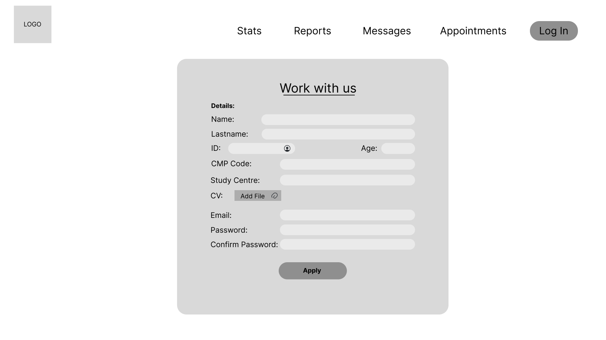 
</p>

<p align="center">
  
</p>

<p align="center">
  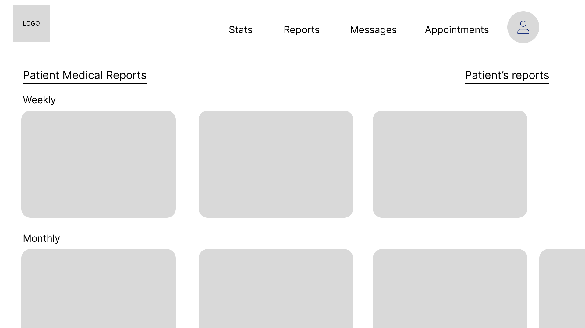
</p>

<p align="center">
  
</p>

<p align="center">
  
</p>

<p align="center">
  
</p>

<p align="center">
  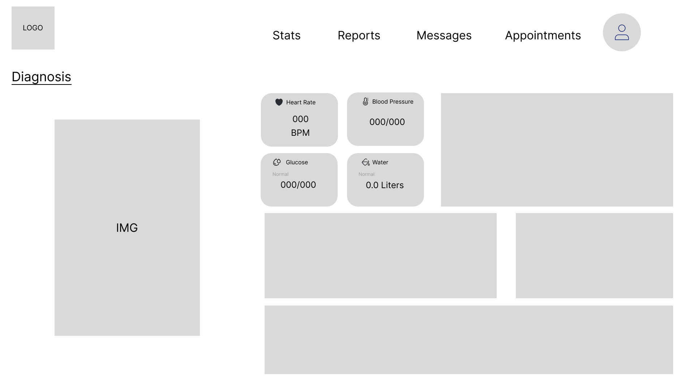
</p>

<p align="center">
  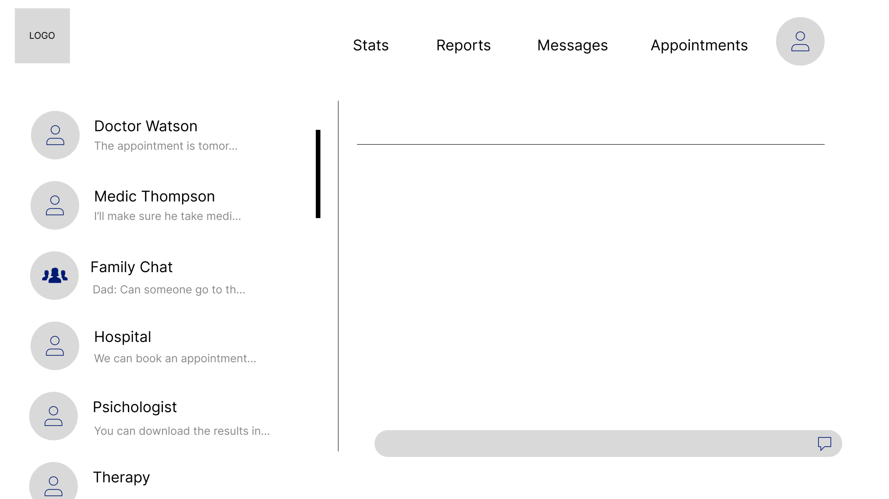
</p>

<p align="center">
  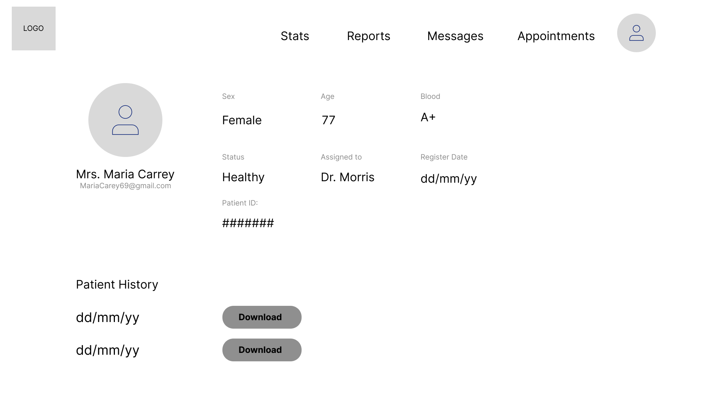
</p>

#### 4.4.2. Web Applications Wireflow Diagrams

<p align="center">
  
</p>

<p align="center">
  
</p>

#### 4.4.3. Web Applications Mock-ups

Los siguientes mockups representan una visión más cercana al diseño final de AgeCareDB, nuestra solución tecnológica enfocada en mejorar la experiencia dentro de los asilos de ancianos.
Cada pantalla ha sido cuidadosamente diseñada para reflejar una interfaz moderna, amigable e intuitiva, pensada para usuarios con distintos niveles de experiencia digital: desde familiares que buscan información clara y rápida, hasta personal de salud que necesita registrar datos de forma eficiente.

<p align="center">
  
</p>

<p align="center">
  
</p>

<p align="center">
  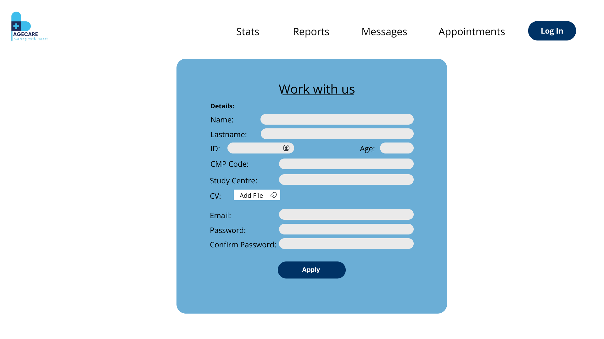 
</p>

<p align="center">
  
</p>

<p align="center">
  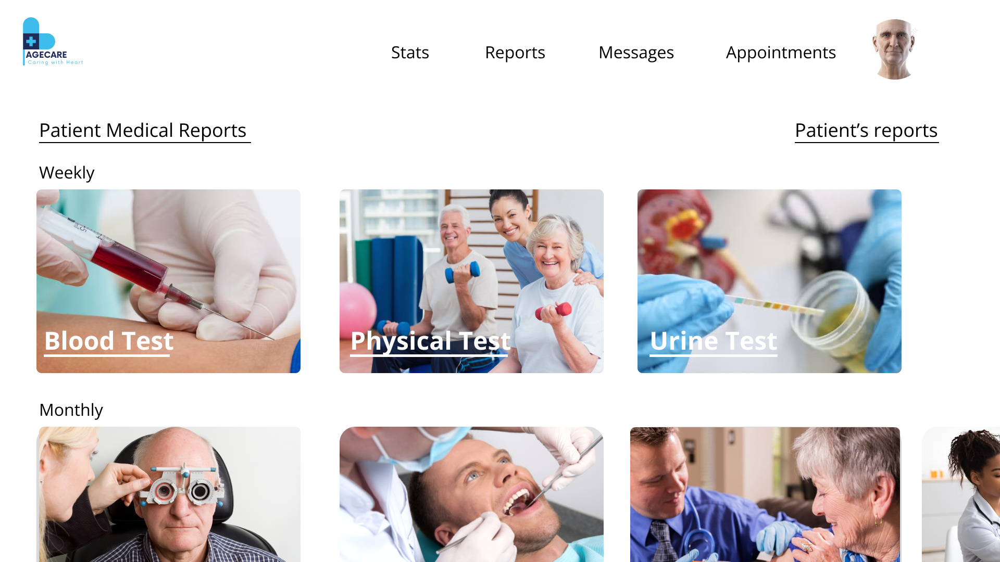
</p>

<p align="center">
  
</p>

<p align="center">
  
</p>

<p align="center">
  
</p>

<p align="center">
  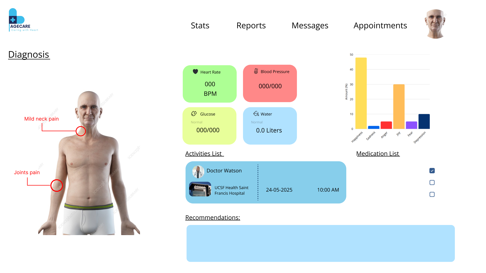
</p>

<p align="center">
  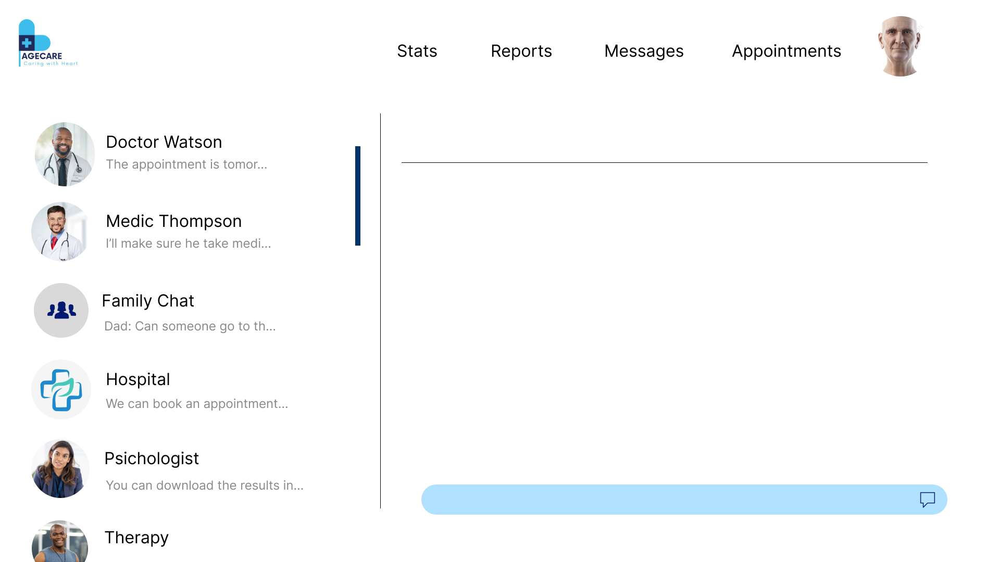
</p>

<p align="center">
  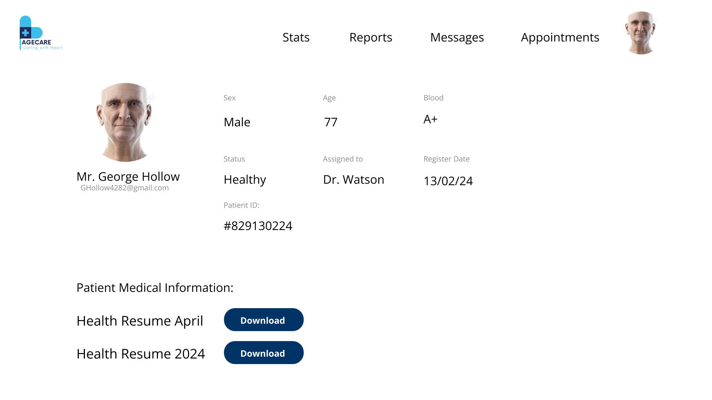
</p>

#### 4.4.4. Web Applications User Flow Diagrams

<p align="center">
  
</p>

### 4.5. Web Applications Prototyping

<p align="center">
  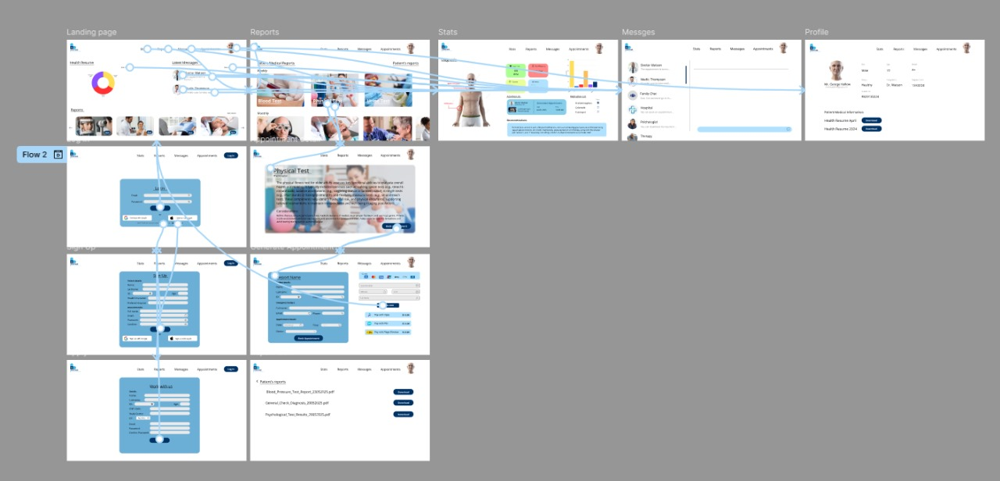
</p>

Link: https://www.figma.com/proto/amrMbK6r2R7ws36HjXJSwK/Mockup?node-id=2-3632&t=o24brncKf6wW1q6w-1

### 4.6. Domain-Driven Software Architecture

#### 4.6.1. Software Architecture Context Diagram

<p align="center">
  
</p>

#### 4.6.2. Software Architecture Container Diagrams

<p align="center">
  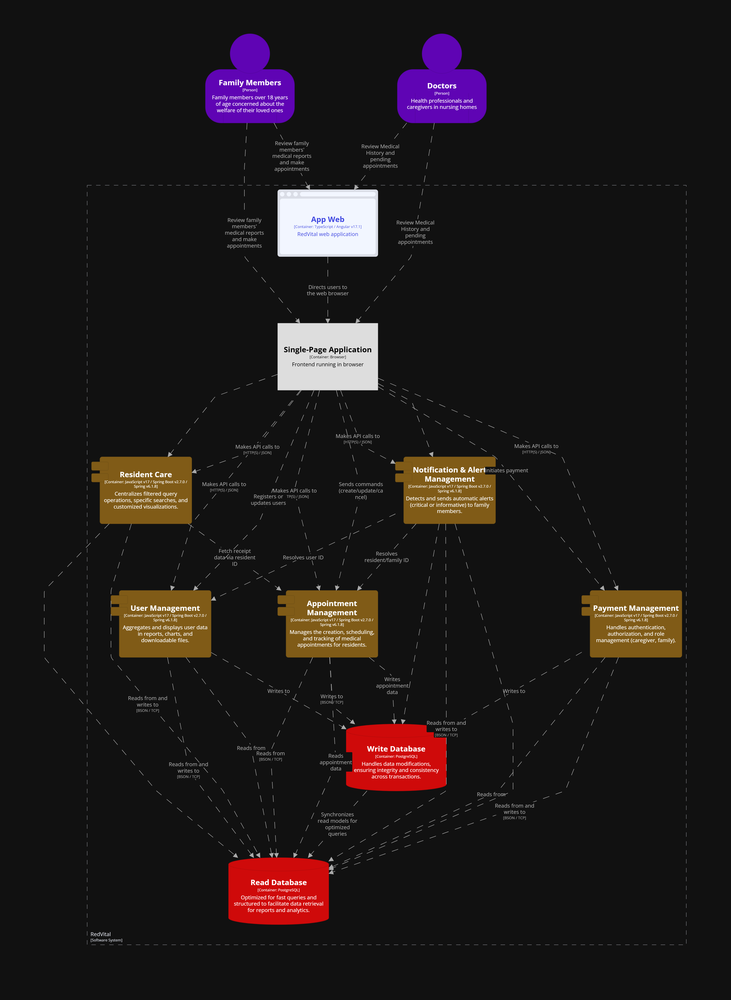
</p>

#### 4.6.3. Software Architecture Components Diagrams

<p align="center">
  
</p>

### 4.7. Software Object-Oriented Design

#### 4.7.1. Class Diagrams

<p align="center">
  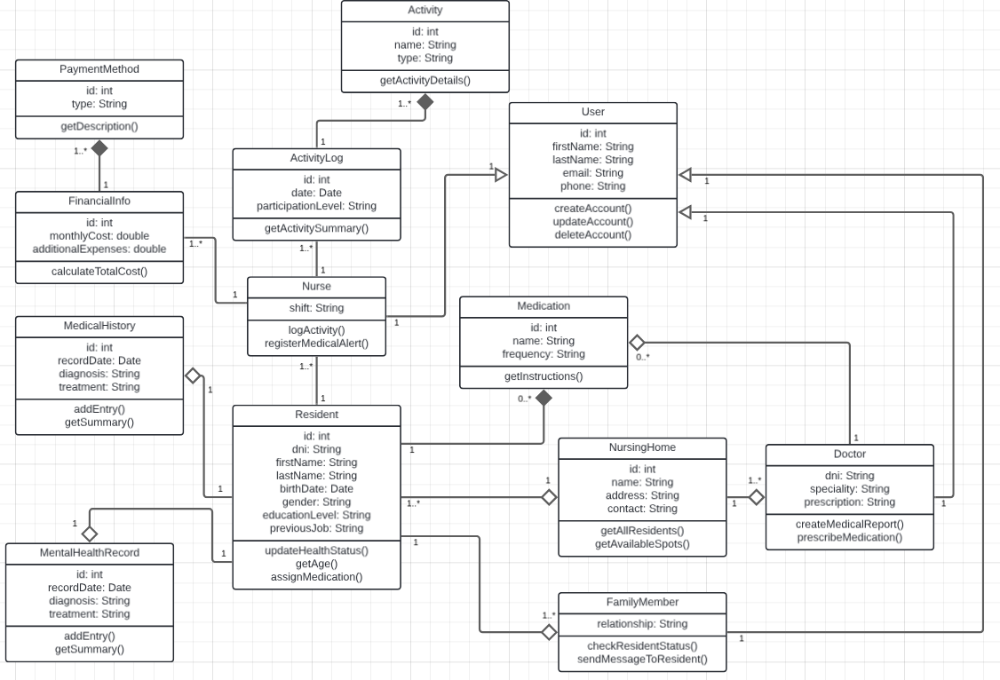
</p>

Link del diagrama de clases: https://lucid.app/lucidchart/e1a8458e-70f6-4b9a-96e7-9fda3fcaad34/edit?viewport_loc=-6264%2C-3939%2C4168%2C1978%2C0_0&invitationId=inv_a4cdcc79-55c7-4114-855c-7be0170317ce

### 4.7.2 Class Dictionary

Este es el formato deberán seguir nuestras colecciones en SQL para replicar nuestras entidades de la base de datos.

### NursingHome  
**Descripción**: Tabla que representa los hogares de cuidado donde residen los adultos mayores.

Campo              | Tipo de dato       | Descripción
-------------------|--------------------|---------------------------------------------------
NursingHomeId      | int                | Identificador único del hogar de cuidado  
Name               | varchar(100)       | Nombre del hogar  
Location           | varchar(200)       | Dirección del hogar  
Contact            | varchar(100)       | Información de contacto  

### Resident  
**Descripción**: Tabla que almacena la información personal de los residentes.

Campo              | Tipo de dato       | Descripción
-------------------|--------------------|---------------------------------------------------
ResidentId         | int                | Identificador único del residente  
DNI                | varchar(20)        | Documento Nacional de Identidad  
FirstName          | varchar(100)       | Nombres del residente  
LastName           | varchar(100)       | Apellidos del residente  
BirthDate          | date               | Fecha de nacimiento  
Gender             | varchar(10)        | Género  
EducationLevel     | varchar(100)       | Nivel de educación  
PreviousJob        | varchar(100)       | Ocupación previa  
NursingHomeId      | int                | FK al hogar de cuidado  

### FamilyMember  
**Descripción**: Tabla que representa a los familiares de los residentes.

Campo              | Tipo de dato       | Descripción
-------------------|--------------------|---------------------------------------------------
FamilyMemberId     | int                | Identificador único del familiar  
FirstName          | varchar(100)       | Nombres del familiar  
LastName           | varchar(100)       | Apellidos del familiar  
DNI                | varchar(20)        | Documento de identidad  
Phone              | varchar(20)        | Número de teléfono  
ParticipationLevel | varchar(100)       | Nivel de participación  
Address            | varchar(200)       | Dirección  

### ResidentFamilyMember  
**Descripción**: Relación entre los residentes y sus familiares.

Campo              | Tipo de dato       | Descripción
-------------------|--------------------|---------------------------------------------------
ResidentId         | int                | FK al residente  
FamilyMemberId     | int                | FK al familiar  

### MedicalHistory  
**Descripción**: Historial médico general de los residentes.

Campo              | Tipo de dato       | Descripción
-------------------|--------------------|---------------------------------------------------
MedicalHistoryId   | int                | Identificador del historial médico  
PreviousDiseases   | varchar(200)       | Enfermedades previas  
Allergies          | varchar(200)       | Alergias  
LastConsultationDate | date             | Fecha de última consulta  
Specialist         | varchar(200)       | Especialista que atendió  
BloodType          | varchar(10)        | Tipo de sangre  
ResidentId         | int                | FK al residente  
DoctorId           | int                | FK al doctor  

### Doctor  
**Descripción**: Tabla que almacena la información de los doctores asignados.

Campo              | Tipo de dato       | Descripción
-------------------|--------------------|---------------------------------------------------
DoctorId           | int                | Identificador único del doctor  
FirstName          | varchar(100)       | Nombre  
LastName           | varchar(100)       | Apellido  
Speciality         | varchar(100)       | Especialidad  
Phone              | varchar(20)        | Teléfono  
NursingHomeId      | int                | FK al hogar de cuidado  

### Nurse  
**Descripción**: Tabla que almacena la información de las enfermeras.

Campo              | Tipo de dato       | Descripción
-------------------|--------------------|---------------------------------------------------
NurseId            | int                | Identificador único de la enfermera  
FirstName          | varchar(100)       | Nombre  
LastName           | varchar(100)       | Apellido  
Phone              | varchar(20)        | Teléfono  
NursingHomeId      | int                | FK al hogar de cuidado  

### Medication  
**Descripción**: Tabla con los medicamentos registrados en el hogar.

Campo              | Tipo de dato       | Descripción
-------------------|--------------------|---------------------------------------------------
MedicationId       | int                | Identificador del medicamento  
Name               | varchar(100)       | Nombre del medicamento  
Description        | varchar(200)       | Descripción  
Effects            | varchar(200)       | Efectos secundarios  

### ResidentMedication  
**Descripción**: Relación entre los medicamentos y su administración a los residentes.

Campo              | Tipo de dato       | Descripción
-------------------|--------------------|---------------------------------------------------
Date               | date               | Fecha de administración  
Time               | time               | Hora de administración  
Dosage             | varchar(100)       | Dosis  
ResidentId         | int                | FK al residente  
MedicationId       | int                | FK al medicamento  

### MedicalRecord  
**Descripción**: Registro de diagnósticos y tratamientos médicos de los residentes.

Campo              | Tipo de dato       | Descripción
-------------------|--------------------|---------------------------------------------------
MedicalRecordId    | int                | Identificador del registro  
Date               | date               | Fecha del registro  
Diagnosis          | text               | Diagnóstico médico  
Treatment          | text               | Tratamiento aplicado  
BloodType          | varchar(10)        | Tipo de sangre  
ResidentId         | int                | FK al residente  
NurseId            | int                | FK a la enfermera  

### MentalHealthRecord  
**Descripción**: Registro del estado de salud mental de los residentes.

Campo              | Tipo de dato       | Descripción
-------------------|--------------------|---------------------------------------------------
MentalHealthId     | int                | Identificador del registro  
Date               | date               | Fecha del registro  
Evaluation         | text               | Evaluación psicológica  
Note               | text               | Notas adicionales  
BloodType          | varchar(10)        | Tipo de sangre  
ResidentId         | int                | FK al residente  
NurseId            | int                | FK a la enfermera  

### ActivityLog  
**Descripción**: Registro de las actividades realizadas por los residentes.

Campo              | Tipo de dato       | Descripción
-------------------|--------------------|---------------------------------------------------
ActivityLogId      | int                | Identificador del log de actividad  
Date               | date               | Fecha de la actividad  
Activity           | varchar(100)       | Nombre de la actividad  
Notes              | text               | Notas o comentarios  
ParticipationLevel | varchar(100)       | Nivel de participación  
Resident_ResidentId| int                | FK al residente  
Nurse_NurseId      | int                | FK a la enfermera  

### PaymentMethod  
**Descripción**: Tabla con los métodos de pago aceptados por los hogares.

Campo              | Tipo de dato       | Descripción
-------------------|--------------------|---------------------------------------------------
PaymentMethodId    | int                | Identificador del método de pago  
Description        | text               | Descripción del método  

### FinancialInfo  
**Descripción**: Relación entre métodos de pago y hogares.

Campo              | Tipo de dato       | Descripción
-------------------|--------------------|---------------------------------------------------
PaymentMethodId    | int                | FK al método de pago  
NursingHomeId      | int                | FK al hogar de cuidado  


#### 4.8 Database Design

#### 4.8.1. Database Diagram
Para la elección de cómo relacionar las entidades, primero nos basamos en buscar tablas principales. Por ejemplo, en el sistema de gestión de proyectos, las entidades principales incluyen Resident, NursingHome, Doctor, Nurse, ResidentMedication y MedicalHistory. Basándonos en ellas como punto de partida es que se nos hizo más sencillo y lógico la relación con las otras entidades. Esto nos ayudó a modelar eficazmente los datos y asegurar la coherencia de la información en nuestra aplicación.

<p align="center">
  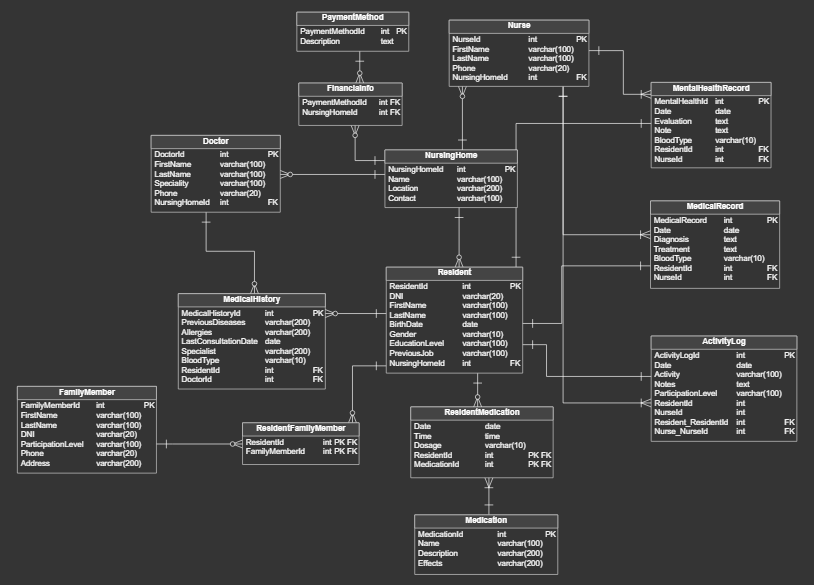
</p>

## Capítulo V: Product Implementation, Validation & Deployment

### 5.1. Software Configuration Management
#### 5.1.1. Software Development Environment Configuration
#### 5.1.2. Source Code Management
#### 5.1.3. Source Code Style Guide & Conventions
#### 5.1.4. Software Deployment Configuration

### 5.2. Landing Page, Services & Applications Implementation
#### 5.2.X. Sprint n
##### 5.2.X.1. Sprint Planning n
##### 5.2.X.2. Aspect Leaders and Collaborators
##### 5.2.X.3. Sprint Backlog n
##### 5.2.X.4. Development Evidence for Sprint Review
##### 5.2.X.5. Execution Evidence for Sprint Review
##### 5.2.X.6. Services Documentation Evidence for Sprint Review
##### 5.2.X.7. Software Deployment Evidence for Sprint Review
##### 5.2.X.8. Team Collaboration Insights during Sprint

### 5.3. Validation Interviews
#### 5.3.1. Diseño de Entrevistas
#### 5.3.2. Registro de Entrevistas
#### 5.3.3. Evaluaciones según heurísticas

### 5.4. Video About-the-Product

## Conclusiones
### Conclusiones y recomendaciones

## Video About-the-Team

## Bibliografía

## Anexos

## **3.2. User Stories**

Las siguientes historias de usuario han sido organizadas por Epics, los cuales agrupan funcionalidades clave del sistema AgeCareDB, orientado a la gestión del bienestar de adultos mayores en una institución geriátrica. Cada historia sigue el formato rol – necesidad – propósito y se complementa con criterios de aceptación en estilo Gherkin, facilitando su validación en un entorno ágil.

El enfoque principal está en dos segmentos de usuarios: cuidadores, responsables del monitoreo y atención diaria, y familiares de residentes, interesados en el seguimiento del estado de salud y bienestar. Asimismo, se consideran actores secundarios como desarrolladores (para el consumo técnico del sistema vía API) y visitantes del sitio web, que acceden a contenido informativo.

Las historias se estructuran en los siguientes Epics:

Epic: Gestión del Bienestar del Residente

Epic ID: E001

Epic que agrupa funcionalidades sobre salud, actividades y bienestar emocional del residente.

| Epic/Story ID | Título | Descripción | 	Criterios de Aceptación | Relacionado con (Epic ID) |
|---------------|---------|-------------|--------------------------|---------------------------|
| US-01 | Ver estado de salud del residente | Como familiar, quiero ver el estado de salud actualizado del residente para estar informado. | "Given el familiar ha iniciado sesión. When accede al perfil del residente. Then puede ver sus signos vitales y registros recientes." | EP-001 |
| US-02 | Registrar signos vitales | Como cuidador, quiero registrar los signos vitales del residente para llevar un control de su salud. | "Given el cuidador está autenticado. When ingresa los datos del residente. Then el sistema guarda los signos vitales correctamente." | EP-001 |
| US-03 | Recibir alertas críticas | Como familiar, quiero recibir una alerta cuando la salud del residente esté en riesgo. | "Given el sistema detecta un valor crítico. When el familiar tiene las notificaciones activadas. Then se envía una alerta inmediata." | EP-001 |
| US-11 | Ver actividades diarias | Como familiar, quiero ver las actividades realizadas por mi ser querido para saber si participa y está activo. | "Given el familiar está autenticado. When accede al perfil del residente. Then visualiza un resumen de las actividades registradas por el personal." | EP-001 |
| US-12 | Registrar actividad del residente | Como cuidador, quiero registrar las actividades del residente para tener un seguimiento de su rutina diaria. | "Given el cuidador está autenticado. When completa el formulario de actividad. Then se guarda la información y se vincula al residente correspondiente." | EP-001 |
| US-13 | Evaluar estado emocional del residente | Como cuidador, quiero registrar una evaluación emocional diaria para dar seguimiento a su bienestar psicológico. | "Given el cuidador está autenticado. When ingresa a la sección emocional del residente. Then puede registrar el estado anímico observado y comentarios." | EP-001 |
| US-14 | Recibir notificaciones de cambios | Como familiar, quiero recibir notificaciones cuando hay cambios importantes en el estado de mi familiar. | "Given hay un cambio relevante (crítico o anormal). When se registra el evento. Then el sistema genera una alerta que llega al familiar por el canal configurado." | EP-001 |
| US-15 | Filtrar residentes por estado de salud | Como cuidador, quiero filtrar a los residentes según su estado de salud para priorizar la atención. | "Given el cuidador accede a la lista. When usa los filtros. Then el sistema muestra solo residentes con el estado seleccionado (crítico, estable, etc.)." | EP-001 |
| US-28 | Ver lista de residentes asignados | Como cuidador, quiero ver solo a los residentes que tengo asignados para optimizar mi trabajo. | "Given el cuidador está autenticado. When entra al módulo de residentes. Then el sistema filtra solo los que están bajo su responsabilidad." | EP-001 |

Epic: Interacción Familiar

Epic ID: E002

Epic que incluye funciones que permiten a los familiares interactuar, recibir actualizaciones y dar feedback.

| Epic/Story ID | Título | Descripción	 | Criterios de Aceptación | Relacionado con (Epic ID) |
|---------------|---------|-------------|--------------------------|---------------------------|
| US-04 | Enviar mensajes al personal | Como familiar, quiero enviar mensajes al personal para consultar sobre el residente. | "Given el familiar ha iniciado sesión. When redacta y envía un mensaje. Then el mensaje se entrega al personal correspondiente." | EP-002 |
| US-05 | Ver respuestas del personal | Como familiar, quiero leer las respuestas a mis consultas para mantenerme informado. | "Given el personal responde un mensaje. When el familiar accede a su bandeja. Then puede leer las respuestas asociadas." | EP-002 |
| US-29 | Evaluar la calidad del servicio | Como familiar, quiero dejar una evaluación de la atención brindada para contribuir con la mejora del servicio. | "Given el familiar accede a la sección de feedback. When responde la encuesta. Then el sistema registra sus respuestas de forma anónima y confidencial." | EP-002 |

Epic: Landing Page / Sitio Informativo

Epic ID: E003

Epic sobre contenido y funcionalidades del sitio web informativo orientado a visitantes.

| Epic/Story ID | Título | Descripción	 | Criterios de Aceptación | Relacionado con (Epic ID) |
|---------------|---------|-------------|--------------------------|---------------------------|
| US-06 | Conocer los servicios del asilo | Como visitante, quiero conocer los servicios que ofrece el asilo para evaluar si es adecuado. | "Given el visitante accede a la landing. When navega por la sección de servicios. Then visualiza una descripción detallada de cada servicio." | EP-003 |
| US-07 | Leer la misión y visión del proyecto | Como visitante, quiero saber la misión y visión del proyecto para entender su propósito. | "Given el visitante accede a la sección institucional. When explora la página. Then ve la misión, visión y objetivos claros del servicio." | EP-003 |
| US-08 | Visualizar preguntas frecuentes | Como visitante, quiero leer preguntas frecuentes para resolver dudas básicas. | "Given el visitante accede a la sección FAQ. When selecciona una pregunta. Then se despliega la respuesta correspondiente." | EP-003 |
| US-16 | Ver equipo profesional del asilo | Como visitante, quiero conocer el equipo profesional del asilo para confiar en su experiencia y formación. | "Given el visitante accede al sitio. When entra a la sección “Nuestro equipo”. Then visualiza perfiles con formación, especialidades y funciones." | EP-003 |
| US-17 | Solicitar información desde la web | Como visitante, quiero llenar un formulario de contacto para recibir más información personalizada sobre los servicios. | "Given el visitante completa el formulario. When envía los datos. Then el sistema envía un correo al área correspondiente y muestra confirmación." | EP-003 |
| US-18 | Ver testimonios y casos de éxito | Como visitante, quiero leer experiencias reales para sentir confianza en el servicio. | "Given el visitante está en la sección de testimonios. When explora las historias. Then puede ver comentarios y casos de familiares satisfechos." | EP-003 |
| US-19 | Descargar folleto informativo | Como visitante, quiero descargar un folleto para compartir la información del servicio con otros miembros de mi familia. | "Given el visitante está en la landing. When hace clic en “Descargar folleto”. Then el sistema genera un PDF con resumen de AgeCareDB." | EP-003 |

Epic: RESTful API

Epic ID: E004

Epic que agrupa requerimientos técnicos y endpoints de acceso y gestión de datos para desarrolladores.

| Epic/Story ID | Título | Descripción | Criterios de Aceptación | Relacionado con (Epic ID) |
|---------------|---------|-------------|--------------------------|---------------------------|
| US-09 | Consultar API de residentes (GET) | Como developer, quiero consultar el listado de residentes mediante la API para integrarlo al frontend. | "Given se realiza un GET a `/api/residentes` . When la autenticación es válida. Then se devuelve un JSON con los residentes registrados" | EP-004 |
| US-10 | Validar credenciales del API | Como developer, quiero autenticarme con token para acceder a los servicios protegidos del API. | "Given se envía un token válido en la cabecera. When accede a una ruta protegida. Then el sistema verifica la autenticación y autoriza o deniega el acceso." | EP-004 |
| US-20 | Registrar un nuevo residente (API) | Como developer, quiero registrar un nuevo residente en la base de datos a través del API. | "Given se realiza un POST a `/api/residentes` con información válida. When la petición es aceptada. Then se guarda el nuevo residente y se devuelve su ID con código 201." | EP-004 |
| US-21 | Actualizar datos del residente (API) | Como developer, quiero actualizar los datos personales o médicos de un residente vía API. | "Given se realiza un PUT a `/api/residentes/{id}` con información válida. When se valida la existencia del residente. Then se actualizan los datos y retorna un código 200." | EP-004 |
| US-22 | Obtener historial de actividades (API) | Como developer, quiero obtener el historial de actividades de un residente para mostrarlo en su perfil. | "Given se realiza un GET a `/api/actividades/{residenteId}`. When el residente tiene registros. Then se devuelve un array con las actividades en formato JSON." | EP-004 |
| US-23 | Eliminar registro médico (API) | Como developer, quiero eliminar un registro médico incorrecto desde el API. | "Given se realiza un DELETE a `/api/registros/{id}`. When el registro existe. Then se elimina de la base de datos y retorna código 204." | EP-004 |
US-24 | Consultar métricas de salud (API) | Como developer, quiero obtener métricas resumidas del estado de un residente para visualizaciones en el dashboard. | "Given se hace un GET a `/api/metricas/{residenteId}`. When los datos existen. Then el sistema responde con promedio, tendencias y alertas clave. And el código de respuesta es 200."" | EP-004 |

Epic: Reportes y Analítica

Epic ID: E005

Epic que agrupa funcionalidades para la visualización de tendencias y generación de reportes.

| Epic/Story ID | Título | Descripción | 	Criterios de Aceptación | Relacionado con (Epic ID) |
|---------------|---------|-------------|--------------------------|---------------------------|
| US-25 | Ver reporte semanal de estado del residente | 	Como familiar, quiero ver un reporte semanal de salud para entender la evolución general. | "Given el familiar está autenticado. When accede a “Reportes”. Then visualiza gráficos y resúmenes del estado físico y emocional en la semana." | EP-005 |
| US-26 | Descargar reporte en PDF | Como familiar, quiero descargar el reporte semanal en formato PDF para archivarlo o compartirlo. | "Given hay un reporte disponible. When hace clic en “Descargar PDF”. Then el sistema genera el archivo y permite su descarga inmediata." | EP-005 |
| US-27 | Ver tendencias de salud por categoría | Como cuidador, quiero ver tendencias por categorías (nutrición, movilidad, ánimo) para ajustar planes de cuidado. | "Given el cuidador accede a la vista de métricas. When selecciona una categoría. Then el sistema muestra la evolución gráfica correspondiente." | EP-005 |
| US-30 | Recibir recordatorios para revisar informes | Como familiar, quiero recibir recordatorios semanales para revisar los reportes y estar al tanto del estado del residente. | "Given es fin de semana. When el sistema detecta que hay un nuevo reporte. Then se envía un recordatorio vía correo o notificación push configurada." | EP-005 |
